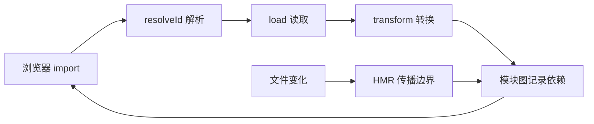

# Vite 开发服务器与插件

运行 Vite 后，浏览器打开入口页面，再逐个请求导入的源码模块。修改一个组件时，开发服务器只更新相关模块，不重新打完整 Bundle。这就是 Vite 开发阶段反馈快的基础，但插件、依赖扫描和转换仍会影响启动速度。

本篇沿一次模块请求讲清解析、加载、转换与 HMR，再写一个只处理虚拟模块的最小插件。生产构建由 Rollup 等构建能力完成，开发服务器行为与生产 Bundle 不能混为一谈。

## 一次源码请求怎样返回浏览器



浏览器原生 ESM 负责按 URL 请求模块，Vite 在服务器端改写裸模块导入、转换 TypeScript/Vue/JSX 并维护模块图。源码按访问转换，不表示启动时间与项目规模无关；插件、配置、文件扫描和依赖数量都会产生成本。

## 步骤一：为什么要预构建依赖

一些依赖以 CommonJS 发布，或内部包含很多小模块。Vite 使用 esbuild 将它们转换成浏览器可消费的 ESM，并把大量请求合并成更稳定的依赖结果。依赖预构建缓存由依赖、锁文件和配置共同决定。

源码频繁变化，按请求转换；依赖相对稳定，预先处理。两类策略不同，解释了冷启动、首次请求和热更新的时间为何不能只看一个数字。

## 步骤二：插件钩子怎样配合

Vite 插件扩展 Rollup 风格钩子，并增加开发服务器相关能力。常用主线是 `resolveId` 决定模块身份，`load` 提供内容，`transform` 修改已有代码。钩子返回 `null` 表示交给后续插件，不要无条件吞掉所有模块。

下面是根据公开插件 API 编写的虚拟模块。输入 `import 'virtual:build-info'`，输出一个只在内存存在的 ESM。使用 `\0` 前缀标记内部解析 ID，避免与真实 URL 冲突。

```ts
import type { Plugin } from 'vite'

export function buildInfoPlugin(version: string): Plugin {
  const publicId = 'virtual:build-info'
  const internalId = '\0' + publicId

  return {
    name: 'build-info',
    resolveId(id) {
      return id === publicId ? internalId : null
    },
    load(id) {
      if (id !== internalId) return null
      return `export const version = ${JSON.stringify(version)}`
    }
  }
}
```

`JSON.stringify` 避免版本字符串破坏生成代码。插件只处理精确 ID，不读 Secret，也不把本机路径写进浏览器 Bundle。

调用方导入公开 ID 后会得到一个普通 ESM 字符串导出；其他模块 ID 返回 `null`，继续进入后续插件链。这个示例适合构建信息等非敏感常量，不适合把服务端密钥或机器环境原样暴露给浏览器。

## 步骤三：HMR 如何决定更新范围

文件变化后，Vite 沿模块图找到接受 HMR 的边界。Vue SFC、React Fast Refresh 等框架插件会定义组件级更新语义；普通模块可以使用 `import.meta.hot.accept`。无法安全接受时回退到页面刷新。

HMR 保留状态不是正确性保证。模块副作用、全局单例和事件监听需要 dispose 清理，否则每次热更新都会重复注册。生产环境也不会运行 HMR 逻辑。

## 步骤四：调试插件顺序与性能

插件有执行顺序和 apply 条件。开发与构建都运行的 transform 应产生等价语义；只适用 serve 或 build 时明确声明。Source Map 在多次转换中继续组合，否则错误位置会偏移。

排查慢启动先观察 debug 日志、插件耗时、依赖优化和模块请求，不先删除缓存宣称解决。插件测试覆盖 resolve、load、transform、Source Map、HMR 和生产构建，必要时使用最小 Fixture。

## 正常结果和失败结果

虚拟模块能在开发与构建中解析；其他 ID 继续交给后续插件；文件变更只更新合法边界；dispose 后没有重复监听。插件生成无效代码、泄露绝对路径或 Source Map 丢失时，测试应失败。

下一篇离开开发服务器，观察 Rollup、esbuild 和代码分割怎样共同生成浏览器最终加载的文件。

## 参考资料

- [Vite Why](https://vite.dev/guide/why.html)
- [Vite Plugin API](https://vite.dev/guide/api-plugin.html)
- [Vite Dependency Pre-Bundling](https://vite.dev/guide/dep-pre-bundling.html)
- [Vite HMR API](https://vite.dev/guide/api-hmr.html)
