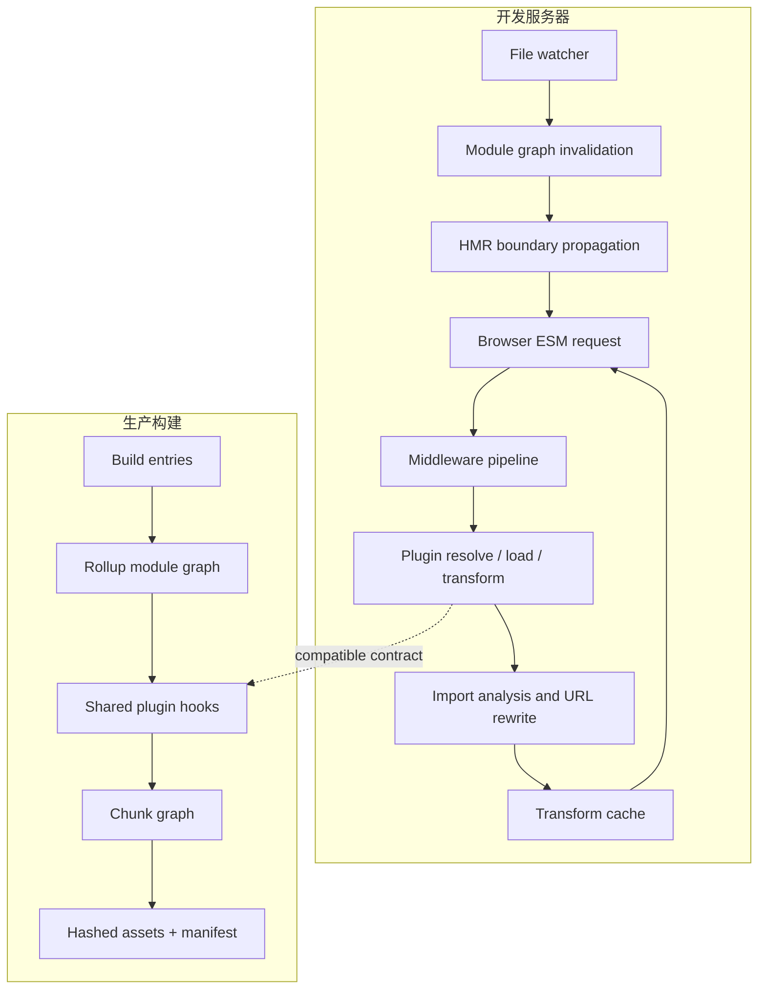
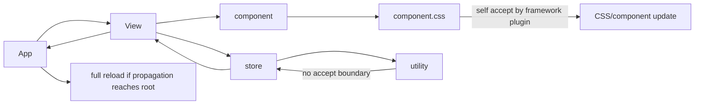

# Vite 开发服务器与插件

Vite 快，不是因为“开发时完全不打包”，也不是因为项目规模对启动时间没有影响。它改变的是开发反馈链路：应用源码主要按浏览器请求即时解析和转换，依赖则通过预构建获得兼容性与请求粒度；文件变化利用模块图定位失效和 HMR 边界。冷启动仍会受配置加载、插件初始化、依赖扫描、文件系统、解析入口和首次请求影响，规模只是从“启动前全量构建”的主导因素变成多个因素之一。

理解 Vite 最有效的方式，不是记配置项，而是追踪一个模块的完整生命周期：URL 如何映射模块身份、插件在哪里介入、转换结果如何缓存、依赖如何进入模块图、文件变化后哪些节点失效、开发与生产为什么会产生不同证据。

## 两条不同但要一致的链路



开发阶段以 URL 请求和模块图为中心；构建阶段从入口闭包形成模块图，再规划 Chunk 和制品。Vite 插件扩展了 Rollup 插件接口，并增加开发服务器专用钩子，但“同一个插件名”不意味着两个环境逐字执行相同路径。

| 维度 | 开发服务器 | 生产构建 |
| --- | --- | --- |
| 工作触发 | 浏览器请求 URL、文件变化 | 构建入口与静态/动态依赖闭包 |
| 主要产物 | 即时转换的 ESM 响应 | Chunk、CSS、资产、Manifest |
| 模块身份 | 规范化 URL 与 resolved id | Rollup resolved id |
| 优化目标 | 冷启动、首次页面、单文件反馈 | 下载、缓存、执行和部署一致性 |
| 失效单位 | 模块图节点与 HMR 边界 | 内容哈希制品与依赖 Chunk |
| 常见差异 | 浏览器原生 ESM、开发条件 | Tree Shaking、压缩、目标降级 |

插件必须在这两条链路上明确自己的适用范围。只在 `serve` 生效的 Mock、调试注入不应污染构建；生成代码、路由扫描、虚拟模块若两个环境都需要，就要建立等价测试。

## 一次开发请求经历什么

浏览器请求 `/src/main.ts` 时，开发服务器并非简单读取文件。概念过程包括：

1. 中间件处理 base、公开目录、HTML 转换、资源与源码请求；
2. URL 被规范化，查询参数区分脚本、样式、原始内容或 Worker 等语义；
3. 插件容器执行 `resolveId` 确定模块身份；
4. `load` 从文件、虚拟模块或远程适配器获得源码；
5. `transform` 链依次转换，并合并 Source Map；
6. import analysis 解析静态/动态导入，重写浏览器可访问 URL，记录依赖图；
7. 结果进入 transform cache，并带 ETag 返回；
8. 后续导入由浏览器继续请求，形成按需工作集。

裸导入 `import { ref } from 'vue'` 不能由浏览器相对当前文件直接解析。教学 Mini Vite 常把它重写为 `/node_modules/vue`，这只覆盖非常窄的情况：真实包可能有 `exports` 条件、子路径、CommonJS 入口、浏览器字段、别名、去重和 monorepo symlink。Vite 使用解析器与预构建元数据选择可消费入口，而不是字符串拼接文件路径。

URL 也不等于磁盘路径。同一文件可能以 `?raw`、`?url`、Worker 或不同查询进入不同模块语义；插件虚拟模块根本没有真实文件。缓存和 HMR 如果只以 `pathname` 为键，会混淆这些身份。

## 依赖预构建解决两个问题

开发模式并非“完全不打包”。依赖预构建通常使用 esbuild，主要解决：

**模块兼容**：把 CommonJS/UMD 或存在互操作问题的依赖转换为浏览器友好 ESM。包的 `exports`、条件解析与 interop 必须由工具链处理，不能把 `module.exports` 原样发给浏览器。

**请求粒度**：某个依赖可能由数百个内部模块组成。浏览器逐个请求会放大握手、调度、Header、转换和文件系统开销；预构建可把稳定依赖合并为较少模块。

预构建缓存键不只包含包版本。锁文件、补丁、相关配置、模式、目标与工具版本变化都可能要求重建。`--force` 是排查手段，不是日常修复；如果每次启动都必须 force，应该检查缓存目录权限、动态依赖、重复包、插件修改解析和锁文件稳定性。

依赖扫描也并非总能发现运行时才拼出的导入。可用 `optimizeDeps.include/exclude` 精确补充，但不能看到一个问题就把整个 monorepo 加入。应先确认它是应预构建的稳定第三方依赖，还是需要按源码转换的 linked package。

### 为什么启动仍会随工程变化

Vite 避免了传统全量 Bundle 启动的线性前置工作，但以下因素仍随规模或复杂度增长：

- HTML/入口与依赖扫描范围；
- 配置文件及其导入、插件数量和初始化 I/O；
- monorepo 解析、软链接、重复依赖和文件监听范围；
- 首屏模块工作集及每个模块的转换成本；
- 大型自动导入、路由和内容扫描插件；
- 首次依赖预构建、缓存命中率和磁盘性能；
- 类型检查器、lint 或代码生成是否被错误阻塞在 Dev Server 启动路径。

因此性能报告至少区分：无缓存冷启动、依赖缓存命中启动、首个 HTML 响应、首屏模块全部可用、单文件 HMR。只报告终端出现 “ready” 的时间会漏掉浏览器首次请求成本。

## 插件钩子是一份模块协议

一个插件不应靠全局字符串替换修改源码。它要围绕模块身份和生命周期选择钩子：

- `resolveId`：把 import specifier 与 importer 解析成稳定 id；
- `load`：为已解析 id 提供源码；
- `transform`：对已有源码做局部转换，并返回 Source Map；
- `configureServer`：插入开发中间件或访问 Server；
- `transformIndexHtml`：结构化修改 HTML；
- `handleHotUpdate`：根据文件变化调整失效模块或返回 HMR 传播集合；
- 构建期 `generateBundle/writeBundle`：检查或输出最终制品信息。

下面的虚拟模块插件展示最小闭环：公开 id、内部 id、两端适用、稳定输出和 HMR 依赖都必须考虑。

```ts
import type { Plugin } from 'vite'

const PUBLIC_ID = 'virtual:build-metadata'
const RESOLVED_ID = '\0virtual:build-metadata'

export function buildMetadataPlugin(version: string): Plugin {
  return {
    name: 'example:build-metadata',

    resolveId(source) {
      return source === PUBLIC_ID ? RESOLVED_ID : null
    },

    load(id) {
      if (id !== RESOLVED_ID) return null
      return {
        code: `export default ${JSON.stringify({ version })}`,
        map: { mappings: '' }
      }
    }
  }
}
```

内部 id 的 `\0` 前缀用于避免与真实模块冲突，并向其他插件表明它已解析。虚拟模块导出的数据必须可以公开进入客户端 Bundle；不能把服务器环境变量、文件绝对路径或密钥序列化进去。

若元数据来自一个文件，插件要把该文件登记为 watch dependency，并在变化时使虚拟模块失效。否则开发环境会一直返回旧缓存。若每次 `load` 都生成当前时间或随机值，结果不可复现，也会破坏缓存与 SSR 一致性。

## AST、MagicString 与 Source Map

源码转换有三种常见级别：

1. 明确、无语法歧义的完整文件生成；
2. 基于定位信息的局部编辑，例如解析 import 后用 MagicString 重写；
3. 需要理解作用域、语法和语义的 AST 转换。

正则无法可靠区分注释、字符串、模板、同名局部变量和各种新语法。转换 import、JSX、装饰器或调用表达式时应使用与目标语法匹配的 Parser。局部编辑保留原始布局并生成高质量 Source Map；多插件链必须把上一阶段 Map 作为输入合并。

```ts
import MagicString from 'magic-string'
import { parse } from 'acorn'
import type { Plugin } from 'vite'

export function replaceFlagPlugin(): Plugin {
  return {
    name: 'example:replace-flag',
    enforce: 'pre',
    transform(code, id) {
      if (!id.endsWith('.js') || id.includes('/node_modules/')) return null

      const ast = parse(code, { ecmaVersion: 'latest', sourceType: 'module' })
      const edits = findApprovedFlagReferences(ast)
      if (edits.length === 0) return null

      const output = new MagicString(code)
      for (const edit of edits) output.overwrite(edit.start, edit.end, 'false')

      return {
        code: output.toString(),
        map: output.generateMap({ source: id, hires: true, includeContent: true })
      }
    }
  }
}
```

`findApprovedFlagReferences` 必须验证引用语义，而不是替换所有同名标识符。插件还要明确该值是否可在构建期内联；把权限判断或服务器 Feature Flag 固化成客户端常量会形成安全问题。

Source Map 验收不能只看“返回了 map”。构建一段经过多个转换的故意异常，上传与 Release 匹配的 Map，再验证监控定位到原始文件、行列和函数。错误 Map 比没有 Map 更危险，因为它会把排障引向错误源码。

## 模块图和 HMR 边界

Vite 的 ModuleGraph 记录 URL、resolved id、importers、imported modules、HMR 接受关系和转换结果等信息。文件变化时，服务器找到对应模块，失效缓存，并沿 importer 传播，直到找到接受更新的边界；没有合适边界则整页刷新。



框架插件会为组件注入 HMR 接受逻辑，尽可能保留状态并替换组件定义。普通模块若主动 `import.meta.hot.accept`，必须能用新模块更新消费者；“写了 accept 就一定热更新”是错误的。

```ts
let disposeCurrent = registerFeature()

if (import.meta.hot) {
  import.meta.hot.accept((nextModule) => {
    disposeCurrent()
    disposeCurrent = nextModule?.registerFeature() ?? (() => undefined)
  })

  import.meta.hot.dispose(() => {
    disposeCurrent()
  })
}
```

事件监听、Timer、Worker、WebSocket 和全局注册必须 dispose。否则每次 HMR 都多一份副作用，开发环境运行一小时后与生产完全不同。`import.meta.hot.data` 可跨模块替换保留受控数据，但要版本化结构，不能成为无限增长的全局 Store。

`handleHotUpdate` 适合非标准文件到模块的映射，例如内容文件影响虚拟索引。钩子不能每次扫描整个仓库；维护反向索引，并只返回真正受影响模块。HMR 正确性比“永远不刷新页面”重要，无法保证状态兼容时明确 full reload 更安全。

## CSS、静态资源与 Worker 也是模块

在 Vite 中导入 CSS 会形成模块依赖，开发时注入样式并支持 HMR，构建时抽取和分割。`url()`、显式资产 import、`?url`、`?raw` 和 public 目录的语义不同：

- 源码中 import 的资产进入模块图，构建可改名和哈希；
- public 目录资源按固定根路径复制，不经过 import 分析；
- `new URL('./asset.png', import.meta.url)` 适合可静态分析的相对资产；
- 用户输入不能直接拼到静态 `new URL` 并期待构建器收集所有可能文件。

Worker 推荐通过 `new Worker(new URL('./worker.ts', import.meta.url), { type: 'module' })` 等受支持形式，让开发和构建都识别独立图。Worker 不能直接访问页面 DOM，消息经过结构化克隆；大 ArrayBuffer 可用 transferable 避免复制。插件若转换 Worker 代码，必须验证主线程、Worker 和 SSR 三种环境，而不是只看普通 `.ts`。

## 环境变量与客户端安全

Vite 会把特定前缀的环境变量暴露给客户端代码，构建期替换意味着任何用户都能从 Bundle 读取。前缀是“允许公开”的标识，不是加密：API 密钥、数据库连接、内部凭证绝不能通过客户端 env 注入。

```ts
interface PublicRuntimeConfig {
  apiBaseUrl: string
  release: string
}

function parsePublicConfig(value: unknown): PublicRuntimeConfig {
  // 对部署注入的运行时配置做 Schema 验证和 URL allowlist。
  return PublicConfigSchema.parse(value)
}
```

需要同一制品在不同环境运行时，可以由服务器提供受控的公开运行时配置，而不是为每个环境重新构建且把所有环境值混进 Bundle。运行时配置同样不允许 Secret，并应绑定 CSP、缓存策略和 Schema 版本。

HTML 转换插件尤其要防注入。把环境字符串直接拼到 `<script>` 可造成闭合标签或 XSS；使用结构化序列化并转义 HTML 敏感序列，或由外部 JSON 端点返回。

## SSR 中的两个模块世界

Vite SSR 开发会在服务器环境加载模块，并对依赖外部化、转换和失效做不同处理。一个模块若在顶层访问 `window`、`document` 或浏览器 Storage，SSR 导入阶段就会失败。相反，Node-only 模块也不能进入客户端图。

插件可以通过 `ssr` 参数区分 transform 上下文，但更理想的是源码边界清楚：共享纯逻辑、`.client` 适配器、`.server` 适配器和显式入口。不要在一个模块里到处 `typeof window` 掩盖依赖混乱。

SSR 开发还要注意模块单例。服务进程复用模块，顶层可变 Map 可能跨请求泄露用户数据；请求状态必须在每次请求创建的 Context 中。HMR 会替换模块但未必清理外部资源，服务端插件也需要 dispose 生命周期。

## 插件性能与缓存正确性

插件通常比 Vite 核心更容易成为性能瓶颈，因为它可能对每个模块运行。优化顺序是先缩小工作集，再缓存纯转换，最后考虑并行：

```ts
function shouldTransform(id: string): boolean {
  const cleanId = id.split('?', 1)[0]
  return cleanId.endsWith('.example.ts') && !cleanId.includes('/node_modules/')
}
```

高频路径避免每次同步读取多个文件、启动子进程、访问网络或全仓 glob。缓存键应包含源码、影响转换的配置、工具版本和依赖文件版本；只用 `id` 会在文件变化后返回旧内容。缓存中不能混入 importer、SSR mode 等上下文而不纳入 key。

性能测试至少记录 P50/P95 transform 时间、调用次数、缓存命中率和最慢模块。插件总时间不是各 hook 简单相加：某个插件改变解析可能放大模块数量。使用 Vite debug 日志、Node CPU profile、文件系统 trace 和最小插件二分定位。

## 设计一个可维护插件

插件项目可以按纯核心和宿主适配拆分：

```text
plugin/
  core/
    parse.ts          # 无 Vite 依赖的解析
    transform.ts      # 输入源码和选项，输出 code/map/diagnostics
  adapters/
    vite.ts           # 钩子、模块身份、watch 与 HMR
  fixtures/
    app-basic/
    app-ssr/
  tests/
    core.spec.ts
    serve.spec.ts
    build.spec.ts
```

纯转换做快速单测和基于 fixture 的快照；Vite 适配器验证 `serve/build/ssr` 生命周期。错误应使用插件上下文的 `this.error/this.warn` 并提供 id、位置和可行动建议，不能吞错后返回原源码，让构建“成功但功能缺失”。

插件配置要可序列化、可验证，默认值稳定。改变生成代码或公共虚拟模块应按版本治理；插件自身升级可能是应用的破坏性变更。

## 验证与故障演练

| 场景 | 操作 | 验收证据 |
| --- | --- | --- |
| 冷启动 | 删除专用依赖缓存后启动 | 记录 ready、首屏完成、预构建时间和工作集 |
| 热启动 | 缓存命中再次启动 | 依赖未无故重建，首屏内容一致 |
| HMR | 修改叶子、共享工具、样式和虚拟模块来源 | 合理边界更新；副作用不重复；必要时可靠刷新 |
| Source Map | 多插件转换后抛出固定错误 | DevTools 与监控均定位原始源码 |
| 构建一致性 | 同一 fixture 跑 serve 与 build preview | 路由、资产、动态导入和功能一致 |
| SSR | 并发两个不同用户请求 | 无浏览器全局错误、无模块单例数据串流 |
| 缓存失效 | 改配置、锁文件和生成依赖 | 只使相关缓存失效且不返回旧代码 |
| 安全 | 构建后扫描制品 | 无 Secret、绝对路径和内部配置；公开 env 受控 |

插件测试不能只直接调用 `transform`。应启动真实 Vite Server，通过 HTTP 请求转换模块，修改 fixture 文件，读取 HMR 消息，再执行生产 build 和 preview。对 HMR 不稳定路径使用浏览器自动化验证状态是否保留、监听数量是否增长和控制台是否报错。

故意删除插件返回的 Source Map、把缓存键改成 id、漏掉 dispose 或让虚拟模块输出随机值，确认门禁能够失败。没有 mutation 的“绿测试”可能从未覆盖真正风险。

## 常见误区

- **Vite 启动时间与项目大小无关**：前置全量 Bundle 被移除，但入口扫描、插件、monorepo、首屏工作集和监听仍随工程变化。
- **开发环境完全不打包**：依赖预构建本身是 Bundle/转换过程。
- **裸导入改成 `/node_modules/` 就完成了解析**：真实解析包含 exports 条件、interop、别名、去重与 linked package。
- **HMR 就是 WebSocket 通知刷新**：传输只是一层；模块图失效、接受边界和副作用清理决定正确性。
- **Vite 插件等于 Rollup 插件**：共享许多钩子，但开发 Server、HTML、HMR 和 SSR 有额外生命周期，输出阶段也不同。
- **esbuild 让任何插件都快**：一个全仓同步 I/O 或错误缓存插件仍会主导反馈时间。
- **`import.meta.env` 中的值安全**：进入客户端 Bundle 的值都是公开信息。

## 源码与规范

- [Vite Plugin API](https://vite.dev/guide/api-plugin)：开发/构建钩子、虚拟模块、HMR 和插件顺序。
- [Vite Dependency Pre-Bundling](https://vite.dev/guide/dep-pre-bundling)：依赖预构建、缓存和 CommonJS/ESM 处理。
- [Vite 原理与插件开发](https://juejin.cn/post/6998894575175598088)：我的早期 Vite 文章；本文按当前 Vite 修正启动性能和插件边界。
- 个人实验材料已匿名化；本文只抽取通用机制，不建立项目映射。
- 个人实验材料已匿名化；本文只抽取通用机制，不建立项目映射。
