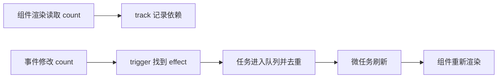

# Vue 3 响应式与调度

在同一个点击事件里连续修改两次 `count`，页面通常不会同步渲染两遍，而是在本轮同步代码结束后统一更新。这里有两个不同问题：响应式系统怎样知道谁依赖 `count`，调度器又怎样把重复更新合并。

本篇先观察页面结果，再拆开 Proxy、effect 与 Job Queue。教学示例只帮助理解主线；Vue 的真实实现还包含嵌套 effect、依赖清理、computed、watch 和组件更新顺序。

## 先看一次更新流程

本篇目标是解释“状态改了，DOM 什么时候变”的现象。开始前需要会读 Vue 组件和事件处理器；不需要阅读 Vue 源码，先用一个按钮实验区分依赖收集、触发和调度。



响应式解决“哪些计算受这个值影响”，调度解决“何时以及按什么顺序重新执行”。把二者混成“Proxy 自动刷新 DOM”，会看不懂 computed 和 watch 为什么有不同时间语义。

## 步骤一：读取时收集依赖

`reactive()` 使用 Proxy 拦截属性读取与写入。组件渲染在一个活跃 effect 中执行；读取 `state.count` 时，将当前 effect 记录到目标对象与属性对应的依赖集合。没有活跃 effect 的普通读取不会被订阅。

真实实现会在每次运行前后维护 effect 栈并清理旧依赖。例如条件从 `showA` 切到 `showB` 后，组件不应继续订阅已经不再读取的 A。数组长度、Map/Set 迭代与属性新增也有专门依赖键，不能用一个简单对象 Map 覆盖全部语义。

## 步骤二：写入时触发，但不立即重渲染

Proxy 的 setter 比较旧值与新值，并区分新增、修改和删除，再找到相关 effect。普通同步 effect 可以直接执行；组件 effect 通常交给 scheduler，避免同一调用栈内多次改动造成重复渲染。

下面是可运行的观察示例。输入是在一次点击中连续赋值，预期是同步日志先结束，`nextTick` 后 DOM 显示最终值 2。代码不模拟 Vue 内部实现，只验证公开更新时序。

```vue
<script setup lang="ts">
import { nextTick, ref } from 'vue'

const count = ref(0)

async function updateTwice() {
  count.value = 1
  count.value = 2
  console.log('sync DOM:', document.querySelector('#count')?.textContent)

  await nextTick()
  console.log('updated DOM:', document.querySelector('#count')?.textContent)
}
</script>

<template>
  <button @click="updateTwice">更新两次</button>
  <span id="count">{{ count }}</span>
</template>
```

点击按钮后，`updateTwice` 先连续写入两次响应式状态，Vue 把组件更新任务放入同一轮队列并去重；第一次日志在同步代码中执行，因此可能仍读取旧 DOM。`await nextTick()` 等待当前更新队列执行完成，第二次日志应输出 2。这个函数的返回只表示 Vue 已完成本轮 DOM 更新，它不是通用延时器，也不保证浏览器已经完成下一帧绘制。

## 步骤三：队列怎样保持稳定顺序

调度器把 Job 去重并安排到微任务刷新。组件更新要考虑父子顺序、已卸载任务和刷新过程中新增任务。Vue 还区分 pre、component job 和 post 等时机；`watch` 的 `flush` 选项决定回调在组件更新前、后或同步执行。

`flush: 'sync'` 会失去批处理保护，适合极少数明确场景。默认时机下如果要读取更新后的 DOM，使用 post flush 或 `nextTick`。不要依赖未公开的队列字段和内部函数名，它们会随版本演进。

## computed 和 watch 为什么不同

computed 是带缓存的派生值。依赖变化时先标记为需要重新计算，下一次读取才求值，并通知依赖它的消费者。watch 用于副作用，关注源值变化后执行回调，还需要处理 cleanup，避免旧异步请求晚到覆盖新结果。

| 场景 | 合适工具 |
| --- | --- |
| 从已有状态计算显示值 | computed |
| 状态变化后发请求或写存储 | watch |
| 等待本轮 DOM 更新 | nextTick / post flush |
| 修改状态本身 | ref / reactive |

## 正常结果和失败结果

连续同步修改会合并到一次组件更新；条件依赖变化后旧分支应被清理；组件卸载后排队 Job 不应继续更新。若 watch 发出多个请求，要在 cleanup 中取消旧请求或使用序号防止乱序。

验证时关注公开行为：渲染次数、DOM 时序、cleanup 和父子组件结果。阅读源码可以从 reactivity effect 测试和 runtime-core scheduler 测试进入，但文章结论应标明 Vue 版本，内部结构不作为永久 API。

## 在浏览器里做三次时序实验

先打开示例并在一次点击中连续写入 `1`、`2`，记录同步日志、`nextTick` 日志和页面最终值。第二次把 watch 设为默认 flush，在回调中读取 DOM；第三次改为 `flush: 'post'`。通过结果区分“响应式值已经变化”和“组件 DOM 已经提交”。

| 观察点 | 预期解释 |
| --- | --- |
| 同步读取 `count.value` | 已经是最新值 2 |
| 同步读取 DOM | 可能仍是上次渲染结果 |
| `nextTick` 后读取 DOM | 当前组件更新队列已经刷新 |
| post watch | 在组件 DOM 更新后执行 |

再做依赖清理实验：渲染表达式为 `enabled ? a : b`，先修改 A 观察更新，再把 `enabled` 设为 false，随后修改 A 和 B。切换后 A 不应继续触发本组件，B 应成为新依赖。这个实验能直观看到 effect 每轮执行都要清理和重新收集依赖。

工作中遇到“watch 为什么执行两次”或“DOM 还是旧的”，先记录 Vue 版本、开发/生产模式、flush 时机、状态写入调用栈和组件是否被重复挂载。不要先用 `setTimeout` 掩盖时序；确认需要等待的是 Vue 更新队列还是浏览器下一帧，再选择 `nextTick`、post watch 或 `requestAnimationFrame`。

## 这套解释的边界

本文描述的是 Vue 3 的公开响应式和调度行为，便于排查组件更新时序。它不承诺内部队列字段、函数名或具体微任务实现永远不变，也不覆盖服务端渲染、Suspense 和第三方渲染器的全部细节。遇到这些场景，应以当前 Vue 版本的公开 API 和测试结果为准。
