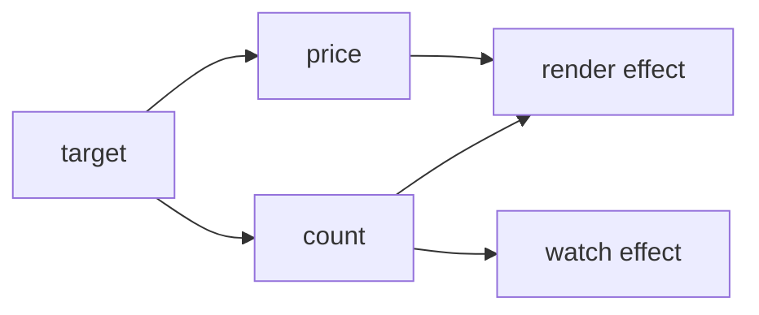

# Vue 3 响应式系统：依赖图与 Effect

Vue 3 的响应式系统负责把状态读取与需要重新执行的计算连接起来。它位于普通 JavaScript 数据和组件渲染、`computed`、`watch` 之间：Proxy 拦截读写，ReactiveEffect 表示副作用，依赖图记录“哪个 Effect 读过哪个 target/key”。状态变化后，系统只通知相关 Effect，并把组件更新交给调度器。

例如模板读取 `state.price * state.count` 后，修改 `count` 会触发组件更新，修改无关字段不会。Vue 不需要定时比较整个对象；它在 Effect 执行期间收集读取关系，写入时再沿依赖图寻找订阅者。

## 依赖图的数据结构

全局 WeakMap 以原始 target 为键，避免阻止对象回收；每个 target 对应 Map，按属性 key 找到 Dep；Dep 保存订阅该属性的 ReactiveEffect。概念结构是 `WeakMap<object, Map<PropertyKey, Set<Effect>>>`，当前源码为性能加入更复杂标记，但职责不变。



Effect 反向也要记录自己加入过哪些 Dep。重新执行前清理旧依赖，才能处理条件分支。否则 `ok ? text : fallback` 从 ok=true 切到 false 后，仍订阅 text，产生无效更新。

## Proxy 只负责拦截，不等于完整响应式

`reactive` 返回 Proxy。get 中 track，set 中比较旧值和新值再 trigger。还需缓存原对象与 Proxy，避免重复代理；处理嵌套对象、数组 length、迭代键、Map/Set 方法和 readonly 语义。一个十行 Proxy 示例只能说明入口。

```ts
let activeEffect: (() => void) | undefined
const graph = new WeakMap<object, Map<PropertyKey, Set<() => void>>>()

function track(target: object, key: PropertyKey): void {
  if (!activeEffect) return
  const keys = graph.get(target) ?? new Map()
  graph.set(target, keys)
  const effects = keys.get(key) ?? new Set()
  keys.set(key, effects)
  effects.add(activeEffect)
}

function trigger(target: object, key: PropertyKey): void {
  const effects = new Set(graph.get(target)?.get(key) ?? [])
  for (const effect of effects) effect()
}
```

track 的输入是当前 target/key 与 activeEffect，执行后在依赖图中建立唯一订阅；trigger 复制集合再逐个调用，输出是相关 Effect 重新执行。示例缺少 cleanup、嵌套栈和 scheduler，所以分支切换会保留旧订阅，异常函数也需要 finally 恢复上下文，不能直接用于生产。

复制 Set 再执行，避免 Effect 运行时清理并重新加入同一 Dep 导致迭代异常。教学模型省略 Effect 栈、cleanup、scheduler 和集合类型，不能当作 Vue 源码替代。

## ReactiveEffect 的执行状态

嵌套 computed 或组件会形成 Effect 栈。执行前保存父 Effect，设置 activeEffect，清理/准备依赖；finally 中恢复父级。缺少 finally 时，用户函数抛错会污染全局 activeEffect，后续普通读取被错误收集。

Effect 还要阻止不允许的递归触发，并把“立即执行”与“交给 scheduler”分开。trigger 找到 Effect 后，若有 scheduler 就把 job 交给队列，而不是同步重跑组件。

这也是响应式系统与组件调度的交界。依赖图回答“谁需要更新”，scheduler 决定“何时执行以及同一轮是否去重”。`nextTick` 等待的是当前刷新队列完成，不是等待任意网络请求或浏览器所有绘制结束。调度队列、`computed` 和 `watch` 的执行顺序由后续专题展开，本文只把交接点讲清楚。

## ref、reactive 与解包

reactive 适合对象代理；ref 用带 value 的容器承载原始值或对象，并有自己的 Dep。模板和 reactive 属性在部分场景自动解包 ref，但数组、集合和类型边界存在差异。`toRefs` 用属性 ref 保持解构后的连接；直接解构 reactive 的原始属性只得到当时值。

computed 是带缓存和脏标记的特殊 Effect。依赖变化时先标脏并通知消费者，下次读取 value 才重算。watch 建立显式数据源与回调，watchEffect 自动收集同步执行阶段读取的依赖；await 之后的读取不属于最初同步收集窗口。

## 验证依赖清理

实现 `state.ok ? state.text : 'hidden'` 的 Effect，记录每次 track/trigger。期望日志可以直接写成下面这条轨迹：

```text
run 1: track ok, track text -> "hello"
set ok=false: trigger ok -> cleanup -> run 2: track ok -> "hidden"
set text="bye": no run
set ok=true: trigger ok -> run 3: track ok, track text -> "bye"
```

如果第三步仍然运行，说明旧 `text` 依赖没有清理。还要测试重复读取同一 key 只保留一个订阅、停止 Effect 后 Dep 不再持有它，以及用户函数抛错后 `activeEffect` 能在 `finally` 中恢复。

数组 push、删除属性、`in`、Object.keys 和 Map size 需要额外迭代依赖，若教学实现不支持要明确标注。生产排查可使用 Vue Devtools 和组件 onRenderTracked/onRenderTriggered，定位具体 target/key 操作。

完整链路是代理拦截、Effect 上下文、双向依赖、cleanup、trigger 分类和 scheduler 入口。真实实现会用 Effect flags、Dep 链接和版本计数优化订阅维护，不能把某个版本的 `Set` 教学模型当成永久源码形状；稳定的是这些职责，不是私有字段名。

## trigger 为什么不能只找同名 key

`SET` 通常触发该 key；`ADD`/`DELETE` 还会影响 `in`、`Object.keys`、数组长度或 Map/Set 迭代；清空集合影响所有相关读取。数组索引新增可能改变 length，缩短 length 又会影响越界索引。触发器先收集 Effect，再执行 scheduler 或直接 run，必须避免在遍历 Dep 时同步修改同一集合造成重复/死循环。

Ref 通过 `.value` 持有自己的 Dep；reactive 深层代理与 `shallowReactive`、`shallowRef` 的边界不同。解构普通 reactive 属性会丢失后续 getter 跟踪，`toRef/toRefs` 用稳定 Ref 连接原对象。`markRaw`、`toRaw` 是互操作工具，不应成为绕开状态设计的默认手段。

## 源码与官方依据

- [Vue: Reactivity in Depth](https://vuejs.org/guide/extras/reactivity-in-depth.html)
- [Vue source: effect.ts](https://github.com/vuejs/core/blob/main/packages/reactivity/src/effect.ts)
- [Vue source: baseHandlers.ts](https://github.com/vuejs/core/blob/main/packages/reactivity/src/baseHandlers.ts)

调试特定版本时锁定 `vue` 的实际版本和对应源码 tag。Devtools 的 tracked/triggered 信息用于定位依赖来源，业务代码不应读取内部 Dep 或依赖私有 flags。

## 迁移复核：Vue 3 响应式系统：依赖图与 Effect
把这套机制迁移到真实前端时，先确认它运行在哪一层：浏览器解析与调度、框架渲染、构建工具、网络协议或应用状态。相邻层可以互相影响，却不能用框架术语替代浏览器事实，也不能用一次视觉正确推断生命周期和资源已经正确释放。

验证同时覆盖首次加载、更新、卸载或离开页面、错误恢复和低性能设备。交互组件保留键盘路径、焦点、可访问名称与响应式边界；异步逻辑检查取消、竞态和迟到结果；构建结果检查产物图、缓存和 Source Map。

性能优化先用 Performance、Network、Memory 或框架 Profiler 找到时间和资源归属，再改变代码。示例中的阈值、设备与数据规模只用于解释机制，项目结论需要在目标浏览器和真实产物上复测。
