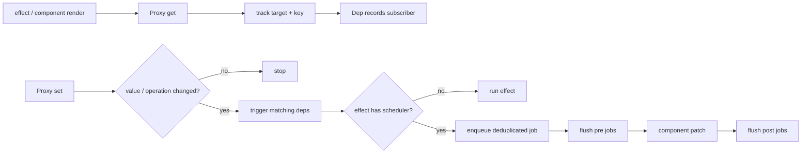

# Vue 3 响应式与调度

Vue 3 的响应式常被压缩成一句“Proxy 拦截 `get/set`”。Proxy 只提供观察入口，真正决定系统是否正确的是：当前谁在读取、依赖如何记录、分支变化后旧依赖如何移除、同一轮写入如何去重、computed 如何把失效传播给消费者，以及组件更新在什么时机提交。

如果教学实现只有一个全局 `activeEffect`、`Set` 中永久加入函数、setter 无条件同步执行，它可以展示概念，却会在嵌套 effect、条件依赖、自触发、批量更新和 computed 场景下给出错误结论。理解 Vue 源码不需要逐行背实现，但必须知道每一层在维护什么不变量。

## 从读写到调度的完整路径



依赖图通常可以抽象为 `WeakMap<object, Map<PropertyKey, Dep>>`。WeakMap 允许原始对象不再被使用时回收；属性键对应一组订阅者。数组长度、迭代、Map/Set 的 key 变化需要额外的依赖键，不能只把一切视为普通 `get/set`。

| 层次 | 保存的事实 | 典型问题 |
| --- | --- | --- |
| Proxy handler | 哪个目标发生何种读写 | 新增、修改、删除、迭代语义不同 |
| Dep | 哪些 effect 依赖该读取 | 分支切换需要清理旧依赖 |
| ReactiveEffect | 正在执行什么、由谁嵌套调用 | effect 栈、停止、递归保护 |
| Scheduler | 本轮哪些任务需要运行 | 去重、顺序、递归上限、flush 时机 |
| Renderer | 新旧 VNode 如何形成 DOM 变更 | render 可重复，commit 必须一致 |

## Effect 不是一个裸函数

生产级 effect 至少需要保存执行函数、活跃状态、所订阅的依赖集合、scheduler 和父 effect。下面是用于说明不变量的缩小实现，不是 Vue 源码复制：

```ts
type Dep = Set<ReactiveEffect>

let activeEffect: ReactiveEffect | undefined
let shouldTrack = true

class ReactiveEffect<T = unknown> {
  active = true
  deps: Dep[] = []
  parent?: ReactiveEffect

  constructor(
    private readonly fn: () => T,
    readonly scheduler?: () => void
  ) {}

  run(): T {
    if (!this.active) return this.fn()
    if (activeEffect === this) return this.fn()

    const previous = activeEffect
    try {
      this.parent = previous
      activeEffect = this
      cleanupEffect(this)
      return this.fn()
    } finally {
      activeEffect = previous
      this.parent = undefined
    }
  }

  stop(): void {
    if (!this.active) return
    cleanupEffect(this)
    this.active = false
  }
}

function cleanupEffect(effect: ReactiveEffect): void {
  for (const dep of effect.deps) dep.delete(effect)
  effect.deps.length = 0
}

function trackEffect(dep: Dep): void {
  if (!shouldTrack || !activeEffect || dep.has(activeEffect)) return
  dep.add(activeEffect)
  activeEffect.deps.push(dep)
}
```

为什么每次执行前要清理？考虑：

```ts
effect(() => {
  output.value = state.enabled ? state.primary : state.fallback
})
```

第一次 `enabled=true` 时订阅 `enabled` 和 `primary`；切换为 false 后应订阅 `enabled` 和 `fallback`，并从 `primary` 的 Dep 移除。只增不减会让修改 `primary` 继续触发无意义更新，还会让已停止的组件被依赖集合持有。

真实 Vue 使用更精细的依赖标记和版本机制减少重复清理成本，但语义不变：**一次 effect 执行结束后，它的订阅集合必须准确反映本次实际读取**。

嵌套 effect 则要求恢复父 effect。只把全局变量设为 `null` 会导致内层运行完以后，外层后续读取无法被追踪。异步回调也不会自动继承 active effect：effect 同步执行期间发生的读取才属于这次收集，`await` 后的读取需要显式组织状态。

## Track 与 Trigger 的操作语义

简单 setter 常犯两个错误：赋相同值仍触发，新增属性和修改属性不区分。更完整的系统会比较原值（处理 `NaN` 等同值语义），区分 `ADD`、`SET`、`DELETE`，并根据集合类型触发对应依赖。

```ts
function triggerEffects(dep: Dep): void {
  // 复制集合，避免执行过程中 cleanup / re-track 改变当前迭代。
  for (const effect of new Set(dep)) {
    if (effect === activeEffect) continue
    effect.scheduler ? effect.scheduler() : effect.run()
  }
}
```

数组的 `push` 不只是某个索引变化，还影响 `length` 和可能依赖迭代的消费者；把数组长度缩短会让超出新长度的索引失效。`Map.set` 新 key 会影响 `size`、key 迭代和值迭代，更新已有 key 则不一定影响 key 集合。Vue 为数组与集合提供专门 instrumentation，是因为 JavaScript 内建对象的内部槽不能仅靠普通对象 Proxy 语义覆盖。

还需要避免追踪不应该成为业务依赖的内部访问，例如某些 symbol、原型探测或数组变异方法为读取 length 而产生的自依赖。结论不是“Proxy 自动完成深响应式”，而是运行时围绕语言对象语义实现一套受控追踪规则。

## Computed 是惰性订阅者，也是依赖来源

一个常见错误实现是创建 effect 只执行 `dirty = true`，却从未在 effect 内执行 getter，于是没有收集 getter 依赖；另一个错误是 getter 每次变化立即重算，失去惰性和缓存。

computed 的关键过程是：

1. 第一次读取 `.value`，让内部 effect 执行 getter 并缓存；
2. getter 读取的响应式值把内部 effect 加入各自 Dep；
3. 上游变化调用 scheduler，只把 computed 从 clean 标为 dirty；
4. 标脏时通知“读取过 computed.value 的外部 effect”；
5. 下一次真正读取才重新计算，随后恢复 clean。

```ts
class ComputedRef<T> {
  private dirty = true
  private cached!: T
  private readonly dep: Dep = new Set()
  private readonly effect: ReactiveEffect<T>

  constructor(getter: () => T) {
    this.effect = new ReactiveEffect(getter, () => {
      if (this.dirty) return
      this.dirty = true
      triggerEffects(this.dep)
    })
  }

  get value(): T {
    trackEffect(this.dep)
    if (this.dirty) {
      this.cached = this.effect.run()
      this.dirty = false
    }
    return this.cached
  }
}
```

这里顺序很重要：外部渲染 effect 读取 computed 时，要订阅 computed 自己的 Dep；computed 内部 effect 运行 getter 时，active effect 临时切换成内部 effect；结束后恢复外部 effect。没有 effect 栈就会把后续依赖绑错对象。

computed getter 应保持纯净。若在 getter 里写响应式状态或发请求，可能造成递归触发、缓存语义混乱和多次副作用。副作用放在 watch、生命周期或应用服务中。

## Watch 的本质是 source、调度和清理

`watch` 不只是“值变了执行回调”。它要决定如何读取 source、比较新旧值、何时执行，以及上一轮异步工作如何取消。深度 watch 通常通过遍历触发依赖收集，成本与对象图规模相关；它也不能神奇地产生廉价的深层 diff。

```ts
watch(
  () => state.query,
  async (query, _previous, onCleanup) => {
    const controller = new AbortController()
    onCleanup(() => controller.abort())

    const result = await search(query, controller.signal)
    if (!controller.signal.aborted) state.results = result
  },
  { flush: 'post' }
)
```

新 query 触发时先清理旧请求，避免旧响应覆盖新结果。`flush: 'pre'` 通常在组件 DOM 更新前，`post` 在更新后，`sync` 同步执行且不享受普通批处理。只有确实需要同步观察且写入频率可控时才使用 `sync`。

## Scheduler 为什么不能等同 Promise.then

将 effect 放进 `Promise.resolve().then(job)` 只能说明使用了微任务，不能解决重复任务、父子顺序、任务在 flush 中新增、递归更新或错误隔离。一个最小调度器至少维护 Set 去重、flush 状态与稳定顺序：

```ts
type Job = (() => void) & { id?: number }

const queue = new Set<Job>()
let flushing = false
const resolved = Promise.resolve()

function queueJob(job: Job): void {
  queue.add(job)
  if (flushing) return
  flushing = true
  void resolved.then(flushJobs)
}

function flushJobs(): void {
  try {
    const jobs = [...queue].sort((a, b) => (a.id ?? Infinity) - (b.id ?? Infinity))
    queue.clear()
    for (const job of jobs) job()
  } finally {
    flushing = false
    if (queue.size > 0) {
      flushing = true
      void resolved.then(flushJobs)
    }
  }
}
```

这仍是教学缩小版。Vue 还处理 pre/post flush callback、正在执行队列中的插入位置、已卸载任务、允许递归的任务、开发环境递归上限和错误处理。组件更新通常有稳定 id，使父组件先于子组件更新；如果父更新卸载子组件，子任务可跳过。

同一同步调用栈多次赋值通常只触发一次组件更新：

```ts
state.count += 1
state.count += 1
state.count += 1
await nextTick()
// DOM 通常已经反映最终值，而不是经历三次可观察提交。
```

`nextTick` 等待的是当前调度 flush 关联的 Promise，不等于浏览器一定完成绘制，也不应成为用来修复所有竞态的工具。需要测量布局时仍要考虑更新 flush、浏览器样式布局和动画帧之间的关系。

## 组件渲染 effect 与 DOM 提交

组件挂载时，Vue 用响应式 effect 包裹组件更新函数。首次运行创建子树并 patch；依赖变化后 scheduler 把更新任务入队；再次运行产生下一棵 VNode 树并 patch 差异。

教学实现常见 `effect(() => container.appendChild(render()))`，每次更新都追加新 DOM，既没有旧树也没有卸载。它能证明“数据变化可触发函数”，不能证明渲染器正确。真实渲染还要处理：

- VNode 类型或 key 改变时替换与状态身份；
- Props、事件、class、style 和 DOM property 的不同 patch 语义；
- keyed children 的移动、插入与删除；
- Fragment、Teleport、Suspense 和组件边界；
- 生命周期 hook 与 DOM 更新顺序；
- 卸载时停止 effect、清理 watch 和事件。

响应式和渲染器通过 scheduler 相连，但职责不同。一个响应式对象也可以驱动非 DOM 任务；渲染器不能依赖 Proxy setter 直接操作 DOM。

## Vue 2 与 Vue 3 不应只比较 API

Vue 2 主要通过 `Object.defineProperty` 对已知属性建立 getter/setter，数组变异需要方法增强，新增/删除属性需要特殊 API。Vue 3 Proxy 可以观察属性新增、删除、`in`、迭代以及集合操作，并能按需代理嵌套对象。

但 Proxy 也没有消除所有限制：

- 解构普通 reactive 属性会得到当前值，之后不再通过 Proxy 读取；需要 `toRefs` 或在 effect 中保持对象访问；
- 替换整个 reactive 变量的引用不会自动让旧消费者跟随，状态容器的身份需要稳定；
- 第三方类实例、DOM 节点等不应默认深度代理，可使用 `markRaw`、浅响应式或适配器；
- 深层响应式是访问时递归包装，不等于任意对象都应进入全局响应式图；
- 大对象频繁深 watch 仍会有遍历成本。

选择 `ref`、`reactive`、`shallowRef` 不是风格题，而是身份和变化粒度设计。不可变大对象或第三方实例通常更适合 shallow 容器，通过替换顶层引用发布新版本。

## 调试响应式问题的证据链

遇到“数据变了页面没变”或“组件重复渲染”，不要立即加 `nextTick`。按链路检查：

1. 写入是否发生在同一个被代理对象上，还是修改了脱离 Proxy 的原始对象；
2. render/effect 本轮是否真正读取了目标 key；
3. 条件分支是否让依赖已被清理；
4. trigger 属于 SET、ADD、DELETE 还是迭代变化；
5. effect 是否有 scheduler，任务是否被去重或在卸载后跳过；
6. render 是否运行，patch 是否因 VNode 身份、key 或 memo 跳过；
7. 看到的是响应式状态、DOM 状态还是浏览器绘制时机。

Vue 开发工具、组件 `onRenderTracked/onRenderTriggered`、性能时间线和最小复现可以提供证据。不要在生产中无界记录整个响应式对象，它可能包含隐私且会造成序列化压力。

## 验证

可以用以下测试区分“概念 Demo”与语义正确的响应式核心：

| 用例 | 操作 | 必须观察到的结果 |
| --- | --- | --- |
| 条件依赖 | effect 从读取 `a` 切到 `b`，再改 `a` | effect 不再运行 |
| 嵌套 effect | 外层在内层前后分别读两个 key | 两个外层 key 都订阅外层 effect |
| computed 缓存 | 连续读取两次，依赖未变 | getter 只运行一次 |
| computed 传播 | effect 读取 computed，再改上游 | 外层 effect 被调度，读取时才重算 |
| 批处理 | 同步写三次组件依赖 | 组件 job 本轮只执行一次并看到最终值 |
| watch 竞态 | 请求 A 后立即请求 B，A 最后返回 | A 被取消或结果不提交 |
| stop/unmount | 停止 effect 后修改依赖 | 不再执行且 Dep 不保留订阅者 |
| 集合操作 | Map 新增、更新、删除 key | size、key 迭代和值读取按语义触发 |

测试 scheduler 时使用受控 Promise flush，不依赖任意 `setTimeout`；测试组件更新时同时断言 DOM 最终状态和调用次数。再做一次故障注入：移除 cleanup、将 Set 改 Array、让 computed scheduler 每次都 trigger，确认对应测试确实失败。

## 常见误区

- **computed 就是带缓存的函数**：它同时是上游依赖的订阅者和下游消费者的依赖来源，还要传播失效。
- **Vue 3 更新完全同步**：响应式 trigger 可以同步发生，组件更新通常经过批处理调度；watch 的 flush 策略也不同。
- **Fiber 与 Vue scheduler 都基于 requestIdleCallback，所以原理相同**：Vue 的组件批处理和 React 并发协调解决的问题与机制不同，不能用浏览器空闲回调概括。
- **Proxy 能代理任何值**：只有对象可被 Proxy；内建集合、ref 拆装和第三方实例都有专门语义。
- **深度 watch 能给出精确新旧快照**：嵌套对象可能是同一引用，深遍历主要用于收集依赖；需要审计 diff 时应保存版本化快照或事件。
- **多次 render 就是性能 bug**：先区分开发检查、父级更新、依赖变化和实际 DOM commit，用性能证据判断，而不是只数 console。

## 源码与规范

- [Vue Reactivity in Depth](https://vuejs.org/guide/extras/reactivity-in-depth.html)：Proxy 追踪、effect、computed 与调试钩子的公开语义。
- [Vue Core](https://github.com/vuejs/core)：`reactivity` 与 `runtime-core` 的源码和测试；内部实现结论需锁定版本。
- 个人实验材料已匿名化；本文只抽取通用机制，不建立项目映射。
- 个人实验材料已匿名化；本文只抽取通用机制，不建立项目映射。
