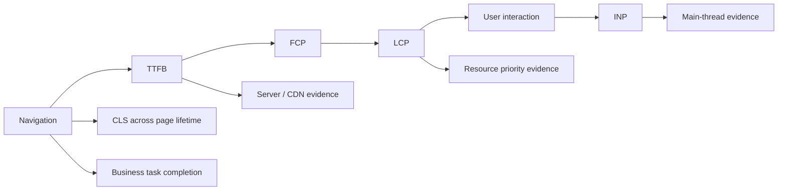

# Web 性能工程

选一条具体路径：用户打开文章列表，看到主标题，再点击筛选并得到结果。先在固定设备和网络条件下录制一次 trace，同时记录 LCP、INP、CLS 和资源瀑布；然后只修改一处资源优先级，再用相同条件复测。

本篇用这条路径建立性能排查顺序：先定义用户完成点，再用 RUM 找范围、用 Lab 复现、用 Trace 验证瓶颈，最后设置回归预算。示例数字只用于演示记录格式，不代表真实线上指标。

## 指标映射到用户体验



Core Web Vitals 使用 LCP、INP 和 CLS，但工程仍需结合 TTFB、FCP、资源时间、Long Task、错误率和业务可用时间。

| 指标 | 回答的问题 | 常见误读 |
| --- | --- | --- |
| TTFB | 导航到首字节经历多久 | 只归因服务器，忽略 DNS/TLS/CDN/队列 |
| LCP | 主要内容何时绘制 | 把 Skeleton 或 Cookie 弹窗当真正内容 |
| INP | 交互到下一次绘制的长尾延迟 | 只优化 handler，不看渲染与布局 |
| CLS | 生命周期内意外布局移动 | 只测首屏，不测加载后广告/字体/交互 |
| Long Animation Frame | 哪一帧脚本/渲染阻塞 | 看到长任务就盲目切 `setTimeout` |
| 业务任务时间 | 用户何时真正完成目标 | 页面可见不等于功能可用 |

公开阈值适合基线判断，内部预算还应按页面和受众设定。例如内容阅读页强调 LCP/CLS，复杂编辑器更关注 INP、内存和长会话稳定性。至少看 P75，并按设备、网络、国家/地区、页面模板、Release 和登录状态分组；分组不能包含可识别隐私。

## 实验室、真实用户与追踪各有职责

**Lab** 提供可重复环境，适合比较变更和保存 trace；它无法覆盖真实设备、扩展、缓存和用户行为。

**RUM** 来自真实访问，适合看分布、长尾和版本回归；它受采样、页面生命周期和设备差异影响，不能单凭相关性定位根因。

**Trace/Profiler** 展示具体一次加载或交互中网络、脚本、样式、布局、绘制的时间线，用于验证假设。

典型闭环是：RUM 发现某页面 Android P75 INP 回归，按 Release 和交互类型缩小范围；在代表设备复现并录 Performance trace；定位某点击触发同步过滤和大列表布局；优化索引与虚拟化；用同场景 Lab 比较，再观察新 Release RUM 是否收敛。

## LCP 从发现时间开始拆解

LCP 可粗分为 TTFB、资源加载延迟、资源下载时间、元素渲染延迟。不同分量对应不同修复：

- TTFB 高：查 CDN miss、服务端 waterfall、数据库、冷启动与队列；
- 资源发现晚：LCP 图片由客户端 JS/深层 CSS 才发现，或错误懒加载；
- 下载慢：资源过大、源站/CDN、优先级竞争；
- 下载后迟迟不显示：主线程阻塞、CSS、字体、动画或 hydration。

```html
<picture>
  <source
    type="image/avif"
    srcset="/media/hero-640.avif 640w, /media/hero-1280.avif 1280w"
  >
  
</picture>
```

只有确认它是首屏 LCP 候选时才设高优先级，不要让多张图都 `fetchpriority=high`。首屏图不应 lazy；折叠下图片使用原生 lazy 并提供尺寸。AVIF/WebP 的收益取决于图像与编码质量，CDN 转码应避免缓存 key 漏格式/宽度。

`preload` 是强提示，会抢占带宽。仅预加载浏览器无法及时发现且确实关键的字体、图像或模块，并确保 `as/type/crossorigin` 与实际请求一致，否则会重复下载或浪费。

## 关键渲染路径不是“所有 CSS 内联”

浏览器解析 HTML，发现 CSS、脚本和图片，构建 DOM/CSSOM，计算样式、布局、绘制和合成。样式表通常阻塞首次渲染以避免无样式内容，但全量内联会使 HTML 失去独立缓存并增大 TTFB。关键 CSS 应基于页面模板抽取、设置体积预算，非关键 CSS 仍需可靠加载和无闪烁验证。

早期通过 `media=print` + onload 异步样式的技巧增加 CSP、无脚本和闪烁复杂度，现代项目优先使用构建器代码分割、合理路由样式和真实优先级证据。不要因为旧文章列出某技巧就默认采用。

字体优化包括 WOFF2、必要字重、子集、`font-display` 和后备字体度量。仅设置 `swap` 可能减少不可见文本，却因度量差异增加 CLS。使用 `size-adjust` 等字体度量覆盖或选择接近后备字体，并验证中文子集覆盖，不要生成大量按字符请求。

## JavaScript 成本不只有下载

JavaScript 还要解析、编译、执行，并可能触发样式与布局。低端 CPU 上的执行成本往往比网络体积更突出。优化顺序：

1. 删除无业务价值和重复能力；
2. 只在需要页面加载重型功能；
3. 减少初始化和 hydration 范围；
4. 拆分长任务，优先调度用户输入；
5. 对 CPU 密集且可序列化工作使用 Worker；
6. 最后再做局部 memo 与微优化。

```ts
function processInChunks<T>(
  items: readonly T[],
  consume: (item: T) => void,
  signal: AbortSignal
): Promise<void> {
  return new Promise((resolve, reject) => {
    let index = 0

    function runChunk(): void {
      if (signal.aborted) return reject(signal.reason)
      const deadline = performance.now() + 8
      while (index < items.length && performance.now() < deadline) {
        consume(items[index]!)
        index += 1
      }
      if (index < items.length) setTimeout(runChunk, 0)
      else resolve()
    }

    runChunk()
  })
}
```

分片改善可响应性但增加总调度成本，不适用于要求原子完成的计算。`requestIdleCallback` 支持与触发不稳定，不适合作为关键任务保证；`scheduler.yield/postTask` 等能力要按兼容性渐进增强。昂贵的哈希、解析、图布局可放 Worker，并使用 transferable 降低复制成本。

## INP 包含输入延迟、处理和呈现延迟

一次交互慢可能在 handler 开始前主线程已被第三方脚本占用；handler 自身做大量同步工作；或者更新后 React/Vue 渲染、样式和布局很重。Performance trace 中分别看 input delay、processing duration 和 presentation delay，不能只给 click 函数加防抖。

防抖会延迟工作，适合搜索建议等只关心最后值的场景；节流限制频率，适合连续事件的采样。它们不减少单次工作成本，也不适用于每个输入都必须立即反馈的控件。输入框值即时更新，昂贵结果可用 Transition、异步索引或 Worker 延后。

读写布局交错会强制同步 layout：循环中读取 `offsetWidth` 再写 style，浏览器反复刷新。批量读、计算、再写，并减少 DOM 数量。虚拟列表还要处理动态高度、焦点、键盘、读屏与滚动锚定，仅渲染可见行并不完整。

## CLS 来自空间不确定

图片、视频、广告、嵌入、异步提示和字体都应预留稳定空间。宽高属性通过 aspect ratio 让浏览器在资源到达前计算占位；响应式 CSS 可以改变显示尺寸但保留比例。

不要在现有内容上方无提示插入 Banner。必须出现的状态变化可预留区域，或由用户操作触发（用户预期的移动不一定计入 CLS，但仍需体验合理）。骨架屏尺寸应接近最终内容；不准确的骨架只把一次白屏换成多次布局跳动。

动画优先 transform/opacity 是经验而非绝对。它们常可在合成阶段处理，但大图层、滤镜和过多层会占 GPU 内存。`will-change` 只在短期、确定元素使用，动画结束后移除；全局添加会恶化资源。

## 网络优化从连接和缓存证据出发

HTTP/2/3 多路复用改变了 HTTP/1.1 域名分片和雪碧图的部分取舍。把资源拆到多个 CDN 域名会增加 DNS、TCP/QUIC、TLS 和凭证管理，且失去连接复用。先减少第三方 Origin、使用 `preconnect` 只连接关键且必用域名。

HTTP/2 Server Push 已不再是主流浏览器优化路径，不应作为现代方案。使用正确缓存、`preload/modulepreload`、103 Early Hints（平台支持时）和服务器优先级，并通过 waterfall 验证。

缓存按内容身份设计：哈希资产长缓存 immutable；HTML 短缓存/验证；公开 API 根据新鲜度；私有数据不进入共享缓存。Service Worker 增加离线能力但也增加版本和用户隔离风险，不是通用“二次缓存加速”。

## 第三方脚本是独立预算

分析、客服、广告和 A/B SDK 常在主线程初始化、注入 iframe、访问 DOM 和发起网络。`async/defer` 只改变加载/执行时机，脚本执行仍有成本。建立第三方登记：所有者、用途、数据字段、加载页面、触发时机、性能预算、隐私评审和故障开关。

对非关键脚本在同意和用户需要后加载；为失败和超时降级，不能让营销脚本阻塞购买或登录。监控第三方长任务、请求量和错误，定期删除无调用 SDK。Web Worker 隔离第三方需要兼容层和权限评估，不是透明搬迁。

## RUM 采集要可靠且克制

```ts
interface PerformanceEvent {
  name: 'LCP' | 'INP' | 'CLS'
  value: number
  rating: 'good' | 'needs-improvement' | 'poor'
  navigationType: string
  routeTemplate: string
  release: string
}

function reportMetric(event: PerformanceEvent): void {
  queue.enqueue(event)
  if (queue.size >= 20) queue.flush({ reason: 'batch-full' })
}
```

不能只在 `beforeunload` 上报：移动浏览器可能直接终止进程，事件也不保证执行。指标产生时先进入有界队列，按批次、可见性变化、pagehide 和周期发送；`sendBeacon` 或 fetch keepalive 仍有大小和可靠性限制。重要业务状态应服务端持久化，RUM 可采样且允许部分丢失。

URL 使用路由模板，去除查询、片段和动态 ID；不采集输入、DOM 正文、Cookie、Token。采样在会话内稳定，避免同一用户指标忽有忽无；错误/慢样本可提高采样但要控制偏差。

## 性能预算与 CI

预算既要防止制品回归，也要防止用户路径回归：

| 门禁 | 示例 | 局限 |
| --- | --- | --- |
| 入口 JS/CSS | 压缩后体积上限与增量阈值 | 不代表执行成本 |
| Lighthouse | 固定设备/网络多次取中位数 | 模拟环境，不代替 RUM |
| Bundle 依赖 | 禁止重型包进入公共入口 | 需要维护 allowlist |
| 浏览器 trace | 关键交互无超预算长任务 | 自动化稳定性要求高 |
| RUM Release compare | 新旧版本同分群 P75 | 需要样本量与灰度窗口 |

性能数字会波动，CI 不应一次低分就盲目失败。固定环境、预热、运行多次、保留原始报告，使用回归阈值与趋势。严重制品超标可硬失败，Lighthouse 小波动可告警并要求证据。

## 验证

代表性验收应覆盖：

1. 375/768/1024/1440 视口，低端移动模拟与真实设备；
2. 无缓存、热缓存、慢 4G、高延迟和离线恢复；
3. 首次访问、返回访问、路由切换和长会话；
4. 首页 LCP、搜索/编辑等关键 INP、异步内容 CLS；
5. 第三方成功、超时和被拦截；
6. 新旧 Release 对比，保留 trace、waterfall 和制品 Manifest。

故障演练包括：让 LCP 图延迟、让 API 慢、注入 200ms Long Task、字体 404、第三方脚本超时、动态 Chunk 404。页面需要有稳定占位、可取消加载、错误恢复且指标能定位阶段。

优化后做反证：移除资源尺寸应使 CLS 测试失败；让公共入口重新导入重型编辑器应触发预算；恢复 HTTP/2 Push 或全局 `will-change` 不应被文档/门禁当作推荐。

## 常见误区

- **技巧越多越快**：每个预加载、缓存和拆分都有资源竞争与一致性成本。
- **Lighthouse 100 等于真实用户快**：Lab 是可重复样本，RUM 才能看真实分布。
- **图片全部 lazy**：首屏 LCP 图片 lazy 会延迟发现。
- **防抖能修复 INP**：它只改变调用频率/时机，不减少单次主线程工作。
- **transform 一定不重排**：它常更合成友好，但大图层和后续布局仍需 trace。
- **HTTP/2 下请求数量完全无关**：调度、Header、依赖深度、服务器和执行仍有成本。
- **Server Push 是主要优化**：浏览器生态已基本放弃，把它保留为历史背景。
- **beforeunload 能保证监控上报**：页面可能没有卸载事件，Beacon 也不是事务通道。

## 建立一份页面性能改进单

选择一个真实用户路径，记录页面、设备、网络、构建版本和时间窗口。先用 RUM 确认影响范围，再用实验室工具定位 LCP 元素、Long Task、布局移动源和网络瀑布。每条改动绑定一个主要指标和保护指标。

| 观察 | 假设 | 修改 | 验证 |
| --- | --- | --- | --- |
| LCP 主图发现晚 | 图片由脚本插入 | 在 HTML 声明并设尺寸/优先级 | 同环境瀑布 + RUM LCP |
| INP 处理阶段长 | 输入时同步过滤大列表 | 减少计算、分片或 Worker | 交互分解 + 功能回归 |
| CLS 来自推荐位 | 异步内容无预留空间 | 设稳定尺寸约束 | 移动源与视觉回归 |
| 第三方阻塞主线程 | 首屏加载全部脚本 | 延迟非必要脚本 | 转化保护 + Long Task |

优化前保存基线，修改后使用相同条件复测，再等待足够真实用户样本。Lighthouse 分数适合发现线索，不等于全部用户表现。性能预算可以约束入口 JavaScript、关键图片和核心指标，但失败信息要指向具体资源和责任人。

最后检查功能、可访问性、SEO 和监控是否退化。删除脚本让页面“变快”却失去主要转化，或通过隐藏首屏内容降低指标，都不算有效优化。性能工程的产物是一条可以复现的证据链，而不是一组没有环境说明的截图。

## 源码与规范

- [Web Vitals](https://web.dev/articles/vitals)：LCP、INP、CLS 的定义、阈值与测量入口。
- [Navigation Timing Level 2](https://www.w3.org/TR/navigation-timing-2/)：导航阶段时间戳和资源时序。
- [Long Tasks API](https://w3c.github.io/longtasks/)：主线程长任务观测模型。
- 个人实验材料已匿名化；本文只抽取通用机制，不建立项目映射。
