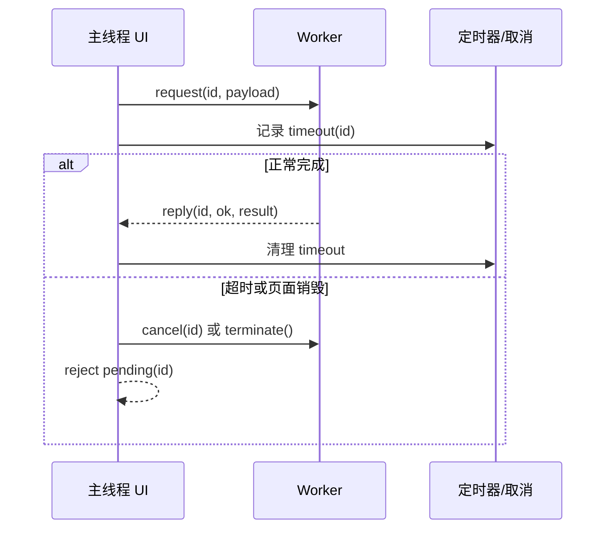

# Web Worker、消息传递与主线程预算

Web Worker 是浏览器提供的后台 JavaScript 执行环境。Dedicated Worker 由一个页面创建，拥有独立的全局对象和事件循环，通过消息与主线程交换数据。它位于页面交互与 CPU 密集计算之间，用来减少长任务对输入和渲染的阻塞；它不能直接访问 DOM，传输数据也有序列化、复制或所有权转移成本。

解析几十 MB 数据让输入停顿时，把同一函数放进 Promise 不会离开主线程。Worker 才能把计算移到另一条线程，但“移走计算”不保证总耗时下降，是否值得迁移要用主线程响应和端到端耗时一起判断。



读图时先看 `id` 的所有权：主线程保存 Promise 和超时，Worker 只处理数据并回传结果。这样排障时能区分计算失败、消息丢失、Worker 崩溃和页面主动终止。

## 隔离边界

主线程创建 Worker，通过 postMessage 发送结构化可克隆值。Worker 通过 onmessage 接收，计算后回复。函数、DOM 节点和多数平台句柄不能克隆。大 ArrayBuffer 可放 transfer list 转移所有权，避免复制；发送方 buffer 随后 detached，不能继续使用。

```ts
type WorkerRequest = { id: string; kind: 'sum'; values: Float64Array }
type WorkerReply = { id: string; ok: true; total: number } | { id: string; ok: false; error: string }

self.onmessage = (event: MessageEvent<WorkerRequest>) => {
  const request = event.data
  try {
    let total = 0
    for (const value of request.values) total += value
    self.postMessage({ id: request.id, ok: true, total } satisfies WorkerReply)
  } catch (error) {
    self.postMessage({ id: request.id, ok: false, error: String(error) } satisfies WorkerReply)
  }
}
```

Worker 收到带 id 的数组后在独立线程累加，并输出同 id 的成功或失败联合，主线程可据此完成对应 Promise。异常被序列化为受控文本；实际协议还要限制数组大小、处理超时和取消。若使用 Transferable，发送方在调用后不能继续读取已转移 buffer。

协议用 id 关联并发请求，用可辨识联合表达成功失败。生产协议还需版本、取消、超时和输入上限。不能把 Error 对象细节或敏感数据无选择发送。

只有 Worker 端代码还无法完成调用。主线程需要保存每个请求的 Promise 所有者，并在 Worker 崩溃、超时或页面销毁时统一收尾：

```ts
type Pending = {
  resolve: (value: number) => void
  reject: (reason: Error) => void
  timer: number
}

export function createSumWorker() {
  const worker = new Worker(new URL('./sum.worker.ts', import.meta.url), {
    type: 'module'
  })
  const pending = new Map<string, Pending>()
  let closed = false

  worker.onmessage = (message: MessageEvent<WorkerReply>) => {
    const task = pending.get(message.data.id)
    if (!task) return
    clearTimeout(task.timer)
    pending.delete(message.data.id)
    if (message.data.ok) task.resolve(message.data.total)
    else task.reject(new Error(message.data.error))
  }

  worker.onerror = () => {
    closed = true
    for (const task of pending.values()) {
      clearTimeout(task.timer)
      task.reject(new Error('worker_crashed'))
    }
    pending.clear()
  }

  return {
    sum(values: Float64Array, timeoutMs = 5_000): Promise<number> {
      if (closed) return Promise.reject(new Error('worker_unavailable'))
      const id = crypto.randomUUID()
      return new Promise((resolve, reject) => {
        const timer = window.setTimeout(() => {
          pending.delete(id)
          reject(new Error('worker_timeout'))
        }, timeoutMs)
        pending.set(id, { resolve, reject, timer })
        worker.postMessage({ id, kind: 'sum', values } satisfies WorkerRequest)
      })
    },
    dispose() {
      closed = true
      worker.terminate()
      for (const task of pending.values()) {
        clearTimeout(task.timer)
        task.reject(new Error('worker_disposed'))
      }
      pending.clear()
    }
  }
}
```

这份适配器解决请求关联和统一终止，Worker 崩溃后也会拒绝新任务；它还没有实现自动重建和单任务取消。若一个 Worker 同时承载多个长任务，应增加 `cancel(id)` 消息，并把计算切成可检查取消标记的小块；若每个页面只有一个独占任务，直接 `terminate()` 更可靠。

## 什么时候值得迁移

适合可独立的 CPU 密集任务：解析、压缩、图像处理、搜索索引。很短任务的 Worker 启动与消息成本可能更大；大量细碎消息会造成复制和调度开销。DOM 测量仍在主线程，Worker 只能计算数据结果。

SharedWorker 可在同源多个页面共享进程和连接，但生命周期、兼容与调试更复杂；Service Worker 负责网络代理和离线生命周期，不是通用长计算线程。

## 取消和容错

终止整个 Worker 最直接，但会取消所有任务。共享 Worker 内可发送 cancel(id)，计算循环定期检查取消集合；单个巨大同步循环不检查就无法及时响应取消。异常监听、超时和页面卸载都要清理 pending Promise。

## 对照实验

固定数组和设备，记录主线程版本的 Long Task、INP 代理交互和总耗时；Worker 版本记录序列化、计算和回传。预期主线程响应改善，总耗时可能因传输增加。若数据可转移，比较 clone 与 transfer。

Promise 只安排异步控制流，Worker 才提供另一条线程。迁移评审还要同时说明 DOM 限制、结构化克隆、Transferable、取消和启动成本。

## 消息协议和所有权

Worker 与主线程没有共享普通对象堆，`postMessage` 默认经过 structured clone。为每个任务定义 `{id,type,payload}` 与 `{id,status,result|error}`，主线程用 Map 保存 pending Promise；收到结果后删除，Worker crash/terminate 时统一拒绝所有 pending，避免永久等待。

ArrayBuffer 可放入 transfer list，把底层所有权转给接收方，源端 buffer 会 detached；SharedArrayBuffer 则允许共享内存，需要 cross-origin isolation，并用 Atomics 建立同步，错误锁和忙等会带来新的并发问题。普通 UI 计算优先消息传递，只有明确性能证据才使用共享内存。

```text
main: pending.set(id) -> postMessage(task, transfer)
worker: validate -> compute chunks -> postMessage(result)
main: match id -> commit only if request generation current
cancel: postMessage(cancel id) or terminate dedicated worker
```

Worker 不能直接操作 DOM，OffscreenCanvas、WebCodecs 等能力还要按浏览器支持判断。打包器处理 `new Worker(new URL('./worker.ts', import.meta.url), {type:'module'})` 时会生成独立 Chunk，部署需保证 CSP、MIME、跨域和旧 Chunk 保留。

## 官方依据

- [HTML Web Workers](https://html.spec.whatwg.org/multipage/workers.html)
- [Structured Clone Algorithm](https://developer.mozilla.org/en-US/docs/Web/API/Web_Workers_API/Structured_clone_algorithm)
- [MDN: Transferable objects](https://developer.mozilla.org/en-US/docs/Web/API/Web_Workers_API/Transferable_objects)

## 迁移复核：Web Worker、消息传递与主线程预算
把这套机制迁移到真实前端时，先确认它运行在哪一层：浏览器解析与调度、框架渲染、构建工具、网络协议或应用状态。相邻层可以互相影响，却不能用框架术语替代浏览器事实，也不能用一次视觉正确推断生命周期和资源已经正确释放。

验证同时覆盖首次加载、更新、卸载或离开页面、错误恢复和低性能设备。交互组件保留键盘路径、焦点、可访问名称与响应式边界；异步逻辑检查取消、竞态和迟到结果；构建结果检查产物图、缓存和 Source Map。

性能优化先用 Performance、Network、Memory 或框架 Profiler 找到时间和资源归属，再改变代码。示例中的阈值、设备与数据规模只用于解释机制，项目结论需要在目标浏览器和真实产物上复测。
