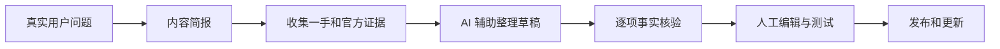

# 怎样用 AI 辅助内容而不制造垃圾

AI 草稿声称“使用 SSE 就能保证断线后不丢数据”，语句通顺、结构完整，却没有说明事件存在哪里、保留多久、客户端怎样告诉服务端最后序号。问题不在文字像不像人写，而在结论没有证据和条件。

本篇建立一条 AI 辅助内容流程。AI 可以整理材料、提出问题和改进表达，作者仍要为选题、事实、经验、验证和发布负责。

## 先理解内容质量来自哪里

高质量内容要解决一个真实任务，并提供读者能核对或应用的独有信息。它可能来自官方规范、真实实验、代码行为、专家判断、数据或工具。把多个公开页面换句话说，通常不会自动产生新价值。

GEO 常被用来描述面向生成式搜索的内容优化。可执行的核心仍是让实体、结论、来源、适用条件和作者责任更清晰。没有方法能保证某个生成式系统一定引用页面。

## 第一步：先写内容简报

简报至少回答：读者是谁、遇到什么问题、读完能完成什么、需要哪些前置知识、有哪些可信来源、必须展示哪个正常和失败结果、与站内已有页面怎样区分。

如果这些问题没有答案，直接让 AI “写一篇 SEO 长文”通常只会得到结构完整的泛化内容。

## 第二步：为重要结论建立证据

可以用一张内部表记录：

| 结论 | 来源 | 适用条件 | 验证方式 | 公开表达 |
| --- | --- | --- | --- | --- |
| SSE 可用事件 ID 恢复 | WHATWG 规范、服务实现 | 服务端保留事件 | 断线重连测试 | 说明保留窗口与失败状态 |
| 某框架支持恢复 | 官方文档、当前版本代码 | 启用持久化配置 | 对应测试 | 不写成所有场景默认能力 |

只有设计文档支持的内容写成目标或建议，不写成已经上线。没有真实数据时，不编造“提升 40%”一类数字；需要演示计算时，明确标为模拟场景。

## 第三步：让 AI 做适合的工作

AI 适合把访谈整理成问题、比较多个官方来源的术语、发现段落跳跃、生成测试用例候选和改进可读性。它也可以帮助检查重复与遗漏。

AI 不应独自决定事实真假、伪造实践经历、生成不存在的引用，或在没有源码证据时描述系统能力。涉及安全、医疗、法律和财务等高责任主题，需要相应专业审核。

## 第四步：发布前做人工验证

1. 从标题开始逐项核对承诺是否兑现；
2. 打开每条重要来源，确认版本和上下文；
3. 运行代码或操作步骤，保留正常与失败结果；
4. 搜索站内是否已有相同意图页面；
5. 删除无独特信息的总结、口号和凑字段落；
6. 记录负责人、更新时间和以后需要复查的触发条件。

语法正确不代表代码可运行，链接存在也不代表支持正文结论。审核要沿着结论回到证据。

## 正常使用和失败使用

正常做法是：作者先准备真实代码与测试，AI 帮助把执行链拆成初学者步骤；作者随后运行示例、核对官方文档并改正措辞。

失败做法是：批量给城市、框架或产品名换词，生成成百上千个结构相同页面，再用字数和关键词密度当质量指标。这类页面没有独立任务和维护责任。

## 内容发布后仍要维护

框架版本、产品功能、价格和政策会变化。给文章设置复查触发器，例如依赖大版本升级、链接失效、读者报告步骤失败或搜索意图明显改变。更新日期应对应实质内容变化，不为制造“新鲜感”机械刷新。

下一篇处理图片、视频和专题页，让非文本内容也可理解、可加载和可维护。

## 参考资料

- [Google Search Central：Guidance about AI-generated content](https://developers.google.com/search/docs/fundamentals/using-gen-ai-content)
- [Google Search Central：Creating helpful content](https://developers.google.com/search/docs/fundamentals/creating-helpful-content)
- [Bing Webmaster Guidelines](https://www.bing.com/webmasters/help/webmaster-guidelines-30fba23a)
