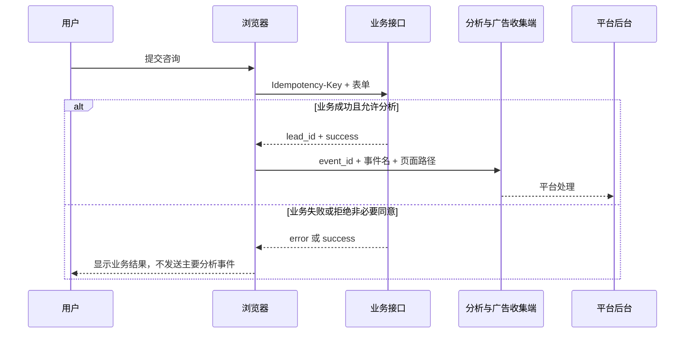

# 分析追踪的五层证据与跨域归因

分析追踪把一次页面访问和后续业务结果连接起来。它需要回答的不是“页面有没有统计代码”，而是某个动作在什么条件下产生事件，请求是否发出，平台是否接收，最终是否对应有效线索、订单、退款或毛利。

这条链路包含浏览器、标签管理器、同意管理、分析平台、广告平台和业务系统。任一层都可能缺失或重复。诊断时必须保留层级，看到源码里的 GA4 ID 只能确认标签存在，不能直接写成“GA4 正常”或“转化已记录”。

## 五层证据分别证明什么

| 层级 | 可以直接观察的证据 | 仍然不能证明 |
| --- | --- | --- |
| 标签存在 | HTML、脚本或容器配置中出现 GA4、GTM、Ads、UET、Clarity | 代码已经执行 |
| 浏览器初始化 | `dataLayer`、`gtag config`、`uetq` 或 SDK 初始化 | 收集请求已经成功发出 |
| 浏览器请求 | Network 中出现目标收集域名、状态与时序 | 平台已经接收、处理并入账 |
| 平台接收 | DebugView、转化诊断或导出报表出现记录 | 线索或订单真实有效 |
| 后端有效业务 | CRM、订单、退款、毛利和幂等记录 | 所有触点都被完整归因 |

前一层是后一层的必要条件之一，却不能代替后一层。广告拦截可能让标签存在但没有请求，代理或同意状态可能让初始化后不发送，平台过滤和配置可能让请求没有进入预期数据流，业务系统还会淘汰重复、测试和无效提交。

未运行现场测试时，状态应显示“尚未测试”。这属于检测边界，不是问题。网站没有投放 Google Ads 或 Microsoft Ads 时，缺少 Ads、UET 也不构成故障；如果业务准备投放，它们才成为带前提的建设机会。

## GA4、GTM、Ads、UET 与 Clarity 的职责

GTM 是标签容器和触发编排工具，不是分析数据库。GA4 记录网站和应用事件；Google Ads 与 Microsoft Advertising UET 服务于广告归因、转化和受众；Clarity 侧重会话与交互观察。发现百度统计或 Clarity，只能确认这些工具自己的信号，不能推断 GA4、Ads 或 UET 已安装。

| 组件 | 常见职责 | 验收位置 |
| --- | --- | --- |
| GTM | 加载标签、管理触发器和变量 | 容器版本、Preview、浏览器请求 |
| GA4 | 页面、事件、会话和关键事件 | DebugView、实时报告、数据导出 |
| Google Ads | 广告点击与转化目标 | 转化诊断、广告报表、离线回传 |
| UET | Microsoft Ads 事件与转化 | UET Tag Helper、平台目标与报表 |
| Clarity | 会话与交互观察 | 项目后台和收集请求 |
| CMP / Consent | 获取和传递用户选择 | 默认状态、更新时序、接受与拒绝路径 |

同一工具可以硬编码安装，也可以由 GTM 加载。两种来源同时存在时容易重复发送，验收需要记录每个标签的安装来源和触发条件，而不是只数页面中出现了几个 ID。

## 一次业务转化怎样穿过各层

以提交咨询为例，浏览器负责收集输入并调用业务接口，后端验证和创建唯一线索。只有接口成功、用户同意允许分析且该动作没有重复发送时，前端才发主要转化事件。平台随后接收事件，业务系统继续记录审核、成交与退款。



事件代码要挂在业务成功回调，而不是按钮点击。下面的 TypeScript 只展示字段关系，`submitLead`、`hasAnalyticsConsent` 和各平台适配器需要替换成项目真实实现：

```typescript
type TrackingResult = {
  eventId: string
  businessId: string
}

async function submitAndTrack(form: FormData): Promise<TrackingResult> {
  const eventId = crypto.randomUUID()
  const response = await fetch('/api/leads', {
    method: 'POST',
    headers: { 'Idempotency-Key': eventId },
    body: form
  })

  if (!response.ok) {
    // 业务失败是错误路径，不能发送主要转化。
    throw new Error(`lead request failed: ${response.status}`)
  }

  const result = await response.json() as { lead_id: string }
  if (window.hasAnalyticsConsent === true) {
    // 两个平台复用同一事件 ID，真实值不写入普通调试日志。
    window.dataLayer?.push({
      event: 'generate_lead',
      event_id: eventId,
      lead_id: result.lead_id,
      page_path: location.pathname
    })
    window.uetq?.push('event', 'generate_lead', { event_id: eventId })
  }

  return { eventId, businessId: result.lead_id }
}
```

这里不向分析层发送姓名、邮箱或电话。`event_id` 用于幂等与平台支持范围内的去重，`lead_id` 用于站内业务核对。后端必须验证请求、持久化幂等键，并在相同键重复提交时返回同一业务结果，否则前端去重无法阻止业务库产生两条线索。

## Consent 的状态必须早于非必要标签

同意管理不是页面上出现一个弹窗或 `consent` 字符串。默认状态要在非必要分析与广告标签初始化前设置，用户选择后再更新；拒绝时，业务表单仍应按合法目的工作，非必要收集停止。

```html
<script>
window.dataLayer = window.dataLayer || [];
function gtag(){ dataLayer.push(arguments); }

gtag('consent', 'default', {
  analytics_storage: 'denied',
  ad_storage: 'denied',
  ad_user_data: 'denied',
  ad_personalization: 'denied'
});

function applyConsent(choice) {
  gtag('consent', 'update', {
    analytics_storage: choice.analytics ? 'granted' : 'denied',
    ad_storage: choice.ads ? 'granted' : 'denied',
    ad_user_data: choice.ads ? 'granted' : 'denied',
    ad_personalization: choice.personalization ? 'granted' : 'denied'
  });
}
</script>
```

这段代码是时序示例，不是法律意见。目标市场、数据用途、CMP 文案和保留期限需要单独确认。Google 的[Consent Mode 文档](https://developers.google.com/tag-platform/security/guides/consent)会随平台能力更新，实现前应核对当前字段与适用地区。

## 单页应用和跨域怎样保持归因关系

单页应用切换路由时，浏览器不会重新加载整份文档。若框架没有自动发送页面浏览，需要在路由确认完成后发送一次；若 GTM 历史触发器和应用代码同时发送，就会重复。验收应逐次记录路由、事件 ID、请求时间和发送来源。

跨域流程常见于营销站跳到独立注册域名或支付域名。需要先确认这些域名属于同一业务旅程，再配置受控的跨域链接与会话连接。URL 对齐时可以移除 fragment、`gclid`、`msclkid` 和 UTM 等追踪参数，但要保留 `/en-us/` 这类语言目录，不能把不同语言页面合并成一个路径。

跨系统关联优先级可以分为三层：点击 ID 精确匹配属于高置信度；唯一 UTM 系列和日期映射属于中置信度；只有系列与日期聚合属于低置信度。邮箱、电话、姓名、地址、客户 ID 和浏览器指纹不能用来强行补齐公开分析数据。

不同平台的数据对账还要统一时区、货币、归因窗口和成熟周期。货币不同且没有明确换算口径时，应停止金额对比；存在成交延迟时，最近周期只能标记未成熟，不能立即判断有效 CPA 或 ROAS 变差。

## 追踪测试覆盖正常路径和失败路径

一次完整测试至少覆盖这些状态：

| 场景 | 浏览器期望 | 业务期望 | 平台期望 |
| --- | --- | --- | --- |
| 页面直接访问 | 按同意状态发送或不发送页面事件 | 不创建业务记录 | 请求出现不等于后台已接收 |
| 表单成功 | 业务成功后最多发送一次主要事件 | 只有一条幂等记录 | 在 DebugView 或转化诊断复核 |
| 表单失败 | 不发送主要转化 | 无成功线索 | 不应出现成功转化 |
| 重复提交 | 同一事件不重复计数 | 相同幂等键返回同一结果 | 检查平台去重支持与报表 |
| 拒绝非必要同意 | 不发送非必要分析或广告事件 | 核心业务仍可完成 | 无请求不能写成平台故障 |
| 跨域完成 | 会话和允许的归因键按配置传递 | 业务结果保留来源 | 在各平台按成熟周期核对 |

浏览器测试可以观察标签、初始化和请求。平台接收必须到 GA4 DebugView、Google Ads 转化诊断或 Microsoft Ads 后台确认，后端有效性则看去重后的业务记录、审核状态、退款与毛利。任何一层没有权限或数据时，都要明确写出缺口。

## 结论按证据强度分组

追踪报告适合固定分为已确认正常、已确认问题、优化机会和检测边界。成功路径观察到一次请求，可以写“浏览器请求已发出”；失败路径仍发送主要事件，才是直接证据支持的问题。缺少 GA4 但没有分析目标时属于不适用，确认要衡量海外自然或广告效果后才是机会。

代码修复的直接结果是事件在正确条件下发送一次，失败和拒绝路径不发送。可能效果是分析与自动出价更接近真实业务。它不能保证平台后台一定接收、线索一定有效、归因完整或收入增长，这些结果需要各自的数据层验证。

## 证据复核：分析追踪的五层证据与跨域归因
SEO 结论要放回“需求、抓取、渲染、索引、排名、点击、转化”这条漏斗定位。页面源代码、渲染 DOM、响应头、搜索平台、分析数据和业务结果各自只能证明一段事实，不能用单页审计分数推断收录、排名或收入。

执行前固定页面类型、目标查询、地区语言、Canonical、观察窗口和成功指标。修复后使用同一 URL 集、同一设备条件与同一数据口径复验，并保留发布日期、抓取状态、展示点击、转化延迟和回滚方案。无法取得的数据明确标为检测边界。

SEM 与自然搜索共享意图和落地页证据，预算、匹配方式和归因仍有独立语义。广告短期结果可以帮助发现搜索词和页面问题，不能直接替代 SEO 长周期判断；自动建议先进入候选列表，再由人工核对业务边界。
