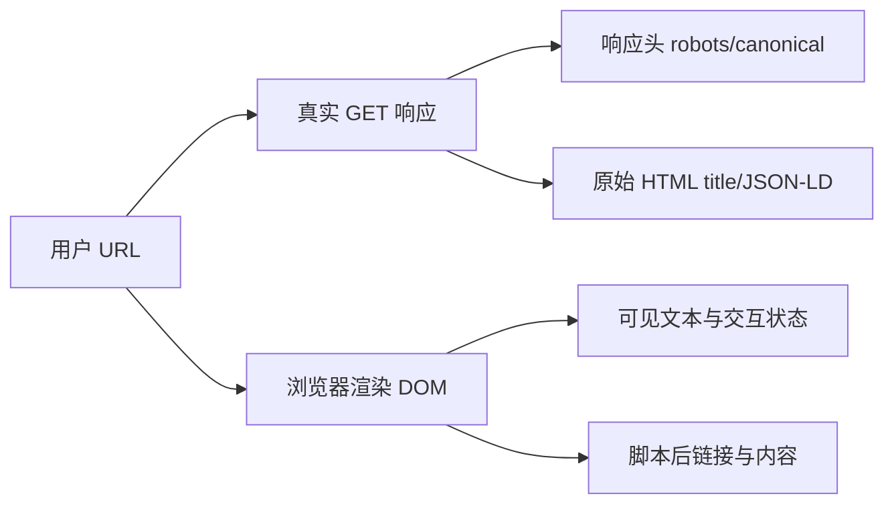

# 使用页面快照和原始 HTML 完成 SEO 审计

一个页面检查工具显示“标题缺失”，但浏览器标签页明明有标题；另一个工具显示结构化数据存在，搜索平台却没有使用。原因通常是检查对象不同：原始 HTML、渲染后的 DOM、网络响应、页面可见内容和工具规则不是同一份证据。

本章设计一条浏览器侧审计流程。它从单页开始，记录快照，再扩展到多页抽样、模板差异、近重复和内链机会。规则分数只用于排序，不能被当成搜索引擎排名分数。

## 先区分五类观察对象



原始 HTML 能证明服务端返回了什么；渲染 DOM 能证明脚本运行后的页面状态；它们不能互相替代。审计结果要标记采集时刻、页面 URL、最终 URL、状态码、是否执行脚本和视口。

## 第一步：建立单页快照

快照至少保存这些字段：

| 字段 | 证据用途 |
| --- | --- |
| 请求 URL/最终 URL | 识别跳转、规范地址与页面版本 |
| 状态码、响应时间、Content-Type | 判断可访问性和资源类型 |
| 原始 title、description、canonical、robots | 检查服务端模板 |
| 原始 HTML 中 H1、正文、链接 | 检查脚本依赖和首屏语义 |
| 渲染 DOM 的对应字段 | 比较客户端补充或修改 |
| 可见文本长度与主要标题 | 判断用户看到的内容 |
| JSON-LD 原文与解析结果 | 检查语法和可见事实一致性 |
| 资源、图片尺寸与加载状态 | 排查性能和布局问题 |

不要把完整 Cookie、表单、用户文档和内部请求参数写入快照。URL 查询参数按敏感策略脱敏，截图放在临时目录，验收后删除。

## 第二步：原始 HTML 与渲染 DOM 对照

故意对一个客户端渲染标题做对照：若原始响应只有空的 `<div id=app>`，渲染 DOM 才出现 H1，搜索引擎是否能稳定执行脚本就成为抓取风险，而不是“标题标签有没有”这么简单。

比较时记录差异类型：

- 原始没有、渲染出现：客户端注入内容或链接。
- 原始有、渲染删除：脚本条件、权限或错误覆盖。
- 两者都有但值不同：模板与客户端状态冲突。
- 两者都没有：缺失或选择器没有命中。

审计建议使用浏览器获取真实 DOM，同时用 fetch 保存原始 GET。不要用 `document.title` 代替网络响应，也不要只看开发工具 Elements 面板。

## 第三步：把规则变成证据，而不是分数

规则输出应包含：规则 ID、对象、观察值、证据来源、严重程度、置信度、修复建议、适用条件和复查方法。

示例：

| 发现 | 证据 | 置信度 | 动作 |
| --- | --- | --- | --- |
| canonical 与最终 URL 不同 | 原始 link 标签 + 跳转结果 | 高 | 统一规范地址并回归参数页 |
| H1 只在脚本后出现 | 原始 HTML/渲染 DOM 差异 | 中 | 评估 SSR/预渲染与抓取日志 |
| description 与正文承诺不一致 | 标签与可见首段 | 中 | 重写页面承诺并观察点击 |
| 图片无尺寸 | HTML img 属性缺失 | 高 | 加 width/height 或稳定容器 |

“标题太长”“内容分数 72”不能单独成为 P1。影响要结合页面类型、查询、状态、流量和业务价值。

## 第四步：从一页扩展为抽样

全站工具不能只检查首页。按模板和业务重要性抽样：首页、栏目、商业页、文章、参数页、错误页、多语言页、登录前后和移动布局。每一类选成功、异常和最近修改的代表页。

采样表：

| 模板 | URL 数 | 抽样数 | 观察字段 | 负责人 |
| --- | ---: | ---: | --- | --- |
| 文章 | 真实统计 | 若干 | title、H1、正文、内链、更新时间 | 内容/前端 |
| 产品 | 真实统计 | 若干 | 价格、结构化数据、CTA、库存 | 产品/增长 |
| 参数 | 真实统计 | 若干 | canonical、索引、重复度 | SEO/后端 |

抽样结论不能夸大为全站事实。模板级问题需要用 URL 数量和日志/站点地图进一步估计影响。

## 第五步：近重复与内链机会

近重复检查使用规范化文本、标题路径、实体和主要数据，排除导航、页脚和模板噪声。相似度高不自动代表必须合并：地区、权限、产品配置或搜索任务不同，可能需要独立页面。

内链检查至少看：核心页面是否被栏目/正文链接；孤立页能否从站内发现；链接文本是否说明目标；链接是否指向规范 URL；`nofollow` 是否误用。工具只能发现候选机会，最终由页面职责和用户路径决定。

## 第六步：把浏览器插件放在正确边界

浏览器审计插件可以读取当前页面、抓取可公开的 HTML 与渲染状态、抽样多个页面并生成规则报告。它不应把 Cookie、私有接口响应、完整用户输入或内部项目名称上传给 AI 服务。

AI 建议的正确流程：先在本地裁剪字段，提供规则证据和页面类型，再要求模型生成解释候选；人工核对证据后才进入报告。评分、置信度和建议动作要分开存储，模型生成的文本不能覆盖原始观测。

## 第七步：故意验证两个误判

1. 页面原始 HTML 没有正文，脚本失败时显示错误：工具只看渲染 DOM 会漏掉抓取风险。
2. 页面有多个类似参数 URL，但 canonical 指向同一产品：工具只数 URL 会把规范关系误报成重复内容。

每个误判都记录“当前规则为什么错、增加什么证据、修复后如何复查”。规则变更要版本化，不要悄悄改分数让报告看起来变好。

## 一次完整审计步骤

1. 选择页面类型与目标 URL，记录范围和权限。
2. 真实 GET，保存状态、最终 URL、响应头和原始 HTML 摘要。
3. 浏览器渲染，比较 DOM、可见内容、资源与网络错误。
4. 运行页面规则，给每条发现附证据、置信度和影响。
5. 对同模板、参数、语言和近期变更页面抽样复查。
6. 输出 P0-P3 报告，动作必须有验证指标和回滚。
7. 修复后重新快照，比较新旧证据，而不是只看分数。

## 报告模板

```text
审计范围与采样：
页面类型与目标任务：
原始 GET 证据：
渲染 DOM 证据：
规则发现与置信度：
影响 URL/查询/业务路径：
事实、假设、数据缺口：
P0-P3 动作与负责人：
验证指标、观察周期、回滚：
```

这份模板的输入是同一轮审计保存的网络、HTML、DOM 与规则证据，输出是能够分配负责人并复查的行动项。没有证据的判断放入“假设或数据缺口”，不要直接提升为 P0/P1 结论。
