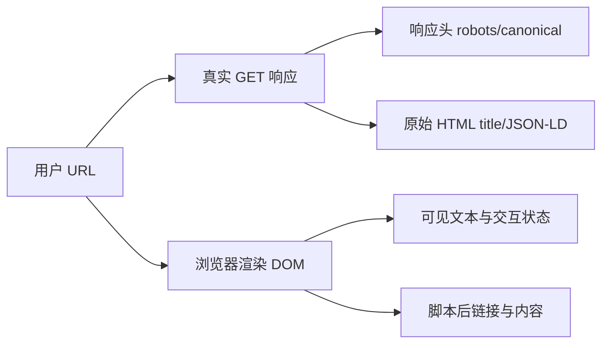

# 页面 SEO 六类规则与证据采集

页面 SEO 审计是一种对原始 HTML、HTTP 响应、渲染 DOM 和可见内容逐项取证，再判断标题、Canonical、索引指令、结构化数据与正文是否一致的检查过程。它位于页面实现和搜索问题修复之间，用于区分工具误报、渲染后才出现与源代码本身缺失。

一个页面检查工具显示“标题缺失”，但浏览器标签页明明有标题；另一个工具显示结构化数据存在，搜索平台却没有使用。原因通常是检查对象不同：原始 HTML、渲染后的 DOM、网络响应、页面可见内容和工具规则不是同一份证据。

本章设计一条浏览器侧审计流程。它从单页开始，记录页面目标、网络、原始 HTML、渲染 DOM、可见内容与本次会话性能。规则分数只用于整理当前可测信号，不能被当成搜索引擎排名分数。

单页审计把索引治理矩阵、原始 HTML 与渲染 DOM 对照、性能诊断和开发任务放入同一份页面报告。它只证明当前样本的状态，不能直接扩展为全站结论。

## 单页审计的五类观察对象



原始 HTML 能证明服务端返回了什么；渲染 DOM 能证明脚本运行后的页面状态；它们不能互相替代。审计结果要标记采集时刻、页面 URL、最终 URL、状态码、是否执行脚本和视口。

## 建立可复现的单页快照

快照至少保存这些字段：

| 字段 | 证据用途 |
| --- | --- |
| 请求 URL/最终 URL | 识别跳转、规范地址与页面版本 |
| 状态码、响应时间、Content-Type | 判断可访问性和资源类型 |
| 原始 title、description、canonical、robots | 检查服务端模板 |
| 原始 HTML 中 H1、正文、链接 | 检查脚本依赖和首屏语义 |
| 渲染 DOM 的对应字段 | 比较客户端补充或修改 |
| 可见文本长度与主要标题 | 判断用户看到的内容 |
| JSON-LD 原文与解析结果 | 检查语法和可见事实一致性 |
| 资源、图片尺寸与加载状态 | 排查性能和布局问题 |

不要把完整 Cookie、表单、用户文档和内部请求参数写入快照。URL 查询参数按敏感策略脱敏，截图放在临时目录，验收后删除。

扫描前还要记录三个业务输入：页面类型、预期索引状态和目标查询/页面任务。同一个 `noindex` 在登录后台是合理设置，在公开价格页可能是 P0；文章没有价格结构化数据是不适用，产品页有虚构价格则是明确风险。

页面类型自动识别可以参考 JSON-LD、分页和路径，但用户应能校正。自动分类是候选，不应反过来改变页面真实业务目标。

## 对照原始 HTML 与渲染 DOM

故意对一个客户端渲染标题做对照：若原始响应只有空的 `<div id=app>`，渲染 DOM 才出现 H1，搜索引擎是否能稳定执行脚本就成为抓取风险，而不是“标题标签有没有”这么简单。

比较时记录差异类型：

- 原始没有、渲染出现：客户端注入内容或链接。
- 原始有、渲染删除：脚本条件、权限或错误覆盖。
- 两者都有但值不同：模板与客户端状态冲突。
- 两者都没有：缺失或选择器没有命中。

审计建议使用浏览器获取真实 DOM，同时用 fetch 保存原始 GET。不要用 `document.title` 代替网络响应，也不要只看开发工具 Elements 面板。

## 用规则状态组织页面证据

规则输出应包含：规则 ID、对象、观察值、证据来源、严重程度、置信度、修复建议、适用条件和复查方法。

示例：

| 发现 | 证据 | 置信度 | 动作 |
| --- | --- | --- | --- |
| canonical 与最终 URL 不同 | 原始 link 标签 + 跳转结果 | 高 | 统一规范地址并回归参数页 |
| H1 只在脚本后出现 | 原始 HTML/渲染 DOM 差异 | 中 | 评估 SSR/预渲染与抓取日志 |
| description 与正文承诺不一致 | 标签与可见首段 | 中 | 重写页面承诺并观察点击 |
| 图片无尺寸 | HTML img 属性缺失 | 高 | 加 width/height 或稳定容器 |

“标题太长”“内容分数 72”不能单独成为 P1。影响要结合页面类型、查询、状态、流量和业务价值。

### 页面规则应覆盖哪些信号

一次完整单页审计至少按六类检查，遇到不可测或不适用要明确退出判断：

| 分类 | 规则与输入 | 典型失败 | 需要外部补证 |
| --- | --- | --- | --- |
| 可发现与可索引 | GET、索引指令、robots、Canonical、原始/渲染差异 | 应索引页非 200、noindex 冲突、Canonical 目标异常 | 真实抓取、实际索引 |
| 元信息 | Title、Description、H1、目标查询对齐 | 缺失、重复输出、页面承诺冲突 | 搜索结果重写与 CTR |
| 内容语义 | 标题顺序、main、lang、可见正文、作者/日期 | 空壳正文、语言错误、虚构责任信息 | 内容质量与用户满足 |
| 链接 | href、可访问名称、内部入口、fragment、pagination | 空链接、断裂锚点、关键页无入口 | 全站孤立页与链接价值 |
| 媒体/结构化 | Alt、尺寸、Alt 质量、加载优先级、JSON-LD、视频、hreflang | 首屏懒加载、虚假 Schema、语言目标异常 | 图片/视频展示与多语言效果 |
| 性能 | LCP、CLS、FCP、TTFB、viewport | 本次会话较差或移动视口缺失 | INP、真实用户 p75 |

另有不计入基础分的技术交付信号：HTTPS 和正式主机、HSTS、混合内容、文本压缩、分类缓存、CSS/JS 加载、匿名爬虫访问和 nofollow 关系。这些项目可能很重要，但工具不了解证书链、缓存业务规则或链接关系时，应保留限制说明。

规则的输入、判断和输出要可复查。例如图片无尺寸的输入是最终 DOM 中的 `width`/`height` 与稳定容器；输出是具体元素定位、影响和复验方式。只展示“图片扣 2 分”无法指导开发。

### 状态、覆盖率和封顶要一起读

审计状态使用通过、警告、失败、信息、不可测和不适用。通过得满分、警告可得部分分、失败得零分；不可测与不适用不应被强行记零。覆盖率太低时，总分只能标“暂定”。

P0/P1 索引阻断可以触发总分封顶，防止一堆低影响通过项掩盖核心故障。原始归一化分、封顶后的分数、触发规则和覆盖率都要显示。完整计算和边界见[SEO 诊断的证据、评分与边界](/docs/seo/seo-evidence-scoring-boundaries)。

## 单页证据的适用边界

单页快照能确认当前 URL 的最终状态与 DOM，不能证明同模板所有页面、全站重复、孤立页、真实爬虫频率、搜索表现或转化。发现疑似模板问题时，先把范围写成“当前页面确认、同模板待抽样”，再进入站点级抽样审计。

交接给站点审计时记录：

| 候选范围 | 当前证据 | 下一步样本 | 负责人 |
| --- | ---: | ---: | --- | --- |
| 文章模板 | 当前页重复 Title 或空作者 | 同模板正常、边界、最近发布页 | 内容/前端 |
| 产品模板 | 当前页价格 Schema 冲突 | 有货、无货、变体和下架页 | 产品/开发 |
| 参数页面 | 当前参数 Canonical 异常 | 不同参数类型与规范页 | SEO/后端 |

单页结论不能夸大为全站事实。模板级问题需要用 URL 数量、站点抽样、日志与 Sitemap 进一步估计影响。

## 链接与媒体的上下文证据

内链检查至少看：当前页面是否通过导航/正文连接相关核心页；链接文本或可访问名称是否说明目标；fragment 是否存在；分页是否有真实 href；`nofollow` 是否按真实关系使用。单页只能看到“从这里链接到哪里”，不能证明目标页没有其他入口。

图片审核要区分缺失 Alt、合理空 Alt、文件名式 Alt、重复 Alt 和链接图片无名称；是否准确描述图像仍需结合页面语境。JSON-LD 先做语法解析，再核对字段与可见内容。自动规则负责找候选，内容和业务负责人完成语义判断。

## 浏览器审计工具的职责边界

浏览器审计插件可以读取当前页面、抓取可公开的 HTML 与渲染状态、抽样多个页面并生成规则报告。它不应把 Cookie、私有接口响应、完整用户输入或内部项目名称上传给 AI 服务。

AI 建议的正确流程：先在本地裁剪字段，提供规则证据和页面类型，再要求模型生成解释候选；人工核对证据后才进入报告。评分、置信度和建议动作要分开存储，模型生成的文本不能覆盖原始观测。

浏览器扩展通常不能访问 Chrome 内部页、Chrome Web Store、PDF、跨域 iframe 和 closed shadow root。它也不能从浏览器 API 直接证明证书链、TLS 等级、真实爬虫身份、实际收录、排名、外链、全站重复或真实用户总体 CWV。这些应进入“数据缺口”，而不是用 AI 补答案。

## 通过反例检查误判

1. 页面原始 HTML 没有正文，脚本失败时显示错误：工具只看渲染 DOM 会漏掉抓取风险。
2. 页面有多个类似参数 URL，但 canonical 指向同一产品：工具只数 URL 会把规范关系误报成重复内容。

每个误判都记录“当前规则为什么错、增加什么证据、修复后如何复查”。规则变更要版本化，不要悄悄改分数让报告看起来变好。

## 单页审计的执行链路

1. 选择页面类型与目标 URL，记录范围和权限。
2. 真实 GET，保存状态、最终 URL、响应头和原始 HTML 摘要。
3. 浏览器渲染，比较 DOM、可见内容、资源与网络错误。
4. 运行页面规则，给每条发现附证据、置信度和影响。
5. 把模板、重复和全站候选移交到站点抽样，不扩大当前结论。
6. 按根因聚合问题，输出 P0-P3 报告，动作必须有负责人、验证和回滚。
7. 修改前保存基线，修复后重新扫描，比较规则和证据变化而不是只看分数。

## 单页审计报告结构

```text
审计范围与采样：
页面类型与目标任务：
原始 GET 证据：
渲染 DOM 证据：
规则发现与置信度：
影响 URL/查询/业务路径：
事实、假设、数据缺口：
P0-P3 动作与负责人：
验证指标、观察周期、回滚：
```

这份模板的输入是同一轮审计保存的网络、HTML、DOM 与规则证据，输出是能够分配负责人并复查的行动项。没有证据的判断放入“假设或数据缺口”，不要直接提升为 P0/P1 结论。

## 页面审计的验收与职责
SEO 负责人设置页面任务与索引目标、解释规则范围；开发/运维提供 HTTP、渲染和性能证据；内容/设计核对正文、链接与媒体语义；数据负责人补搜索和 RUM 缺口；创业者只按业务影响排序，不要求所有页面满分。

选择一个无需登录的代表页面，完成扫描、修复、复验三份记录。验收要求另一位读者能从证据定位到具体元素或响应，知道工具不能证明什么，并能复现修改前后的差异。

## 证据复核：页面 SEO 六类规则与证据采集
SEO 结论要放回“需求、抓取、渲染、索引、排名、点击、转化”这条漏斗定位。页面源代码、渲染 DOM、响应头、搜索平台、分析数据和业务结果各自只能证明一段事实，不能用单页审计分数推断收录、排名或收入。

执行前固定页面类型、目标查询、地区语言、Canonical、观察窗口和成功指标。修复后使用同一 URL 集、同一设备条件与同一数据口径复验，并保留发布日期、抓取状态、展示点击、转化延迟和回滚方案。无法取得的数据明确标为检测边界。

SEM 与自然搜索共享意图和落地页证据，预算、匹配方式和归因仍有独立语义。广告短期结果可以帮助发现搜索词和页面问题，不能直接替代 SEO 长周期判断；自动建议先进入候选列表，再由人工核对业务边界。
