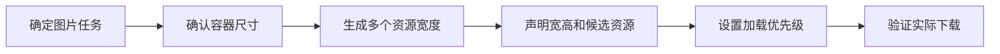

# 图片、视频和专题页怎样做搜索优化

产品页放了一段高清演示视频，效果很直观，手机首屏却要等待数秒；一张步骤图解释了核心操作，但图片加载失败后页面几乎没有信息。视觉内容有价值，交付方式不当仍会损害用户和搜索表现。

本篇先让图片和视频稳定加载、可被理解，再讨论怎样把多篇内容组织成真正有用的专题页。

## 一张图片同时承担三项任务

图片要传达信息，也要适应不同屏幕，还不能让页面发生明显跳动。浏览器最终需要回答：显示多大、下载哪个资源、图片还没回来时预留多少空间。



`alt` 用于描述图片在当前页面传达的信息。纯装饰图可以使用空 `alt`，不要给每张图重复塞入关键词。文件名有助于资源管理，却不能代替正文和替代文本。

## 第一步：根据显示尺寸准备资源

先在窄屏和宽屏测量图片容器，再为常见宽度生成资源。浏览器可以通过 `srcset` 和 `sizes` 选择接近实际需要的文件，而不是手机也下载一张超大原图。

```html

```

输入是两个宽度版本和页面布局信息，输出是浏览器按视口选择的资源。`width` 与 `height` 让浏览器提前计算比例，减少图片回来后推开正文的布局变化。

图片是否清晰还与设备像素密度有关。不要只看原图尺寸，也不要对所有用途统一裁剪；产品主体、步骤文字和人像可能需要不同比例与质量策略。

## 第二步：首屏和屏外图片区别处理

首屏主要图片可能影响 Largest Contentful Paint，不应照搬屏外图片的懒加载策略。屏外长列表图片可以使用 `loading="lazy"`，首屏主图则要确保 HTML 及时发现资源，并避免由脚本很晚才插入。

正常结果是：首屏先出现稳定内容，页面下方图片接近视口时加载。失败结果是：所有图片都懒加载，主图迟迟不出现；或所有图片都立即下载，抢占首屏关键资源。

优化后要在网络面板确认浏览器实际选择了哪张图。只检查模板里的 `srcset`，不能证明 CDN 返回了正确尺寸和媒体类型。

## 第三步：视频先提供可理解的静态入口

视频通常比图片更大。准备与内容一致的 Poster，设置明确宽高，按需只预加载元信息。重要结论还要在页面提供标题、摘要或步骤，不能只存在于视频声音和画面中。

自动播放适合极少数无声背景，不适合教程主体。可操作视频应提供控制和字幕，并允许用户暂停。首屏放视频时要测量 Poster、脚本和媒体资源分别何时下载。

## 第四步：专题页要帮助用户完成任务

专题页不是把十篇相关文章堆在一起。它需要一个明确主问题，先给出方法地图，再把读者带到对应阶段的深入内容、工具或行动。

例如“网站性能优化”专题可以依次连接测量基线、图片交付、JavaScript、缓存和监控。专题页本身要有独立导语、核心结论和选择路径，子页面负责细节。

自动推荐只能作为候选。入口是否重复、是否把初学者直接带到高级排障、失效页面是否仍在列表，都需要验收。

## 一份可执行检查表

| 检查对象 | 正常信号 | 常见失败 |
| --- | --- | --- |
| 图片尺寸 | 接近实际容器和设备需要 | 手机下载超大原图 |
| 布局 | HTML 声明宽高或比例 | 加载后正文跳动 |
| 首屏 | 主图及时发现 | 关键图被错误懒加载 |
| 屏外媒体 | 接近视口再加载 | 所有资源抢占网络 |
| 替代信息 | Alt 与正文说明任务 | 关键词堆叠或信息只在图里 |
| 专题页 | 有问题、路径和下一步 | 只有链接列表 |

下一篇进入技术 SEO，把媒体加载放回渲染、缓存和核心网页指标中一起检查。

## 建立一份媒体资产清单

图片和视频首先要帮助用户理解页面任务。为十个关键媒体记录所在页面、表达目的、原始文件、尺寸、格式、替代文本、字幕或文字稿、版权来源和更新责任。装饰图片的 `alt` 可以为空，功能或信息图片则用上下文描述它传达的内容。

| 场景 | 页面需要提供什么 |
| --- | --- |
| 商品或作品图片 | 清晰主体、多角度、稳定地址和真实说明 |
| 操作截图 | 关键步骤、可读标注、与当前版本一致 |
| 教学视频 | 标题、摘要、字幕/文字稿、缩略图和可播放状态 |
| 图片专题页 | 独特选择逻辑、上下文和可继续探索的内链 |

性能处理从真实尺寸开始：不要用 3000 像素原图显示 300 像素缩略图；为响应式视口提供合适候选；首屏主要图片避免被错误懒加载；非首屏媒体再延迟加载。压缩后同时检查可读性、CLS 和 LCP，不以文件最小为唯一目标。

视频结构化信息和站点地图只描述页面真实可见的视频，不保证视频结果。图片来源不明、装饰性强或无法维护时可以删除。完成后用真实移动网络打开页面，检查媒体加载失败时正文是否仍能完成任务，并记录原始与优化后的字节、尺寸和用户指标。

## 参考资料

- [Google Search Central：Google Images SEO best practices](https://developers.google.com/search/docs/appearance/google-images)
- [web.dev：Responsive images](https://web.dev/learn/images/responsive-images)
- [MDN：HTML video element](https://developer.mozilla.org/docs/Web/HTML/Element/video)
