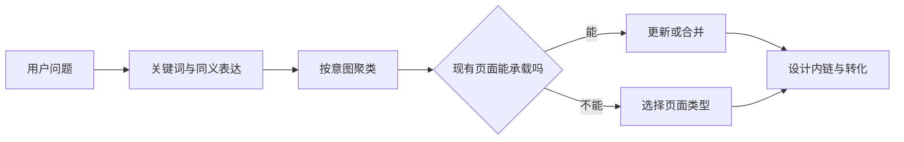

# 怎样把关键词规划成网站页面

整理出 500 个关键词后，最常见的错误是“一词一文”。结果通常是几十篇内容互相重复，同一个查询今天显示 A 页，明天又换成 B 页，真正重要的产品页反而没有清晰职责。

本篇把关键词库变成页面计划。目标不是让每个词都有 URL，而是让每一种独立搜索意图都有最合适的页面，并知道用户读完后应该去哪里。

## 先理解页面映射

**搜索意图**是用户搜索时希望完成的任务，例如理解概念、比较方案、查看价格或解决故障。**页面映射**就是把一组表达相近、任务相同的查询交给一个主页面。

页面类型要服从任务。想了解“什么是项目管理”的人更需要教程；搜索“项目管理软件价格”的人需要价格或产品页；已经购买的用户搜索“如何导入成员”则需要帮助文档。

## 第一步：按任务给关键词分组

不要只根据词面相似度聚类。先观察搜索结果类型，再结合业务判断这些表达是否真的服务同一个目标。

| 查询 | 主要任务 | 合适页面 |
| --- | --- | --- |
| 什么是项目管理 | 学习概念 | 教程 |
| 项目管理软件哪个好 | 比较选型 | 对比或选型页 |
| 项目管理软件价格 | 评估成本 | 价格页 |
| 项目管理软件试用 | 开始使用 | 产品或注册页 |
| 导入项目成员失败 | 解决问题 | 帮助页 |

相同主题不代表必须放在同一页。教程、价格和故障处理面对不同阶段，硬塞在一篇长文里会让页面承诺含糊。

## 第二步：先检查已有页面

对每组意图，先问现有页面是否已经有资格承担它。常见动作不只是“新建”：

- **更新**：页面职责正确，但内容陈旧或不完整；
- **合并**：多页回答同一任务，各自没有独立价值；
- **改写**：保留 URL，但让它承担另一个清晰意图；
- **迁移**：确实需要改变 URL，并维护跳转和内链；
- **暂不创建**：需求、材料或业务承接不足。

旧页面已有外链、访问或稳定索引时，不要为了目录整齐轻易换 URL。先评估保留和更新能否完成目标。

## 第三步：建立页面映射表

一张可执行的表至少包含以下字段：

| 字段 | 要记录什么 |
| --- | --- |
| 主题与意图 | 用户正在完成的任务 |
| 主词与辅助表达 | 自然语言变化，不用于堆词 |
| 主页面与类型 | 哪个 URL 负责，属于哪类页面 |
| 页面承诺 | 进入后具体能得到什么 |
| 独特材料 | 数据、经验、工具、产品能力或官方事实 |
| 下一步动作 | 继续阅读、试用、咨询或购买 |
| 当前决策 | 新建、更新、合并、迁移或观察 |
| 上下游链接 | 从哪里来，完成后去哪里 |

真正有用的是“页面承诺”和“独特材料”。只有关键词与 URL 两列，仍然无法指导作者写出什么，也无法判断页面是否值得存在。

## 第四步：发现并处理页面内耗

同一查询的排名 URL 经常轮换，或者普通文章长期替代核心产品页，可能表示页面分工不清。处理时先核对查询意图和搜索结果，再选择最有资格的主页面。

其他页面不要直接批量删除。先把独有内容合并到主页面，或让它们承担确实不同的任务；随后更新标题、正文和内链。只有存在明确替代关系时才做永久跳转。

## 程序化页面为什么需要上线闸门

地区页、商品页或集成页可以由模板批量生成，但“能排列组合”不代表“值得被索引”。每个候选页面至少需要四项资格：独立需求、独特数据、可完成的任务和明确维护责任。

先用少量代表页面验证空值、重复标题、正文差异、内链、状态码和转化。若页面除城市名外完全相同，或用户进入后只能返回上级页继续找，它就不应因为数量目标进入站点地图。

## 正常规划和失败规划

正常规划中，“预约提醒”由功能页负责，“怎样减少客户爽约”由指南负责，“软件价格”由价格页负责，三页通过上下文内链连接。

失败规划会为“预约提醒工具”“预约提醒软件”“客户提醒系统”分别生成三篇近乎相同的文章。它们没有独立任务，只会增加维护成本和重复风险。

下一篇进入网站结构，看看栏目、URL、导航和正文链接怎样把这些页面组织起来。

## 参考资料

- [Google Search Central：Creating helpful, reliable, people-first content](https://developers.google.com/search/docs/fundamentals/creating-helpful-content)
- [Google Search Central：Consolidate duplicate URLs](https://developers.google.com/search/docs/crawling-indexing/consolidate-duplicate-urls)
- [Bing Webmaster Guidelines](https://www.bing.com/webmasters/help/webmaster-guidelines-30fba23a)
