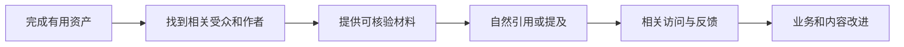

# 外链、品牌提及与站外增长

外链是一种由其他网站指向你页面的链接；品牌提及是外部页面对品牌、产品或人员的引用，不一定带有可点击地址。它们位于站内内容与外部受众之间，用于带来发现、访问、反馈和业务机会，但链接数量本身不能证明排名或收入增长。

一封邮件承诺“一个月增加 500 条高权重外链”，价格不高，还附带第三方权重截图。这样的数量不值得直接购买，因为链接的价值来自真实语境、来源和受众，不来自供应商能批量生成多少地址。站外增长应沿可引用资产、合作关系、访问和业务结果逐层评估。

站外增长的前提是目标页能够正常访问，而且确实值得引用。[站点抽样与收录异常排查](/docs/seo/crawl-index-duplicate-troubleshooting)用于确认抓取、模板和内容基础；如果目标页仍是空壳或 404，应先修复站内问题，不能用外链掩盖。

## 外链的定义与作用

**Backlink（反向链接，也称外链）**是其他网站指向你页面的链接。它可能帮助用户发现内容，也让搜索系统理解页面之间的引用关系。**Referring Domain（引荐域名）**是产生这些链接的网站域名；同一域名的 100 个模板页链接不能简单等同于 100 次独立认可。

**Brand Mention（品牌提及）**可能只有品牌或产品名称，没有可点击链接，但仍表示有人讨论或引用。**Brand Search（品牌搜索）**是包含品牌、产品、人名或明确变体的查询，它常混合已有用户导航、口碑和营销影响，不能直接全部归给 SEO 或某次合作。

站外增长的起点是“别人为什么愿意引用”，而不是先买一个外链套餐。
## 可引用资产的成立条件

可引用资产可以是原始研究、公开工具、标准对照、完整教程、数据集、兼容性实验或问题复盘。它要让引用者省时间、降低错误，或给读者提供原文没有的信息。

例如浏览器事件兼容性实验应说明测试环境、代码、正常与异常结果以及限制。只有一句“我们测试过了”很难被核验，也不值得长期引用。
## 相关来源与引用场景

优先寻找已经讨论同一问题、但缺少某项事实或工具的页面。联系时说明材料能补充什么，不要求固定关键词锚文本，也不批量向无关网站发送同一模板。

合作方式还可以是开源贡献、播客、行业活动、资源目录和联合研究。判断标准仍然是受众与主题是否相关，信息是否真实，双方责任是否清楚。
## 链接属性与风险边界

广告、赞助和其他付费关系应使用平台建议的相应属性；用户可生成内容也应与编辑推荐区分。不要购买隐藏链接、站群文章或承诺操控排名的服务。

一个来源网站第三方分数很高，不代表该链接与主题相关或能带来真实受众。反过来，小型专业社区的一条准确引用，可能更有反馈和业务价值。

**Anchor Text（锚文本）**是链接可见名称。健康引用通常按语境自然说明目标，不需要团队要求每个合作方使用完全相同的商业关键词。付费链接使用 `rel="sponsored"`，**UGC（User-generated Content，用户生成内容）**链接使用 `rel="ugc"`，是否同时 nofollow 按平台政策和真实关系判断。

关系属性用于披露，不是隐藏合作。站内普通链接无需机械 nofollow，外部自然引用也不因“流出权重”而一律 nofollow。批量交换页脚链接、隐藏链接、站群和保证排名的套餐都不在合规增长范围内。
## 站外结果的分层衡量

| 指标 | 能说明什么 | 不能单独说明什么 |
| --- | --- | --- |
| 新增相关引用 | 资产被采用 | 一定提升排名 |
| 引荐访问 | 有用户沿链接到站 | 用户有商业价值 |
| 品牌查询 | 认知可能变化 | 来源一定是某次活动 |
| 有效咨询或注册 | 连接到业务 | 长期增量已确定 |
| 纠错与反馈 | 内容得到真实使用 | 只需追求更多链接 |

跟踪具体页面、来源、访问和后续行为。不要只汇报新增域名数量，也不要把相关性很弱的链接当成成果。

品牌查询增长也不能直接归因于某条链接。发布活动、广告、线下销售、媒体曝光和季节都可能同时影响。小团队至少记录活动日期、目标受众、引荐访问、品牌/非品牌查询和有效业务；证据不足时写“相关变化”，不写“该合作创造了全部增长”。

评估 **Incrementality（增量性）** 时，问题是“没有这项活动，本来会发生多少结果”。可以使用时间、地域或受控停投/未触达对照，但样本与业务条件必须允许。最后点击归因只能说明成交前的一个触点，不等于增量。

为了让判断能够复查，每条记录应包含来源页面与域名、主题和受众、目标页面、引用上下文与锚文本、编辑/赞助/UGC 关系、属性、首次发现与复查日期、页面状态、引荐访问、品牌查询变化、有效线索或订单、证据置信度、风险与负责人。这些字段不是统一报表模板；团队可按业务缩减，但不能只剩域名数量和第三方“权重”。

内容或公关负责人创造资产并维护关系，SEO 负责人评估相关性和链接状态，法务或业务负责人核对竞品、商标与赞助披露，数据负责人连接引荐和业务结果。目标负责人需要确认评价口径，避免链接数量取代真实任务。
## 有效站外增长与无效外链

正常做法是发布一份可复现实验，联系确实讨论该问题的作者。对方引用测试方法，带来少量但高度相关的访问，同时有人指出一个边界条件，作者据此更新文章。

失败做法是购买数百条模板链接，来源页面与主题无关，锚文本完全一致。即使第三方工具短期显示数量上涨，也没有读者、反馈和业务证据。
## 遇到垃圾链接怎么办

先区分主动操控和互联网上自然出现的低质量链接。保存来源、时间和模式，检查是否存在安全入侵或团队购买行为。不要因看到几个陌生链接就大规模改站。

平台工具与政策会变化，涉及拒绝链接等操作时应查看当前官方说明，并谨慎使用。首要任务始终是停止自己能够控制的违规行为。
## 评估一个链接是否值得争取

外链的价值先来自真实受众和引用关系。收到合作机会时记录来源页面主题、编辑主体、目标受众、链接上下文、是否付费、预期业务动作和维护风险。不要只看第三方“权重”或链接数量。

| 观察项 | 健康信号 | 风险信号 |
| --- | --- | --- |
| 相关性 | 页面真正讨论同一问题 | 与业务无关的批量目录 |
| 编辑选择 | 作者因证据或工具主动引用 | 付费保证排名、隐藏链接 |
| 用户价值 | 点击后能继续完成任务 | 锚文本诱导、落地页不相关 |
| 披露与属性 | 赞助和广告关系清楚 | 伪装自然推荐 |
| 可持续性 | 页面稳定、有维护主体 | 临时站群、内容大量复制 |

品牌提及即使没有链接，也能帮助用户发现和验证实体。可以通过原创研究、开源工具、专家解释、合作案例和及时回应建立可引用材料；不要批量购买链接、交换无关页或冒充第三方评价。

每月抽查新增来源的真实页面和引荐流量，记录带来的有效访问、线索和品牌查询，而不是只汇报链接数。遇到垃圾链接先保存证据并评估实际风险，不要因第三方工具警报就批量进行不可逆处理。品牌与链接增长是长期关系建设，不承诺固定排名结果。
