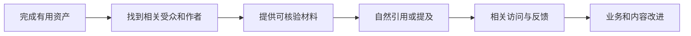

# 外链、品牌提及与站外增长

一封邮件承诺“一个月增加 500 条高权重外链”，价格不高，还附带第三方权重截图。这样的数量为什么不值得直接购买？因为链接的价值来自真实语境、来源和受众，不来自供应商能批量生成多少地址。

本篇先解释外链与品牌提及，再建立一条从可引用资产到合作、访问和业务结果的站外增长路径。

## 外链到底是什么

外链是其他网站指向你页面的链接。它可能帮助用户发现内容，也能让搜索系统理解页面之间的关系。品牌提及则可能只有名称，没有可点击链接，但仍表示有人在讨论或引用该品牌。

站外增长的起点是“别人为什么愿意引用”，而不是先买一个外链套餐。

## 第一步：准备值得引用的资产

可引用资产可以是原始研究、公开工具、标准对照、完整教程、数据集、兼容性实验或问题复盘。它要让引用者省时间、降低错误，或给读者提供原文没有的信息。

例如浏览器事件兼容性实验应说明测试环境、代码、正常与异常结果以及限制。只有一句“我们测试过了”很难被核验，也不值得长期引用。

## 第二步：寻找真正相关的场景

优先寻找已经讨论同一问题、但缺少某项事实或工具的页面。联系时说明材料能补充什么，不要求固定关键词锚文本，也不批量向无关网站发送同一模板。

合作方式还可以是开源贡献、播客、行业活动、资源目录和联合研究。判断标准仍然是受众与主题是否相关，信息是否真实，双方责任是否清楚。

## 第三步：看链接属性和风险

广告、赞助和其他付费关系应使用平台建议的相应属性；用户可生成内容也应与编辑推荐区分。不要购买隐藏链接、站群文章或承诺操控排名的服务。

一个来源网站第三方分数很高，不代表该链接与主题相关或能带来真实受众。反过来，小型专业社区的一条准确引用，可能更有反馈和业务价值。

## 第四步：怎样衡量站外结果

| 指标 | 能说明什么 | 不能单独说明什么 |
| --- | --- | --- |
| 新增相关引用 | 资产被采用 | 一定提升排名 |
| 引荐访问 | 有用户沿链接到站 | 用户有商业价值 |
| 品牌查询 | 认知可能变化 | 来源一定是某次活动 |
| 有效咨询或注册 | 连接到业务 | 长期增量已确定 |
| 纠错与反馈 | 内容得到真实使用 | 只需追求更多链接 |

跟踪具体页面、来源、访问和后续行为。不要只汇报新增域名数量，也不要把相关性很弱的链接当成成果。

## 正常结果与失败结果

正常做法是发布一份可复现实验，联系确实讨论该问题的作者。对方引用测试方法，带来少量但高度相关的访问，同时有人指出一个边界条件，作者据此更新文章。

失败做法是购买数百条模板链接，来源页面与主题无关，锚文本完全一致。即使第三方工具短期显示数量上涨，也没有读者、反馈和业务证据。

## 遇到垃圾链接怎么办

先区分主动操控和互联网上自然出现的低质量链接。保存来源、时间和模式，检查是否存在安全入侵或团队购买行为。不要因看到几个陌生链接就大规模改站。

平台工具与政策会变化，涉及拒绝链接等操作时应查看当前官方说明，并谨慎使用。首要任务始终是停止自己能够控制的违规行为。

下一篇进入数据分析，把展现、点击、到站、有效转化和收入逐层对账。

## 评估一个链接是否值得争取

外链的价值先来自真实受众和引用关系。收到合作机会时记录来源页面主题、编辑主体、目标受众、链接上下文、是否付费、预期业务动作和维护风险。不要只看第三方“权重”或链接数量。

| 观察项 | 健康信号 | 风险信号 |
| --- | --- | --- |
| 相关性 | 页面真正讨论同一问题 | 与业务无关的批量目录 |
| 编辑选择 | 作者因证据或工具主动引用 | 付费保证排名、隐藏链接 |
| 用户价值 | 点击后能继续完成任务 | 锚文本诱导、落地页不相关 |
| 披露与属性 | 赞助和广告关系清楚 | 伪装自然推荐 |
| 可持续性 | 页面稳定、有维护主体 | 临时站群、内容大量复制 |

品牌提及即使没有链接，也能帮助用户发现和验证实体。可以通过原创研究、开源工具、专家解释、合作案例和及时回应建立可引用材料；不要批量购买链接、交换无关页或冒充第三方评价。

每月抽查新增来源的真实页面和引荐流量，记录带来的有效访问、线索和品牌查询，而不是只汇报链接数。遇到垃圾链接先保存证据并评估实际风险，不要因第三方工具警报就批量进行不可逆处理。品牌与链接增长是长期关系建设，不承诺固定排名结果。

## 参考资料

- [Google Search Central：Spam policies](https://developers.google.com/search/docs/essentials/spam-policies)
- [Google Search Central：Qualify outbound links](https://developers.google.com/search/docs/crawling-indexing/qualify-outbound-links)
- [Bing Webmaster Guidelines](https://www.bing.com/webmasters/help/webmaster-guidelines-30fba23a)
