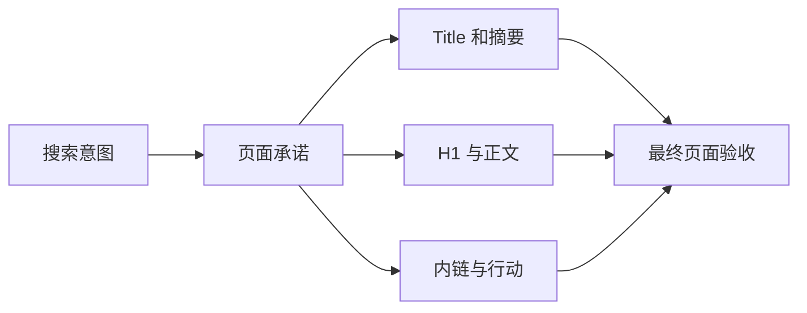

# 一张网页怎样完成基础 SEO

一篇文章的浏览器标题写“前端大全”，页面 H1 却是“SSE 断线重连”，摘要又宣传 WebSocket。每个字段单独看都像技术内容，放在一起却无法回答这页到底解决什么问题。

页面 SEO 的第一步不是把关键词填进所有位置，而是让标题、摘要、主标题、正文和页面动作围绕同一个任务。

上一篇的[页面树和页面类型表](/docs/seo/site-structure-page-planning)是本篇输入。先选一个页面类型和一个页面承诺，再检查模板最终输出；后台字段、组件源码或设计稿都不能替代用户和搜索系统实际收到的 HTML。

**On-page SEO（页面内 SEO）**指可在当前页面内容和 HTML 中调整的表达与语义，包括标题、摘要、正文、标题层级、语言、链接和结构化数据。它解决“这是什么页面、为谁解决什么问题”，但不能单独证明页面已被索引、获得外链或产生业务。

## 先确定页面承诺

页面承诺是一句话：谁来到这里，能够完成什么。例如“初学者能用一个最小示例看懂 SSE 断线后怎样继续接收事件”。后续字段都围绕这句话展开。

## 第一步：写 Title、摘要和 H1

`Title` 是 HTML `<title>` 元素，常用于浏览器标签和搜索结果标题来源；搜索系统可能根据查询和页面内容重写展示标题。它应该准确、具体，并能区分站内其他页面。

`Meta Description（元描述）` 是 `<meta name="description">` 提供的页面摘要候选，不是排名保证。先说明页面解决什么、适合谁，避免每页使用同一段品牌话术。搜索系统也可能从正文截取更匹配查询的内容。

`H1（一级标题）` 是页面可见主标题。它可以与 Title 不完全相同，但两者要服务同一个任务。正文按逻辑使用 H2/H3，标题层级用于组织内容，不用于让文字“更大”。

国内常说的 **TDK** 通常指 Title、Description 和 Keywords。现代页面仍应认真处理 Title 与 Description，但 `meta keywords` 不能承担页面质量或排名策略。固定字符数也不是通用真理：搜索展示受设备、字符宽度、查询和重写影响，应把关键信息放前面，再用真实展示数据复核。

一个页面可能同时出现多个 Title、Description 或 H1，常见原因是组件、SEO 插件和服务端模板重复输出。验收应读取最终 HTML 并检查数量，而不是只确认“后台填过”。

## 第二步：让正文兑现标题

用户点进“断线重放教程”后，应先看到概念、场景和流程，再进入实现与失败路径。若开头只重复关键词，核心答案藏在很后面，标题即使写得漂亮也没有兑现承诺。

正文应包含适用条件、步骤、例子、失败情况和当前限制。涉及容易变化的产品与技术时，记录更新时间和来源。作者信息只在能表达真实责任时使用，批量生成虚假身份会降低可信度。

### 页面语言与 main 地标

`lang` 属性声明页面主要语言，例如 `<html lang="zh-CN">`。它帮助浏览器、读屏软件和搜索系统理解发音与语言环境，但不会自动证明翻译质量。缺失或与正文不符时，应由模板按真实语言输出。

`<main>` 是 **Main Landmark（主要内容地标）**，用来标识页面的核心内容区域。通常一页保留一个可见 main，导航、侧栏和页脚放在外部。main 不会直接带来排名，但能减少语义歧义并改善辅助技术导航。

标题顺序也要服务阅读逻辑。H1 后直接出现 H4 往往意味着组件只按字号选标签。检查时关注“父问题—子问题”的结构，而不是要求所有页面机械拥有相同数量的 H2。

### 可见正文和责任信息

页面只有导航、按钮和模板文字，即使 Title 完整，也可能没有足够内容完成任务。正文长度不能使用统一阈值判断；商品列表、计算器和短答案可能用较少文字完成任务，深度教程则需要条件、步骤和验证。

文章页应按真实情况展示作者和日期，服务页可以展示负责组织、联系方式、服务范围和更新责任。Author 和 Date 是实体证据，不是必须填满的排名字段。无真实负责人时，不要生成虚构“资深专家”。

## 第三步：确认规范地址与索引状态

页面可能同时被多个参数或路径访问。`canonical` 用于提示首选 URL，应指向真实可访问、希望索引的版本。站内链接和站点地图也应使用同一地址。

预览域名、测试环境或错误协议进入 canonical 是常见发布事故。上线后要检查最终 HTML，而不是只看模板源码。

若页面不应进入搜索索引，使用正确的索引控制并确保爬虫能读取它。用 robots 阻止抓取后，搜索系统可能无法看到页面中的 `noindex`。

## 第四步：结构化数据只描述真实内容

**Structured Data（结构化数据）**用预定义词汇表达页面实体和关系，例如文章、面包屑、产品或组织。常用的 **JSON-LD（JavaScript Object Notation for Linked Data，链接数据 JSON）**把这些字段放在脚本块中，便于模板生成和验证。它可能帮助搜索系统理解内容，但不保证富结果。

选择与页面真实类型对应的 Schema；字段必须在可见页面中有依据。教程页不要伪装成商品，普通列表不要虚构评分和价格。先用平台验证工具检查语法，再人工核对语义。

验证分两层：解析器确认 JSON 语法、类型和字段格式；人工确认 `headline`、作者、日期、价格、库存和评分能在页面看到且与业务数据一致。语法通过但标记虚假内容，仍然失败。

模板输入缺失时要有明确分支。没有真实作者就不要输出空 `author`；价格暂不可用时不要复用上一商品默认值；URL 必须是最终生产绝对地址。结构化数据的上游是业务数据和页面模板，下游是搜索系统理解与可能的富结果，两端都需要验收。

## 一张页面验收表

| 检查项 | 正常结果 | 失败信号 |
| --- | --- | --- |
| 页面任务 | 一句话能说明 | 同时争取多个无关意图 |
| Title/H1 | 主题一致且具体 | 夸张大全、彼此冲突 |
| 摘要 | 说明价值和对象 | 全站复制或堆词 |
| 正文 | 兑现步骤与限制 | 只有概念和口号 |
| canonical | 指向唯一生产地址 | 预览域名或错误页面 |
| 结构化数据 | 与可见内容一致 | 虚构实体和评价 |
| 内链 | 有前置和下一步 | 页面成为孤岛 |

插件或脚本还可以检查查询与页面是否基本对齐：目标查询、页面任务、Title、H1 和正文开头是否表达同一需求。这只能发现明显偏离，不能用词频计算证明相关性。没有设置目标查询时，应标为不可测，而不是失败。

正常页面即使没有富结果，也能让用户和搜索系统清楚理解任务。失败页面可能通过结构化数据语法检查，却因内容与标记不一致而没有实际价值。

## 验收页面时查看最终输出

后台已经填写标题，不代表搜索引擎收到的 HTML 正确。选择一个公开页面，用浏览器查看源码或 GET 响应，核对状态码、`title`、描述、主标题、规范地址、robots、主要正文和结构化数据。客户端脚本后来改出的值只能作为补充观察。

| 元素 | 验收问题 |
| --- | --- |
| Title | 是否准确说明主题和页面类型，模板是否重复堆品牌词 |
| Description | 是否概括页面价值，与可见正文一致 |
| H1/H2 | 是否帮助用户理解内容层级，不为关键词机械重复 |
| Canonical | 是否指向可访问的首选版本，与站点地图和内链一致 |
| Robots | 是否误把公共模板设为 `noindex` |
| JSON-LD | 类型是否适合，字段是否在页面真实可见且为合法 JSON |

标题优化要以查询和页面承诺为单位。若点击率低，先拆分品牌/非品牌、设备、地区和平均位置，避免把排名变化误判成标题效果。结构化数据帮助系统理解实体和关系，但不保证富结果，也不替代可见内容。

上线前使用一个正常页、一个参数页和一个不索引页做模板回归。检查变量转义、空字段、绝对 URL、重复标签和移动端内容。修改后保留旧模板与验证记录，出现大面积展示异常时可以快速回滚。

## 角色分工与本篇产物

SEO/内容负责人给出页面承诺、Title、Description、H1 和正文结构；开发负责人保证模板输出唯一、正确转义且原始 HTML 可见；业务负责人核对产品、作者、价格和承诺；数据负责人后续按查询与页面观察展示和 CTR。结构化数据不能由 SEO 一方在不知道业务事实时自行补齐。

本篇产物是按页面类型建立的模板验收表。至少检查一个正常页、一个字段缺失页和一个不应索引页，记录输入数据、最终 HTML、规则状态、修复负责人和复验结果。下一篇会使用页面承诺和证据字段建立内容简报与主题集群。

## 继续学习

- 上一篇：[页面规划、网站结构、URL 与内链](/docs/seo/site-structure-page-planning)
- 下一篇：[内容体系、AI 写作与主题覆盖](/docs/seo/content-ai-media-topic-pages)
- 媒体规则：[图片、视频与媒体 SEO](/docs/seo/media-video-structured-data)
