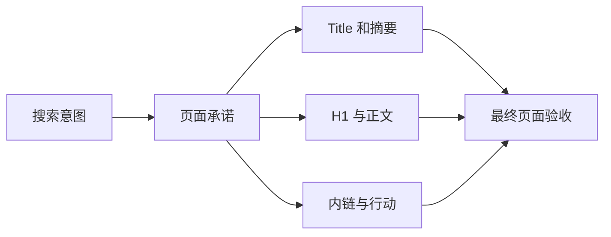

# 一张网页怎样完成基础 SEO

一篇文章的浏览器标题写“前端大全”，页面 H1 却是“SSE 断线重连”，摘要又宣传 WebSocket。每个字段单独看都像技术内容，放在一起却无法回答这页到底解决什么问题。

页面 SEO 的第一步不是把关键词填进所有位置，而是让标题、摘要、主标题、正文和页面动作围绕同一个任务。

## 先确定页面承诺

页面承诺是一句话：谁来到这里，能够完成什么。例如“初学者能用一个最小示例看懂 SSE 断线后怎样继续接收事件”。后续字段都围绕这句话展开。

## 第一步：写 Title、摘要和 H1

`title` 是浏览器标签和搜索结果标题的重要来源；搜索系统可能根据查询重写展示标题。它应该准确、具体，并能区分站内其他页面。

Meta description 是摘要候选，不是排名保证。先说明页面解决什么、适合谁，避免每页使用同一段品牌话术。搜索系统也可能从正文截取更匹配查询的内容。

H1 是页面可见主标题。它可以与 title 不完全相同，但两者要服务同一个主题。正文按逻辑使用 H2/H3，标题层级用于组织内容，不用于让文字“更大”。

## 第二步：让正文兑现标题

用户点进“断线重放教程”后，应先看到概念、场景和流程，再进入实现与失败路径。若开头只重复关键词，核心答案藏在很后面，标题即使写得漂亮也没有兑现承诺。

正文应包含适用条件、步骤、例子、失败情况和当前限制。涉及容易变化的产品与技术时，记录更新时间和来源。作者信息只在能表达真实责任时使用，批量生成虚假身份会降低可信度。

## 第三步：确认规范地址与索引状态

页面可能同时被多个参数或路径访问。`canonical` 用于提示首选 URL，应指向真实可访问、希望索引的版本。站内链接和站点地图也应使用同一地址。

预览域名、测试环境或错误协议进入 canonical 是常见发布事故。上线后要检查最终 HTML，而不是只看模板源码。

若页面不应进入搜索索引，使用正确的索引控制并确保爬虫能读取它。用 robots 阻止抓取后，搜索系统可能无法看到页面中的 `noindex`。

## 第四步：结构化数据只描述真实内容

结构化数据用机器可读方式表达页面上的实体和关系，例如文章、面包屑、产品或组织。它可能帮助搜索系统理解内容，但不保证出现富结果。

选择与页面真实类型对应的 Schema；字段必须在可见页面中有依据。教程页不要伪装成商品，普通列表不要虚构评分和价格。先用平台验证工具检查语法，再人工核对语义。

## 一张页面验收表

| 检查项 | 正常结果 | 失败信号 |
| --- | --- | --- |
| 页面任务 | 一句话能说明 | 同时争取多个无关意图 |
| Title/H1 | 主题一致且具体 | 夸张大全、彼此冲突 |
| 摘要 | 说明价值和对象 | 全站复制或堆词 |
| 正文 | 兑现步骤与限制 | 只有概念和口号 |
| canonical | 指向唯一生产地址 | 预览域名或错误页面 |
| 结构化数据 | 与可见内容一致 | 虚构实体和评价 |
| 内链 | 有前置和下一步 | 页面成为孤岛 |

正常页面即使没有富结果，也能让用户和搜索系统清楚理解任务。失败页面可能通过结构化数据语法检查，却因内容与标记不一致而没有实际价值。

下一篇讨论 AI 如何辅助内容生产，同时保持事实、责任和独特价值。

## 参考资料

- [Google Search Central：Title links](https://developers.google.com/search/docs/appearance/title-link)
- [Google Search Central：Snippets](https://developers.google.com/search/docs/appearance/snippet)
- [Google Search Central：Structured data](https://developers.google.com/search/docs/appearance/structured-data/intro-structured-data)
