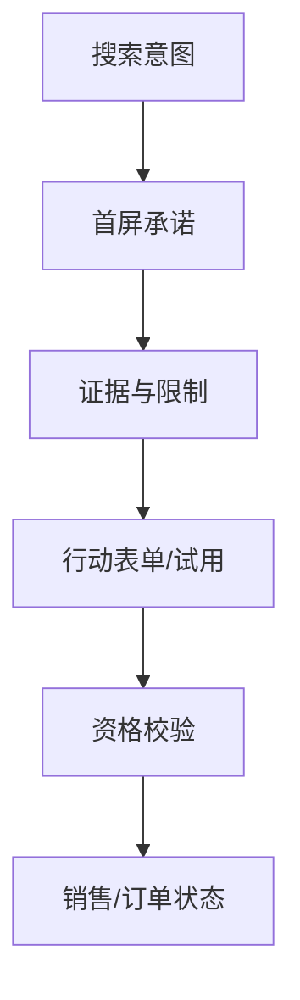

# SEM 创意、落地页与转化追踪

广告点击后发生的事情决定预算是否产生价值。创意应回应搜索任务并说明可验证的差异，落地页应兑现同一承诺、提供证据和明确动作，转化追踪则必须连接到服务端的有效业务状态。只优化 CTR 会鼓励夸张承诺；只看平台转化会把重复、垃圾和未成交线索算成成功。

## 从搜索词写创意

先按意图和用户约束聚类，再为每组写不同的标题、描述和行动。不要把关键词机械重复在每个字段里，也不要使用页面没有的价格、功能、资质或时效。创意测试一次只改变一个主要变量，并记录版本和适用系列。

```text
搜索任务：比较两种文档检索方案
标题：文档检索方案对比｜看清召回、权限与成本边界
描述：用同一组模拟数据对比关键词、向量和混合检索，附验证步骤与限制。
行动：查看对比方法，而不是承诺“排名第一”
```

示例是模拟场景。创意承诺、落地页 H1、证据和转化动作必须一致；如果用户搜的是排障问题，直接落到只有价格的页面会造成高点击低有效率。

## 落地页结构

首屏回答四件事：这是什么、适合谁、为什么可信、下一步怎么做。随后给出机制/规格、限制、案例或实验、常见问题和可逆行动。技术产品页面尤其要说明版本、兼容性、数据边界和支持范围，不要把结构化数据当成正文。



表单要尽量收集完成资格判断所需的信息，避免用大量必填字段换取低质量线索；成功页和错误页要有真实状态码、可访问内容和下一步。移动端、慢网、脚本失败和拒绝分析同意时，主要动作仍应可理解。

## URL 参数和隐私

广告参数用于归因，不能携带邮箱、电话、密钥或完整用户输入。服务端记录时验证来源和格式，展示或导出前脱敏。跨域、重定向、短链接和 CDN 要保留必要参数，但不要让每个参数组合生成可索引页面。

```ts
const allowed = new Set(['utm_source', 'utm_medium', 'utm_campaign', 'gclid'])

export function keepTrackingParams(input: URLSearchParams) {
  return [...input.entries()].filter(([key]) => allowed.has(key))
}
```

这段代码只演示白名单思路。真实平台的点击 ID、同意模式、跨域和离线回传应按官方实现接入，并在服务器验证签名、过期时间和重复事件。

## 浏览器事件不是最终转化

浏览器事件可能受脚本拦截、重复刷新、隐私设置和网络失败影响。将客户端事件视为“意向事件”，由服务端创建不可变记录并在资格通过、支付、退款等状态变化时更新业务事实。平台回传使用稳定的事件 ID 去重，迟到和撤销要有处理策略。

```ts
type Conversion = {
  eventId: string
  clickId?: string
  eventName: 'lead_created' | 'lead_qualified' | 'order_paid' | 'refund'
  occurredAt: string
  value?: number
  currency?: string
  source: 'browser' | 'server' | 'offline'
}

function dedupe(events: Conversion[]) {
  return [...new Map(events.map((event) => [event.eventId, event])).values()]
}
```

金额必须来自服务端订单或财务系统，不能信任客户端传入；退款事件不能被忽略，否则平台会持续优化错误人群。转化名称、主/辅助转化和归因窗口应写入版本化配置。

## 追踪故障验收

用一个隔离的模拟用户走完点击、落地、表单、资格、支付和退款链路，对账五个 ID：广告点击 ID、会话/匿名 ID、客户端事件 ID、服务端记录 ID、平台回传 ID。检查跨域、重定向、同意状态、时区、重复提交和离线回传。失败时先停止自动出价或降低预算，恢复测量后再继续学习。

| 故障 | 证据 | 处理 |
| --- | --- | --- |
| 点击有、落地无 | 平台点击与服务端入口差异 | 检查跳转、参数和拦截 |
| 表单重复 | 同一事件 ID 多条记录 | 服务端幂等和前端锁定 |
| 平台转化多 | 平台与业务状态对账 | 改主转化、去重、回传最终状态 |
| 订单有、广告无 | 订单有 clickId 但未回传 | 检查队列、权限和窗口 |

## 实施记录：从问题到动作

追踪系统要支持迟到、撤销和跨设备场景。用服务端状态校正浏览器事件，平台回传只发送经过资格核验的转化；当参数、同意或去重失败时暂停自动化学习，保留原始事件以便审计和回放。

执行记录需要保留四类信息：基线快照、改动版本、观察条件和业务对账。基线至少包含 URL、模板、查询/搜索词、状态码、索引资格、事件口径和时间范围；改动要能定位到内容、路由、缓存、创意或出价的具体版本；观察条件要记录设备、地域、语言、模型或平台版本；业务对账要以服务端的资格、成交、退款和回款为准。这样在结果变差时可以回到上一个可用版本，而不是凭记忆争论。

## 故障演练与回滚

| 演练场景 | 预期信号 | 保护动作 | 恢复证据 |
| --- | --- | --- | --- |
| robots 或 WAF 误拦截 | 抓取 4xx 上升、核心 URL 失败 | 恢复规则并限制变更面 | GET、日志、覆盖报告 |
| 模板发布错误 | title/canonical/正文异常 | 回滚模板或内容版本 | 原始 HTML 对比 |
| 追踪重复或丢失 | 客户端与服务端数量不一致 | 停止自动化学习，修复去重 | 事件 ID 对账 |
| 业务质量下降 | 有效率、退款或毛利越过护栏 | 收紧查询/预算或下线页 | CRM/订单状态 |

演练使用模拟场景和最小流量，不改变真实生产预算或数据。回滚后再次检查公开页面、缓存、站点地图、广告参数、事件队列和业务状态；只有所有关键证据恢复，才允许继续实验。

## 结果判定与后续动作

把结论分为事实、假设和缺口。事实必须能由页面、日志、平台、实验或业务记录直接复核；假设写出可证伪的预测；缺口说明缺少哪项数据以及它会影响哪项判断。观察周期内不要连续叠加多个主变量，也不要把平台评分、平均排名或单次引用当作有效业务的替代。

```text
基线 -> 小范围变更 -> 技术验收 -> 搜索/广告观察 -> 业务对账 -> 继续、调整、合并或停止
```

## 操作清单与决策记录

点击 ID、事件 ID、服务端记录和最终业务状态要能逐条对账，平台回传只发送核验后的事实。

发布或投放前按顺序记录：

1. **范围**：目标用户、语言、地域、页面类型和明确不覆盖的需求。
2. **证据**：查询样本、页面版本、规范/源码/实验来源、数据时间和负责人。
3. **技术**：状态码、抓取规则、canonical、sitemap、内链、缓存、脚本失败和移动端表现。
4. **业务**：主转化、资格条件、去重键、成交/退款状态和归因窗口。
5. **保护**：预算或发布范围、护栏指标、观察周期、回滚版本和停止条件。

## 指标与停止条件

| 信号 | 可继续的证据 | 应暂停或回滚 |
| --- | --- | --- |
| 技术 | 公开 URL 状态稳定，规范页和索引目标一致 | 5xx、误拦截、canonical 冲突或空壳正文 |
| 搜索 | 相关查询、页面和点击方向一致 | 查询意图偏移、重复页面或无效展现激增 |
| 用户 | 到站后完成主要任务，错误反馈可解释 | 跳转、表单、脚本失败导致任务中断 |
| 业务 | 有效率、毛利和退款符合护栏 | 低质量线索、退款上升或归因无法对账 |

停止不是失败，而是保护样本和现金流的工程动作。停止后保留原始事件、页面快照和决策日志；需要恢复时先回到最后一个可验证版本，再单独改变一个变量。

### 落地页实验护栏

除主要转化外，同时监测加载失败、表单错误、资格通过率、退款和客服投诉。只要页面承诺、价格、库存或合规信息变化，就重新审核创意和追踪；不要保留已经无法兑现的广告版本。

实验报告要把搜索词、创意版本、落地页版本、设备、地域、同意状态和归因窗口写全。点击率提升但资格率下降，说明创意可能吸引了错误人群；表单完成率提升但退款上升，说明页面承诺或销售承接仍然有问题。只有最终业务质量稳定，才考虑扩大流量。

服务端转化应有重放能力：队列失败可以从不可变事件重试，平台 API 限流可以退避，退款可以发送更正事件。所有重试使用事件 ID 去重，不能因为浏览器刷新或销售重复录入而制造多个成交。隐私同意撤回后，新的事件必须按策略停止或匿名化。
异常事件留在原始层，修正只写新版本。

追踪排障先确认浏览器事件是否产生，再确认服务端是否持久化、是否去重、是否正确映射业务状态，最后才检查平台 API。每层都保留请求 ID 和时间戳，才能定位丢失发生在哪里；不要用一个“转化少了”的总数替代链路证据。

```text
事实（页面/日志/业务记录） -> 假设（可证伪预测） -> 动作（单一变量） -> 观察（固定口径） -> 决策（继续/调整/停止）
```

## 参考资料

- [Google Ads：转化追踪](https://support.google.com/google-ads/answer/1722022)
- [Google Ads：增强型转化](https://support.google.com/google-ads/answer/9888656)
- [IAB：数字广告隐私与测量原则](https://iabtechlab.com/standards/)

落地页还要检查承诺与证据的一致性：广告声称的功能、价格、时效和资格条件必须在首屏或可访问章节中明确出现。页面发布、价格变更和库存变化触发创意复审，避免高点击把错误预期放大成客服和退款成本。追踪异常时保留原始事件，修正只写新版本。
服务端状态是最终转化事实。
事件 ID 必须可去重。
