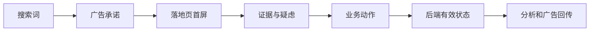

# SEM 创意、落地页与转化追踪

用户搜索“团队排班软件价格”，广告写“查看透明价格”，点击后却进入只有品牌口号的首页。广告获得了点击，用户任务却没有完成，追踪再精准也只会记录一次昂贵的错配。

本篇把搜索词、广告、落地页和后端结果排成一条线。每一层都要兑现上一层承诺。

## 先看完整链路

创意负责让相关用户理解“这里能解决什么”；落地页负责兑现；业务系统确认结果是否有效；分析和广告平台再接收经过定义的数据。

## 第一步：从搜索意图写广告

广告标题和描述应包含需求、价值、可核验差异和下一步，不写页面无法证明的最低价、第一名或保证效果。一个广告组内关键词若需要完全不同的承诺，说明意图分组可能过宽。

响应式广告可以提供多个真实不同的标题方向，不要只是调换词序。资产用于补充价格、场景、功能、电话或站点链接，仍需与页面保持一致。

## 第二步：让落地页立刻确认任务

首屏回答三个问题：这是我刚才搜索的内容吗，能得到什么，下一步是什么。随后提供方法、功能、限制、证据、常见疑虑和操作入口。

不同意图不要全部落到首页。价格查询去价格页，比较查询去选型页，故障查询去帮助内容。移动端还要检查加载、键盘、表单和错误提示。

## 第三步：定义主要、辅助和诊断事件

| 类型 | 示例 | 是否适合自动出价 |
| --- | --- | --- |
| 主要转化 | 付款、有效咨询、完成激活 | 经过业务核验后可以 |
| 辅助转化 | 查看价格、开始填表、播放演示 | 通常只用于分析 |
| 诊断事件 | 表单错误、接口超时、页面错误 | 不作为业务目标 |

把所有按钮点击设为主要转化，会让系统寻找最容易点击的人，而不是最可能成交的人。

## 第四步：以前端事件连接后端事实

业务提交成功后生成稳定的内部 ID，用于去重和连接审核、成交与退款。分析事件不应包含姓名、电话、邮箱等个人信息；必要同意尚未取得时，尊重用户选择，不通过隐藏标识绕过。

正常流程是：表单成功进入待审核，审核后成为有效线索，付款后记录价值，取消或退款后修正。平台匹配失败或超过归因窗口时标记未知，不强行归因。

## 故意制造四种失败

1. 接口返回失败：页面提示用户，不能记录成功转化；
2. 用户重复点击：业务端用幂等键避免两条线索；
3. 用户拒绝非必要分析：业务仍按合法目的工作，非必要事件不发送；
4. 页面跳转丢失来源：保留第一方允许字段，检查跨页传递。

测试时同时查看浏览器事件、网络请求、后端记录和最终报表预期。追踪代码回滚不应破坏表单本身。

## 正常结果和失败结果

正常链路中，用户搜索“试用预约软件”，广告承诺免费试用，页面首屏说明适用对象和试用步骤，后端记录激活，广告平台只把完成激活作为主要目标。

失败链路把页面打开算作转化。平台 CPA 很低，业务端却没有新增激活；自动出价继续扩大这些无价值访问。

下一篇建立跨平台诊断树，处理成本上涨、自动化扩量和预算迁移。

## 参考资料

- [Google Ads：About conversion tracking](https://support.google.com/google-ads/answer/1722022)
- [Microsoft Advertising：Universal Event Tracking](https://help.ads.microsoft.com/#apex/ads/en/56682/2)
- [Google：Consent mode](https://developers.google.com/tag-platform/security/guides/consent)
