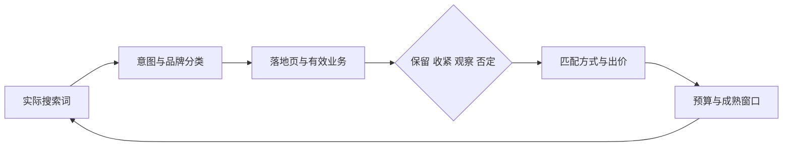

# 搜索词、匹配方式、出价与预算

广告主设置了一个看似高意图关键词，平台却根据匹配机制把广告展示给更多相关查询。报表里“企业预约系统”转化不错，但真实搜索词中出现大量免费模板、个人日历和竞品登录。只看关键词汇总，会把完全不同的需求平均在一起。

[账户与意图结构](/docs/seo/sem-account-keywords-landing)规定每个广告组要承接什么任务。搜索词治理使用真实查询、业务价值和预算上限验证流量是否仍在边界内，并据此选择匹配与出价策略。结果不是一张“自动否词”列表，而是一套需要人工复核的治理规则。



搜索词治理是闭环。新增否定词会改变后续样本，调价后也要等转化延迟和学习期结束再比较，不能按单日平台转化立即下结论。

## Search Term 是最接近用户需求的广告证据

**Search Term（搜索词）**是触发广告时用户实际输入的查询。**Keyword（关键词）**是广告主提供给平台的匹配信号。关键词相同，不同时期、平台和匹配策略可能触发不同搜索词。

搜索词报告至少保留：日期、平台、系列、广告组、关键词、匹配方式、搜索词、品牌分类、展示、点击、成本、平台转化、实际最终页面。若平台未提供搜索词明细，应标数据缺口，不能从关键词名称猜用户输入。

搜索词还要连接后端有效结果。一个词有 20 次平台表单、只有 1 条有效咨询，其问题可能比一个 5 次表单、4 条有效的词更严重。
## 三种匹配方式是范围选择，不是永久合同

| 匹配方式 | 英文 | 主要作用 | 主要风险 |
| --- | --- | --- | --- |
| 精确匹配 | Exact Match | 更靠近指定意图，便于早期控制 | 仍可能覆盖近义表达，不等于字符完全相同 |
| 短语匹配 | Phrase Match | 在语义范围内扩展表达 | 仍会出现意外需求 |
| 广泛匹配 | Broad Match | 结合更多信号探索查询 | 黑盒和无关流量风险更高 |

平台持续调整匹配行为，因此符号或名称不是永远不变的合同。上线后以搜索词、实际落地页和有效业务为准。

广泛匹配可以发现新需求，但前提是主要转化可靠、否定边界清楚、预算可承受且有人复盘搜索词。转化数据失真时，广泛匹配加自动出价会更快把预算推向容易触发的错误事件。

早期创业项目通常先用可控范围验证高意图词，再逐步扩大。不是因为广泛匹配“坏”，而是团队要先证明数据和页面能给算法正确反馈。
## Negative Keyword 需要语义审核

**Negative Keyword（否定关键词）**用于阻止特定搜索意图触发广告。可以按账户共享、系列和广告组层级管理：

- 全业务都无关、违法或无法服务的词放共享层；
- 只对某条业务无效的词放系列层；
- 相邻广告组之间的意图分流放广告组层。

每条否定词记录来源搜索词、理由、匹配方式、层级、添加人和日期。不要看到“零转化”就自动否定：样本可能不足，转化可能延迟，这个词也可能有辅助价值或高客单长周期。

自动诊断可以找出“成本超过复核阈值且当前零转化”的候选，但行动是人工检查意图、落地页、归因延迟和有效业务，然后选择保留、观察、收紧或否定。过宽否定会误伤有价值长尾，恢复时还不易察觉。
## 可承受 CPA 与 CPC 的计算

**CPA（Cost per Acquisition/Action，每次获取或行动成本）**按 `广告成本 / 转化数` 计算。分母必须说明是平台转化、有效线索、订单还是新客户。

服务业务可以从毛利倒推：

```text
单条有效线索期望毛利 = 有效线索成交率 x 单客户毛利
可承受有效 CPA = 期望毛利 x 允许投入比例
可承受 CPC = 可承受有效 CPA x 点击到有效线索率
```

教学示例：有效线索成交率 20%，单客户毛利 5,000 元，允许用 30% 毛利获客，点击到有效线索率 5%。那么线索期望毛利 1,000 元，可承受有效 CPA 300 元，可承受 CPC 15 元。

这些参数必须用真实业务持续校正。电商还要考虑退款、履约和支付成本；SaaS 要考虑激活、续费、服务成本与回收周期。只用订单收入会高估出价空间。

长销售周期可给阶段状态设期望价值，但不能为了让平台有更多数据就虚高“开始填表”的价值。阶段概率应从历史成交校正，并记录成熟窗口。
## 出价策略在优化什么

| 策略 | 英文 | 优化对象 | 使用前提与边界 |
| --- | --- | --- | --- |
| 手动 CPC | Manual CPC | 单次点击出价 | 规模小、需要控制；维护成本高 |
| 最大化点击 | Maximize Clicks | 预算内点击量 | 适合探索，可能偏向便宜低质点击 |
| 展示份额 | Target Impression Share | 展示位置/份额 | 品牌可见等明确目标，需防成本失控 |
| 最大化转化 | Maximize Conversions | 平台主要转化量 | 追踪可靠且有足够预算/样本 |
| 目标 CPA | Target CPA | 平均平台转化成本 | 有稳定基线，目标过紧会限量 |
| 最大化转化价值 | Maximize Conversion Value | 回传价值 | 不同转化价值真实可比 |
| 目标 ROAS | Target ROAS | 平台记录收入回报 | 价值与退款更新可靠，不等于毛利回报 |

自动出价根据平台可见信号优化。它无法知道销售说线索无效，除非数据被可靠回传。手动出价便于控制，也不会自动修复错误关键词和页面。

选择策略时先问：主要转化是否去重、业务结果能否连接、样本是否成熟、预算是否足以学习、波动和现金流能否承受。不能只因平台推荐切换。
## Learning Period 为什么不能天天重置

**Learning Period（学习期）**是自动策略在目标、预算、出价或流量发生变化后重新收集信号、调整模型的观察阶段。具体标识与周期由平台和数据量决定，不应套一个固定天数。

每次核心变更记录：日期、系列、变更维度、旧值、新值、假设、观察到期、主要指标和回滚。预算、出价、转化目标和落地页同时改变时，结果无法可靠归因到单一变量。

学习期不是放任异常的借口。追踪失效、广告进入错误国家、落地页 404、政策风险或异常超支应立即止损。普通 CPA 波动则等待成熟转化和约定窗口，再做等长周期比较。
## 样本和转化延迟怎样影响“零转化”

一个搜索词点击 3 次、零转化，和点击 300 次、零有效业务，证据强度不同。内部可以设简单置信度：点击至少 100 且转化至少 10 为高，点击至少 30 且转化至少 3 为中，其余低；这只是项目规则，不是平台定律。

若业务平均 5 天才确认有效线索，最近 2 天的点击尚未成熟。**Conversion Delay（转化延迟）**应进入停止候选等待期；否则团队会暂停最终会成交的词，又保留即时触发的低质表单。

报告同时展示样本量、成熟/未成熟窗口和归因关联率。小样本优先做可逆动作：修明显无关词、页面故障和预算集中，不根据一两次转化频繁切策略。
## 预算不是平均分配

预算先保证最值得验证的业务组合获得足够样本，再给相邻和探索需求设置明确上限。常见的 70/20/10 只是一种示例，不是行业规则；创业项目可以按现金流、市场容量和证据调整。

**Marginal Return（边际回报）**关注下一笔预算带来的新增价值：

```text
边际回报 = 调整后新增有效业务价值 / 新增广告成本
```

品牌系列平均 ROAS 很高，新增预算可能只购买本来会自然到站的用户。逐步增加非品牌或新市场预算，保持页面和转化稳定，观察新增有效线索、毛利与整体品牌需求。消耗增加但有效业务不增时停止扩量。
## 搜索词诊断顺序

1. 先验证平台、日期、时区、主要转化和业务回传；
2. 分开品牌/非品牌、匹配方式、系列和落地页；
3. 找高消耗零转化候选，但排除未成熟窗口；
4. 检查广泛/智能匹配成本占比及其新增有效需求；
5. 核对否定词误伤和广告组意图串流；
6. 计算平台 CPA、有效 CPA 和可承受边界；
7. 一次只调整一个核心维度，记录学习与回滚。

成本当前期上涨 30%、平台转化没有同比例增长时，先按 CPC、搜索词结构、品牌占比、页面和追踪拆分，不直接归因于出价策略。
## 搜索词治理与预算规则

```text
搜索词｜关键词/匹配｜品牌分类｜意图｜实际落地页｜
点击/成本｜平台转化｜有效业务｜成熟状态｜置信度｜
保留/观察/收紧/否定｜理由与层级｜负责人｜复查日期

系列｜预算上限｜出价策略及前提｜目标有效 CPA/毛利边界｜
变更维度｜观察期｜保护指标｜停止和回滚条件
```

SEM 投手维护搜索词、匹配、出价与变更记录；业务/销售确认有效质量；数据负责人处理转化延迟与归因；创业者设现金流和毛利边界；SEO/内容负责人将有价值搜索词回流页面，但不直接复制成文章。

验收至少包含一个应否定、一个因延迟需要观察、一个可扩展和一个证据不足候选。搜索词结论还要与广告创意、实际最终页面、转化事件和业务归因共同复核。
