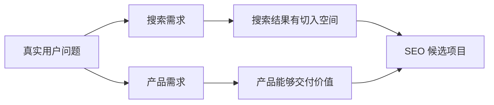

# 搜索项目评估、目标设定与数据基线

SEO 项目评估是一种在投入内容、技术改造或广告前，对搜索需求、业务价值、竞争入口、交付能力和风险做证据判断的方法。它位于搜索增长策略和具体执行之间，用于决定项目应该投入、先做小实验，还是暂缓，并为后续目标与数据基线确定口径。

关键词工具显示某个词每月有很多搜索，于是团队准备写 100 篇文章。这看起来有数据支持，却漏掉了三个问题：搜索的人是否需要你的产品、你能否提供比现有结果更有用的页面、获得访问后能否形成业务结果。

立项前检查不预测“多久排第一”，而是在投入内容和开发之前判断应该投入、先做小实验，还是暂缓。

[搜索增长诊断表](/docs/seo/search-growth-model)是项目评估的输入。至少需要目标用户、核心转化、单次转化毛利、可投入预算和当前数据缺口；缺少这些字段时，任何项目评分都只能是低置信度假设。

这里的项目评估可称为 **SEO Project Evaluation（SEO 项目评估）**：它不是预测某个关键词能排第几，而是判断“搜索需求、团队供给和商业回报是否值得进入验证”。输入是需求、竞争、资源与经济数据，处理过程是证据评分和反证实验，输出是投入、先验证或暂缓三种决策。

## 搜索需求与产品需求的区别

**搜索需求**说明有人主动表达某个问题。**产品需求**说明有人愿意试用、咨询、付费或持续使用你的解决方案。两者可能同时存在，也可能只有一个。

例如很多人搜索“免费图片压缩”，不代表他们愿意购买高价企业服务；一家通过行业介绍稳定成交的软件公司，也可能暂时没有大量公开搜索。SEO 立项需要同时看这两条证据链。



只有搜索量、没有成交路径，容易得到无价值流量；只有产品能力、没有稳定搜索需求，SEO 可能只是补充渠道。

## 明确业务结果与价值上限

先回答“一个有效访问最终值多少钱”，不要从文章数量开始。不同网站的有效结果不同：

| 网站 | 表面行为 | 更接近业务的结果 |
| --- | --- | --- |
| SaaS（Software as a Service，软件即服务） | 注册 | 完成激活或开始付费 |
| 服务网站 | 提交表单 | 通过资格校验的咨询 |
| 电商 | 加入购物车 | 已付款且未退款订单 |
| 内容网站 | 页面浏览 | 广告收入、订阅或产品转化 |

如果团队还无法定义结果，先修业务和数据口径。否则即使自然访问上涨，也很难判断投入是否值得。

## 搜索项目的六维证据

可以给每个维度打 1 至 5 分，但分数不是答案，每一分后面都要记录来源。

| 维度 | 要回答的问题 | 高风险信号 |
| --- | --- | --- |
| 商业价值 | 有效访问怎样连接收入 | 没有产品或转化路径 |
| 搜索需求 | 需求是否持续且覆盖购买过程 | 只依赖短期热点 |
| 竞争空间 | 当前结果是否仍有可改善之处 | 官方和强品牌已完整满足 |
| 内容能力 | 能否给出独特、可信答案 | 只能改写公开资料 |
| 技术基础 | 页面能否稳定发布和测量 | URL、模板和追踪不可控 |
| 风险周期 | 现金流能否等待建设和验证 | 回收期超出承受范围 |

总分只用于比较候选方向。商业价值或内容能力很低时，不应靠其他高分把它“平均”过去。

## 搜索结果页的人工观察

选择一组核心查询，记录排名页面是什么类型：教程、工具、产品、类目、社区还是官方说明。搜索结果实际上在告诉你，当前用户更可能想完成什么任务。

如果结果大多是产品页，只写科普文章很难承接购买意图；如果结果大多是操作指南，一页只有口号的销售页也无法解决问题。还要记录现有页面的更新时间、证据、交互和缺口，判断团队是否真的能做得更好。

这里至少需要一组正常样本和反例。只挑竞争较弱的长尾词，会高估整个项目；只看最难的大词，又可能错过有价值的小市场。

## 低成本反证实验

立项不是证明自己的想法正确，而是尽快发现哪条假设不成立。常见实验包括：

1. 用访谈或销售记录确认问题是否真实存在；
2. 用少量高质量页面验证抓取、展现和有效访问；
3. 用小范围搜索广告测试商业查询是否带来有效结果；
4. 用人工交付验证团队是否能兑现页面承诺。

实验开始前写清停止条件。例如：广告搜索词相关但连续两个业务周期没有有效咨询；内容必须依赖团队没有的专业资质；可承受获客成本明显低于市场点击成本。两周没有自然排名通常不足以单独证明 SEO 无效。

## 可执行结论与无效结论

**正常结论**会写出“先验证”：已有稳定客户问题，搜索结果存在内容缺口，团队能提供专家材料，但自然渠道周期尚不明确。先发布 5 个代表页面并观察一个完整抓取和业务周期，再决定扩展。

**失败结论**只写“搜索量很大，竞争度 45，所以值得做”。它没有产品匹配、结果页面、交付能力和停止条件，无法指导投入。

## 做出三选一决策

- **投入**：关键证据较完整，业务、内容、技术与周期都能承受；
- **先验证**：方向合理，但一两条关键假设缺少数据；
- **暂缓**：核心价值、交付能力或现金流条件不成立。

暂缓不是永久否定。记录缺口和重新评估条件，例如产品激活率稳定、获得专家支持或网站完成技术改造后再判断。

## 用六维表做一次立项判断

假设要评估“面向小团队的预约工具”是否值得投入 SEO。不要先填一个总分，先为需求、商业价值、竞争入口、内容供给、技术交付和风险周期分别打 1 至 5 分，并在分数旁写证据。例如“需求 4 分”的证据可以是访谈原话、搜索词报告和结果页类型；“大家都需要”不算证据。

| 维度 | 需要收集的证据 | 低分意味着什么 |
| --- | --- | --- |
| 搜索需求 | 用户原话、查询趋势、真实搜索词 | 需求可能不存在或不通过搜索表达 |
| 商业价值 | 有效线索率、成交率、毛利、复购 | 流量无法覆盖生产和销售成本 |
| 竞争入口 | 结果页页面类型、品牌集中度、内容缺口 | 当前资源很难提供更合适结果 |
| 内容供给 | 专家、数据、工具、更新责任 | 只能持续产出模板内容 |
| 技术交付 | 抓取、渲染、页面模板、分析能力 | 即使写完也无法稳定被发现和测量 |
| 风险周期 | 合规、季节、现金流和决策周期 | 结果出现前项目可能已无法继续 |

评分后做三种情景估算：保守、基准、乐观。需求覆盖、点击率、转化率和生效周期至少变化两项，成本要包含开发、内容、编辑和销售跟进。最终只给三种结论：投入、先验证、暂缓。

若证据不足，设计低成本反证实验。例如用少量高意图广告验证点击后的激活，而不是先写五十篇文章。开始前记录停止条件和观察周期。连续两个合理周期仍没有有效需求，或可承受获客成本明显低于市场点击成本，就应暂停扩张并复查产品与渠道，而不是继续增加页面数量。

## 谁负责给出哪些证据

| 角色 | 主要输入 | 本章应交付的结论 |
| --- | --- | --- |
| 创业者 | 产品、毛利、现金流、交付上限 | 商业价值、资源上限和停止条件 |
| SEO / 内容 | 查询样本、结果页类型、内容来源 | 搜索需求、竞争入口和内容可行性 |
| 开发 / 运维 | 模板、渲染、日志、发布能力 | 技术基础和预计改造成本 |
| SEM 投手 | CPC、搜索词、历史有效转化 | 用小预算验证需求的成本与范围 |
| 数据负责人 | 转化定义、CRM、订单和退款 | 基线口径、归因缺口和数据可信度 |

决策人可以是创业者，但不能替其他角色编造证据。没有服务器日志时写“抓取频率未知”，没有毛利时写“无法判断可承受 CPA”，比填一个看似完整的总分更可靠。

## 项目评估卡

评估卡固定保留以下字段：

```text
业务目标与核心转化：
六维评分及逐项证据：
十个代表查询与结果页类型：
保守 / 基准 / 乐观收益情景：
最高风险假设：
低成本反证实验：
停止条件与重新评估条件：
最终决策：投入 / 先验证 / 暂缓
```

评分之后必须保留原始证据和不确定项，并把它们转换成统一的证据强度、诊断状态和优先级，避免看到一个 SEO 分数就误以为已经得到了搜索引擎结论。

## 评估结论的边界

这套方法适合判断一个搜索增长方向是否值得进入验证阶段，不是预测排名、流量或收入的模型。搜索量、点击率和转化数据都有口径误差；它们只能支撑假设和下一次实验，不能单独承诺结果。若业务没有可追踪的转化定义，应先补数据基础再做 SEO 投入决策。

## 证据复核：搜索项目评估、目标设定与数据基线
SEO 结论要放回“需求、抓取、渲染、索引、排名、点击、转化”这条漏斗定位。页面源代码、渲染 DOM、响应头、搜索平台、分析数据和业务结果各自只能证明一段事实，不能用单页审计分数推断收录、排名或收入。

执行前固定页面类型、目标查询、地区语言、Canonical、观察窗口和成功指标。修复后使用同一 URL 集、同一设备条件与同一数据口径复验，并保留发布日期、抓取状态、展示点击、转化延迟和回滚方案。无法取得的数据明确标为检测边界。

SEM 与自然搜索共享意图和落地页证据，预算、匹配方式和归因仍有独立语义。广告短期结果可以帮助发现搜索词和页面问题，不能直接替代 SEO 长周期判断；自动建议先进入候选列表，再由人工核对业务边界。
