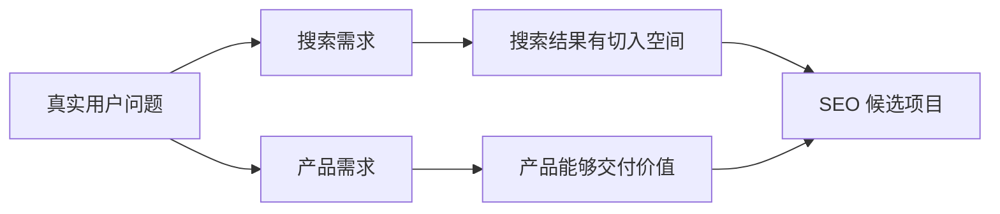

# 一个项目值得做 SEO 吗

关键词工具显示某个词每月有很多搜索，于是团队准备写 100 篇文章。这看起来有数据支持，却漏掉了三个问题：搜索的人是否需要你的产品、你能否提供比现有结果更有用的页面、获得访问后能否形成业务结果。

本篇建立一套立项前检查。它不会预测“多久排第一”，而是帮助你在投入内容和开发之前，判断应该投入、先做小实验，还是暂缓。

## 先分清搜索需求和产品需求

**搜索需求**说明有人主动表达某个问题。**产品需求**说明有人愿意试用、咨询、付费或持续使用你的解决方案。两者可能同时存在，也可能只有一个。

例如很多人搜索“免费图片压缩”，不代表他们愿意购买高价企业服务；一家通过行业介绍稳定成交的软件公司，也可能暂时没有大量公开搜索。SEO 立项需要同时看这两条证据链。

只有搜索量、没有成交路径，容易得到无价值流量；只有产品能力、没有稳定搜索需求，SEO 可能只是补充渠道。

## 第一步：写清楚业务结果

先回答“一个有效访问最终值多少钱”，不要从文章数量开始。不同网站的有效结果不同：

| 网站 | 表面行为 | 更接近业务的结果 |
| --- | --- | --- |
| SaaS | 注册 | 完成激活或开始付费 |
| 服务网站 | 提交表单 | 通过资格校验的咨询 |
| 电商 | 加入购物车 | 已付款且未退款订单 |
| 内容网站 | 页面浏览 | 广告收入、订阅或产品转化 |

如果团队还无法定义结果，先修业务和数据口径。否则即使自然访问上涨，也很难判断投入是否值得。

## 第二步：用六个维度保存证据

可以给每个维度打 1–5 分，但分数不是答案，每一分后面都要记录来源。

| 维度 | 要回答的问题 | 高风险信号 |
| --- | --- | --- |
| 商业价值 | 有效访问怎样连接收入 | 没有产品或转化路径 |
| 搜索需求 | 需求是否持续且覆盖购买过程 | 只依赖短期热点 |
| 竞争空间 | 当前结果是否仍有可改善之处 | 官方和强品牌已完整满足 |
| 内容能力 | 能否给出独特、可信答案 | 只能改写公开资料 |
| 技术基础 | 页面能否稳定发布和测量 | URL、模板和追踪不可控 |
| 风险周期 | 现金流能否等待建设和验证 | 回收期超出承受范围 |

总分只用于比较候选方向。商业价值或内容能力很低时，不应靠其他高分把它“平均”过去。

## 第三步：亲自观察搜索结果

选择一组核心查询，记录排名页面是什么类型：教程、工具、产品、类目、社区还是官方说明。搜索结果实际上在告诉你，当前用户更可能想完成什么任务。

如果结果大多是产品页，只写科普文章很难承接购买意图；如果结果大多是操作指南，一页只有口号的销售页也无法解决问题。还要记录现有页面的更新时间、证据、交互和缺口，判断团队是否真的能做得更好。

这里至少需要一组正常样本和反例。只挑竞争较弱的长尾词，会高估整个项目；只看最难的大词，又可能错过有价值的小市场。

## 第四步：先做低成本反证实验

立项不是证明自己的想法正确，而是尽快发现哪条假设不成立。常见实验包括：

1. 用访谈或销售记录确认问题是否真实存在；
2. 用少量高质量页面验证抓取、展现和有效访问；
3. 用小范围搜索广告测试商业查询是否带来有效结果；
4. 用人工交付验证团队是否能兑现页面承诺。

实验开始前写清停止条件。例如：广告搜索词相关但连续两个业务周期没有有效咨询；内容必须依赖团队没有的专业资质；可承受获客成本明显低于市场点击成本。两周没有自然排名通常不足以单独证明 SEO 无效。

## 正常结论和失败结论长什么样

**正常结论**会写出“先验证”：已有稳定客户问题，搜索结果存在内容缺口，团队能提供专家材料，但自然渠道周期尚不明确。先发布 5 个代表页面并观察一个完整抓取和业务周期，再决定扩展。

**失败结论**只写“搜索量很大，竞争度 45，所以值得做”。它没有产品匹配、结果页面、交付能力和停止条件，无法指导投入。

## 做出三选一决策

- **投入**：关键证据较完整，业务、内容、技术与周期都能承受；
- **先验证**：方向合理，但一两条关键假设缺少数据；
- **暂缓**：核心价值、交付能力或现金流条件不成立。

暂缓不是永久否定。记录缺口和重新评估条件，例如产品激活率稳定、获得专家支持或网站完成技术改造后再判断。

下一篇回到搜索引擎本身，理解发现、抓取、索引和排名之间的区别。

## 参考资料

- [Google Search Central：SEO Starter Guide](https://developers.google.com/search/docs/fundamentals/seo-starter-guide)
- [Google Trends 帮助](https://support.google.com/trends/)
- [Microsoft Advertising：Keyword Planner](https://about.ads.microsoft.com/solutions/tools/keyword-planner)
