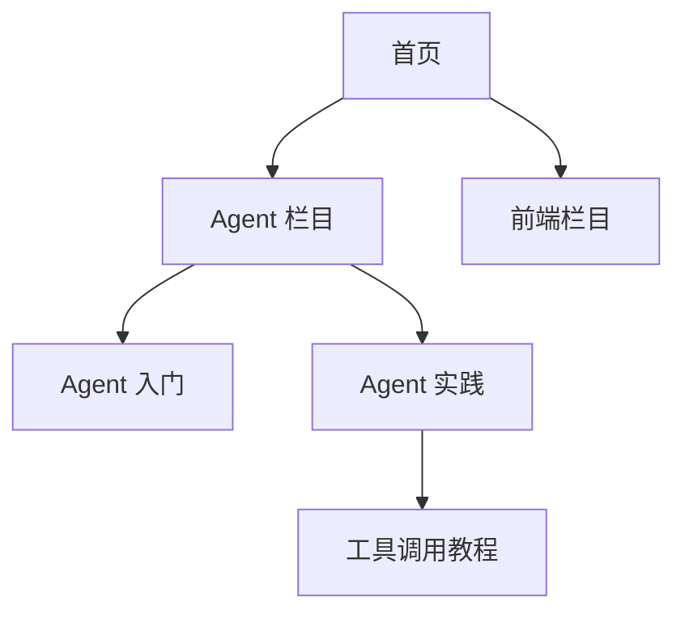

# 网站结构、URL 与内链怎样设计

一个博客把教程、产品说明和故障记录全部放在根目录，文章只能靠站内搜索找到。页面本身可能写得很好，读者却不知道自己位于哪一类内容中，搜索引擎也缺少稳定的主题关系。

本篇用栏目、URL 和链接搭一副网站骨架。目标不是让 URL 越短越好，而是让重要页面有清晰归属、稳定身份和真实入口。

## 先理解三件事的分工

**信息架构**描述网站有哪些页面类型，它们怎样分组。**URL** 是页面的公开身份。**内链**让用户和搜索引擎沿着关系找到其他页面。



这张树不要求每个页面距离首页都只有一次点击。真正重要的是层级符合用户任务，重点页面有可靠入口，面包屑和正文链接又能解释上下文。

## 第一步：先列页面类型和栏目树

在开发导航前，列出首页、栏目、专题、教程、产品、价格、案例、帮助和系统页面。每个一级栏目应该代表一个稳定的业务范围或用户任务，而不是编辑团队的临时分工。

接着说明每种页面允许出现在哪一层。例如教程属于技术栏目，帮助页属于产品支持；登录、搜索结果和临时预览页不应混入公开内容树。

如果栏目按技术主题组织，URL 却按作者组织，相关推荐又只按发布时间生成，网站会同时表达三套互相冲突的关系。

## 第二步：给页面稳定 URL

好的 URL 规则通常具备这些特征：大小写一致，使用稳定分隔符，不携带会话与追踪状态，目录能看出归属，页面身份不随标题小改而变化。

```text
/docs/agent-practice/
/docs/agent-practice/tool-calling/
/docs/frontend/typescript/
```

路径不需要塞满关键词。URL 上线后尽量保持稳定；改文章标题并不自动要求修改路径。确需迁移时，更新内链和站点地图，并从旧地址永久跳到最相关的新地址，避免多级跳转。

## 第三步：让不同链接承担不同关系

| 链接位置 | 主要作用 | 常见错误 |
| --- | --- | --- |
| 主导航 | 表达核心栏目 | 塞入所有页面 |
| 面包屑 | 表达当前层级和返回路径 | 与真实栏目不一致 |
| 正文链接 | 在具体语境中补前置或下一步 | 锚文本只有“点击这里” |
| 专题目录 | 组织完整学习任务 | 只有无序文章列表 |
| 相关推荐 | 延伸同主题或同阶段内容 | 只按发布时间推荐 |

正文链接应解释为什么下一篇相关。例如讲完 Agent 生命周期后，链接到工具调用并说明它负责把模型决策变成受控程序调用，比在页脚自动插入十篇“猜你喜欢”更有帮助。

## 第四步：治理参数、分页和筛选

筛选、排序、追踪和会话参数容易产生大量内容相近的 URL。先给参数分类：真正改变核心集合且有独立需求的组合，可以建立静态页面；只改变排序、颜色或追踪状态的组合通常不进入导航和站点地图。

`canonical` 可以帮助说明重复页面中的首选版本，却不该被当作无限生成 URL 的许可证。爬虫仍可能先访问这些地址，日志与分析也会被污染。

无限滚动可以改善交互，但每一批内容仍应有稳定、可访问的分页地址和普通链接。脚本失败时，用户至少能打开下一页。

## 多语言站点还需要什么

不同语言或地区的页面要有稳定、独立 URL，并使用 `hreflang` 表达对应关系。不要只根据 IP 强制跳转，也不要假装拥有尚未翻译的语言版本。

每个语言版本都要能独立导航、返回正确状态和展示本地化内容。语言标签不是翻译质量检查器。

## 正常结果和失败结果

正常结构中，新文章能从栏目页到达，面包屑与 URL 归属一致，正文链接连接前后知识，站点地图只列希望索引的规范地址。

失败结构中，筛选器每次点击生成一种新参数，所有组合都被内链和收录；后来团队用 canonical 指向一个页面，却仍让爬虫遍历成千上万的组合。

下一篇聚焦单个页面，完成标题、摘要、正文层级、规范地址和结构化数据。

## 参考资料

- [Google Search Central：Site hierarchy](https://developers.google.com/search/docs/fundamentals/seo-starter-guide#site-hierarchy)
- [Google Search Central：URL structure](https://developers.google.com/search/docs/crawling-indexing/url-structure)
- [Google Search Central：Links crawlable](https://developers.google.com/search/docs/crawling-indexing/links-crawlable)
