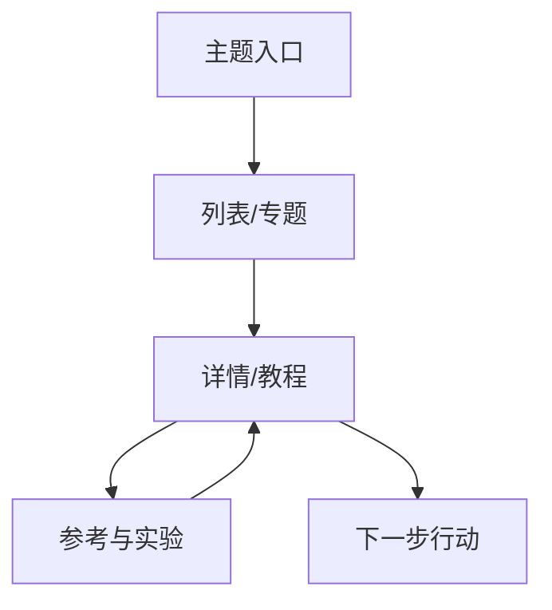

# 网站架构、URL 与内链设计

搜索引擎理解一个站点，不只依赖单页正文，还依赖 URL 的稳定性、目录关系、链接锚文本、页面之间的引用和站点地图。好的架构同时服务三类人：用户能预测下一步，爬虫能发现规范页面，团队能在改版时定位影响范围。把所有页面平铺在一个目录，或者让参数、标签和筛选无限生成 URL，短期看似灵活，长期会让抓取资源和内容信号分散。

## 四份架构产物

在写路由代码前先维护四份轻量产物：页面类型表、URL 规则表、内链关系图和迁移清单。页面类型表定义每类页面的主任务、数据来源、索引资格和生命周期；URL 规则表规定大小写、尾斜杠、语言、参数和分页；内链图说明入口页、列表页、详情页、指南和产品页如何互相支持；迁移清单记录旧 URL 的状态、替代页面、重定向和验证结果。



图中的箭头不是“权重分配公式”，而是用户任务和证据的路径。入口页概括主题并链接到重要子页，详情页链接到前置知识和后续行动，参考页链接回主任务。每个页面都应该能回答“为什么从这里去那里”。

## URL 规则要能长期维护

URL 需要可读、稳定、唯一，并能表达资源而不是当前 UI 状态。建议在项目中集中生成 URL，避免组件各自拼接：

```ts
export function articleUrl(slug: string, locale = 'zh-CN') {
  const normalized = slug.trim().replace(/^\/+|\/+$/g, '')
  if (!normalized || /[?#]/.test(normalized)) throw new Error('invalid slug')
  return locale === 'zh-CN' ? `/docs/${normalized}` : `/${locale}/docs/${normalized}`
}
```

实际规则应按业务替换。需要明确的决策包括：大小写是否统一小写，中文是否编码，是否使用尾斜杠，分页是 `/page/2` 还是参数，语言版本是否独立路径，筛选条件是否承担公开搜索需求。不要因为“参数更方便”就让每个排序、颜色、临时 token 都产生可索引 URL。

## 分页、无限滚动和分面

纯无限滚动对用户体验可能很好，但如果下一页没有可发现的链接，爬虫和键盘用户都难以访问完整内容。保留可访问的分页 URL，首屏提供稳定链接；使用 JavaScript 做增强加载，而不是移除分页语义。过滤条件要分级：有稳定需求和独立内容的组合可以生成静态页面；用户临时筛选、排序和空结果通常不应进入 sitemap。

```text
可索引：/guides/security/
分页：/guides/security/page/2/
临时排序：/guides/security?sort=latest       -> 通常不进 sitemap
内部搜索：/search?q=...                        -> 通常 noindex
```

“通常”不是固定规则。是否公开索引取决于页面能否提供独立价值、是否有稳定需求、是否会产生大量低质量组合和团队能否维护。先用日志和搜索数据验证，再决定规范化策略。

## 内链的五种作用

内链帮助发现页面、解释主题关系、传递上下文、引导任务和暴露孤立页面。锚文本要描述目标内容，不要让整页到处使用“点击这里”。同一页面指向多个相近版本时，必须明确主页面；标题、面包屑、相关内容和正文引用不应互相矛盾。

检查孤立页面时，不要只扫描 Markdown 文件。还要检查模板生成页、数据库内容、分页入口和 sitemap。对每个公开 URL 计算入链来源数和主入口距离，结合业务价值决定补链、合并或下线，而不是机械地给所有页面塞“相关文章”模块。

## 改版迁移的顺序

迁移前保存旧 URL、状态码、抓取量、外部链接、自然点击和业务价值快照；按“有明确替代内容、可合并、无替代内容”分类。先在测试环境生成重定向并验证链路，再分批上线。避免重定向链、将所有旧页跳首页、同时改变域名/目录/内容/模板而没有阶段性基线。

```text
旧页 -> 明确的新页：301/308，更新内链和 sitemap
旧页 -> 多页合并：选择唯一主 URL，保留可核验内容
旧页 -> 无替代内容：真实 404/410，移除入口并记录原因
```

迁移后的观察要包含旧 URL 抓取、重定向命中率、新 URL 200 比例、canonical 一致性、索引覆盖、查询和业务事件。若出现大量 5xx、跳转环或核心页面掉出索引，先回滚路由配置，再分析内容改动；不要在故障期间继续批量更新。

## 验证工具与数据模型

可以用静态检查发现重复和断链，再用爬虫或浏览器检查真实行为：

```sql
select source_url, target_url, count(*) as links
from internal_links
where crawl_id = :crawl_id
group by source_url, target_url;
```

这个示例只表达查询关系，字段名需按实际采集模型替换。验收至少包括：每个索引页有稳定入口；关键页面不是孤立节点；规范 URL 唯一；分页和筛选不会无限制造重复；不存在的 URL 返回真实 404；迁移表中的每一行都有状态和证据。

## 实施记录：从问题到动作

信息架构的最终验收是用户能否在有限点击内找到下一步，并且每个公开 URL 都能被稳定发现。改版时以小目录旁路验证，记录重定向链、404、canonical、sitemap 和业务入口；任何异常先恢复路由，再分析内容迁移。

执行记录需要保留四类信息：基线快照、改动版本、观察条件和业务对账。基线至少包含 URL、模板、查询/搜索词、状态码、索引资格、事件口径和时间范围；改动要能定位到内容、路由、缓存、创意或出价的具体版本；观察条件要记录设备、地域、语言、模型或平台版本；业务对账要以服务端的资格、成交、退款和回款为准。这样在结果变差时可以回到上一个可用版本，而不是凭记忆争论。

## 故障演练与回滚

| 演练场景 | 预期信号 | 保护动作 | 恢复证据 |
| --- | --- | --- | --- |
| robots 或 WAF 误拦截 | 抓取 4xx 上升、核心 URL 失败 | 恢复规则并限制变更面 | GET、日志、覆盖报告 |
| 模板发布错误 | title/canonical/正文异常 | 回滚模板或内容版本 | 原始 HTML 对比 |
| 追踪重复或丢失 | 客户端与服务端数量不一致 | 停止自动化学习，修复去重 | 事件 ID 对账 |
| 业务质量下降 | 有效率、退款或毛利越过护栏 | 收紧查询/预算或下线页 | CRM/订单状态 |

演练使用模拟场景和最小流量，不改变真实生产预算或数据。回滚后再次检查公开页面、缓存、站点地图、广告参数、事件队列和业务状态；只有所有关键证据恢复，才允许继续实验。

## 结果判定与后续动作

把结论分为事实、假设和缺口。事实必须能由页面、日志、平台、实验或业务记录直接复核；假设写出可证伪的预测；缺口说明缺少哪项数据以及它会影响哪项判断。观察周期内不要连续叠加多个主变量，也不要把平台评分、平均排名或单次引用当作有效业务的替代。

```text
基线 -> 小范围变更 -> 技术验收 -> 搜索/广告观察 -> 业务对账 -> 继续、调整、合并或停止
```

## 操作清单与决策记录

改版先做小目录旁路验证，成功后再扩到全站；所有迁移都要能一键回到旧规则。

发布或投放前按顺序记录：

1. **范围**：目标用户、语言、地域、页面类型和明确不覆盖的需求。
2. **证据**：查询样本、页面版本、规范/源码/实验来源、数据时间和负责人。
3. **技术**：状态码、抓取规则、canonical、sitemap、内链、缓存、脚本失败和移动端表现。
4. **业务**：主转化、资格条件、去重键、成交/退款状态和归因窗口。
5. **保护**：预算或发布范围、护栏指标、观察周期、回滚版本和停止条件。

## 指标与停止条件

| 信号 | 可继续的证据 | 应暂停或回滚 |
| --- | --- | --- |
| 技术 | 公开 URL 状态稳定，规范页和索引目标一致 | 5xx、误拦截、canonical 冲突或空壳正文 |
| 搜索 | 相关查询、页面和点击方向一致 | 查询意图偏移、重复页面或无效展现激增 |
| 用户 | 到站后完成主要任务，错误反馈可解释 | 跳转、表单、脚本失败导致任务中断 |
| 业务 | 有效率、毛利和退款符合护栏 | 低质量线索、退款上升或归因无法对账 |

停止不是失败，而是保护样本和现金流的工程动作。停止后保留原始事件、页面快照和决策日志；需要恢复时先回到最后一个可验证版本，再单独改变一个变量。

### 迁移表的字段

迁移表至少记录旧 URL、目标 URL、原状态、替代理由、重定向类型、外部链接、最后抓取时间、验证人和回滚动作。表中没有明确目标的旧页不要批量跳到首页；通过 404/410 结束生命周期同样是有效决策。

```text
事实（页面/日志/业务记录） -> 假设（可证伪预测） -> 动作（单一变量） -> 观察（固定口径） -> 决策（继续/调整/停止）
```

## 参考资料

- [Google Search Central：URL 结构最佳实践](https://developers.google.com/search/docs/crawling-indexing/url-structure)
- [Google Search Central：规范化重复 URL](https://developers.google.com/search/docs/crawling-indexing/consolidate-duplicate-urls)
- [Google Search Central：网站导航与链接](https://developers.google.com/search/docs/crawling-indexing/links-crawlable)
