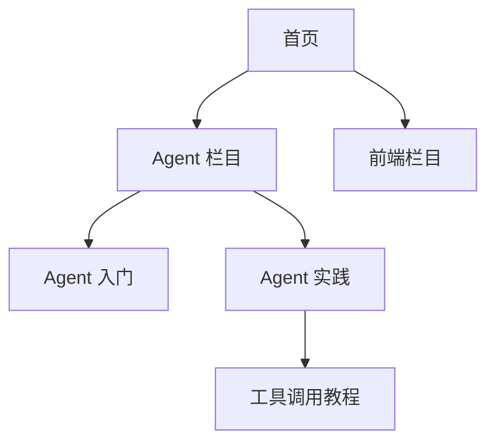

# 页面规划、网站结构、URL 与内链

网站结构是一种组织页面层级和主题关系的信息架构，URL 提供稳定地址，内链让读者和爬虫沿这些关系移动。三者位于查询到页面的映射和正式发布之间，用于让内容可发现、可理解，也便于后续维护、合并和迁移。

一个博客把教程、产品说明和故障记录全部放在根目录，文章只能靠站内搜索找到。页面本身可能写得很好，读者却不知道自己位于哪一类内容中，搜索引擎也缺少稳定的主题关系。

栏目、URL 和链接共同组成网站骨架。重要页面需要清晰归属、稳定身份和真实入口，URL 长度只是其中一项实现细节。

[查询、意图与页面映射](/docs/seo/keyword-intent-page-mapping)是网站结构的直接输入。只有页面承诺、独特材料和索引目标都明确的任务才进入公开结构；“有一个关键词”不足以获得一个新 URL。

## 栏目、URL 与内链的职责

**Information Architecture（信息架构，IA）**描述网站有哪些页面类型、怎样分组以及用户如何完成任务。**URL（Uniform Resource Locator，统一资源定位符）**是页面的公开地址与稳定身份。**Internal Link（内部链接）**是同一网站页面之间可点击的关系，让用户和搜索系统发现下一张页面并理解上下文。

三者的输入是已经验收的页面任务，处理过程是分组、命名、确定路径和连接关系，输出是栏目树、页面类型表、URL 规则与内链规则。只画一张站点树但没有参数、分页和失败页面策略，仍不算完整架构。



这张树不要求每个页面距离首页都只有一次点击。真正重要的是层级符合用户任务，重点页面有可靠入口，面包屑和正文链接又能解释上下文。

## 页面类型与栏目树

在开发导航前，列出首页、栏目、专题、教程、产品、价格、案例、帮助和系统页面。每个一级栏目应该代表一个稳定的业务范围或用户任务，而不是编辑团队的临时分工。

接着说明每种页面允许出现在哪一层。例如教程属于技术栏目，帮助页属于产品支持；登录、搜索结果和临时预览页不应混入公开内容树。

如果栏目按技术主题组织，URL 却按作者组织，相关推荐又只按发布时间生成，网站会同时表达三套互相冲突的关系。

## 稳定 URL 与页面身份

好的 URL 规则通常具备这些特征：大小写一致，使用稳定分隔符，不携带会话与追踪状态，目录能看出归属，页面身份不随标题小改而变化。

```text
/docs/ai-agent/
/docs/ai-agent/tool-calling-contracts
/docs/frontend/typescript/
```

路径不需要塞满关键词。URL 上线后尽量保持稳定；改文章标题并不自动要求修改路径。确需迁移时，更新内链和站点地图，并从旧地址永久跳到最相关的新地址，避免多级跳转。

## 导航链接与上下文链接

| 链接位置 | 主要作用 | 常见错误 |
| --- | --- | --- |
| 主导航 | 表达核心栏目 | 塞入所有页面 |
| 面包屑 | 表达当前层级和返回路径 | 与真实栏目不一致 |
| 正文链接 | 在具体语境中补前置或下一步 | 锚文本只有“点击这里” |
| 专题目录 | 组织完整学习任务 | 只有无序文章列表 |
| 相关推荐 | 延伸同主题或同阶段内容 | 只按发布时间推荐 |

正文链接应解释目标页面为什么相关。例如讲完 Agent 生命周期后，链接到工具调用并说明它负责把模型决策变成受控程序调用，比在页脚自动插入十篇“猜你喜欢”更有帮助。

链接还要在 HTML 语义上成立：

- 导航目标使用真实 `href`，不要用空地址、`javascript:` 或只有点击事件的元素冒充链接；
- 图标链接通过可见文字或 `aria-label` 提供 **Accessible Name（可访问名称）**，让读屏软件和审计工具知道它去哪里；
- 页面操作使用 `button`，跳转到资源使用 `a`，不要混淆；
- 页内目录的 `#fragment` 必须对应真实且唯一的 `id`；
- 重要入口不要只存在于用户完成筛选、登录或滚动后才生成的脚本中。

空 href 既不能提供稳定发现路径，也会破坏键盘和辅助技术体验。可访问性不是独立于 SEO 的装饰：清晰的链接语义同时帮助用户、浏览器和自动化检查理解页面关系。

## 参数、分页与筛选页面治理

筛选、排序、追踪和会话参数容易产生大量内容相近的 URL。先给参数分类：真正改变核心集合且有独立需求的组合，可以建立静态页面；只改变排序、颜色或追踪状态的组合通常不进入导航和站点地图。

`canonical` 可以帮助说明重复页面中的首选版本，却不该被当作无限生成 URL 的许可证。爬虫仍可能先访问这些地址，日志与分析也会被污染。

无限滚动可以改善交互，但每一批内容仍应有稳定、可访问的分页地址和普通链接。脚本失败时，用户至少能打开下一页。

**Pagination（分页）**把长列表拆成一组稳定 URL。每一页要有真实的上一页/下一页链接，后续页若承载独立条目，通常使用自指 Canonical，而不是全部指向第一页。若分页只是同一集合的重复视图，则要根据实际页面任务另行治理，不能机械套规则。

## 多语言站点还需要什么

不同语言或地区的页面要有稳定、独立 URL，并使用 `hreflang` 表达对应关系。不要只根据 IP 强制跳转，也不要假装拥有尚未翻译的语言版本。

每个语言版本都要能独立导航、返回正确状态和展示本地化内容。语言标签不是翻译质量检查器。

**hreflang** 是 HTML 或 Sitemap 中表达语言/地区替代关系的属性。它的输入是可访问、允许索引的语言 URL 集合，输出是相互指回的语言矩阵。A 指向 B 而 B 不指回 A、语言代码无效、目标 404 或 Canonical 跨语言合并，都可能让信号被忽略。它不自动翻译页面，也不会替错误语言的正文兜底。

## 有效网站结构与常见失败

正常结构中，新文章能从栏目页到达，面包屑与 URL 归属一致，正文链接连接前后知识，站点地图只列希望索引的规范地址。

失败结构中，筛选器每次点击生成一种新参数，所有组合都被内链和收录；后来团队用 canonical 指向一个页面，却仍让爬虫遍历成千上万的组合。

## 画出四份一致的结构产物

一个可维护的网站结构至少有栏目树、页面类型表、URL 规则和内链规则。先用十个代表页面检查四者是否表达同一业务关系：帮助文章属于哪个主题，产品页从哪里被发现，参数页是否进入导航，删除页如何处理。

| URL 类型 | 是否索引 | 是否进入内链/地图 | 处理原则 |
| --- | --- | --- | --- |
| 稳定内容页 | 通常是 | 是 | 返回 200，首选地址自洽 |
| 排序/追踪参数 | 通常否 | 否 | 统一参数，避免生成无限组合 |
| 有真实需求的筛选页 | 经过资格审查 | 有限加入 | 有独特结果、说明与维护规则 |
| 删除且无替代页 | 否 | 否 | 404/410，不跳首页 |
| 已迁移页 | 旧 URL 否 | 更新到新 URL | 一对一永久跳转 |

内链锚文本说明目标页解决的问题，栏目、上下文链接和相关推荐承担不同职责。无限滚动仍应提供稳定分页地址和普通链接；多语言页面使用独立 URL，并按真实语言与地区关系声明，不根据 IP 强制把用户和爬虫跳走。

改版前导出有流量、外链、索引或业务价值的旧 URL，逐条映射到最相关新地址。上线后检查状态、跳转链、规范地址、站点地图与内部链接。结构调整是产品、开发、SEO 和分析共同决策，不是为了追求“URL 越短越好”。

## 结构验收与职责
将页面树、页面类型表、URL 规则和内链规则放在同一份结构文档中，并选十个代表 URL 走查：从首页或相关栏目能否到达、锚文本是否说明任务、参数是否产生新地址、分页能否无脚本访问、删除和迁移是否有明确状态。

SEO/内容负责人定义页面职责与上下文链接；开发负责人保证 href、路由、分页和错误状态真实可用；产品或创业者控制导航优先级；数据负责人确保 URL 变化不会切断历史分析。结构确认后，每种页面类型还要形成可验收的 Title、Description、H1、正文和结构化数据规则。
